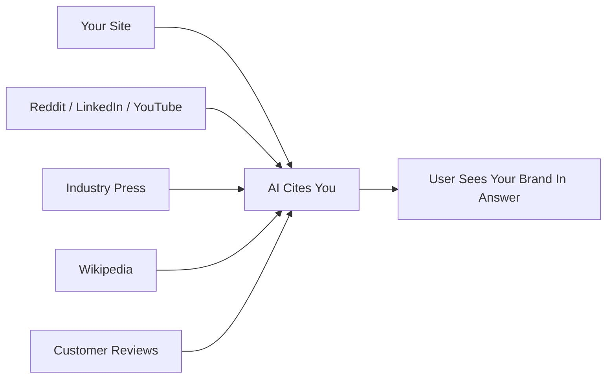

# SEO vs GEO — How Signals and Metrics Differ

> SEO optimises for rank position in a list of links; GEO optimises for citation share inside synthesised answers — and the signals driving each differ.

Related lesson: [The Citation Economy](https://learn.agentpatterns.ai/geo/the-citation-economy/) covers this concept in a hands-on lesson with quizzes.

## Signal comparison

| Signal | Traditional SEO | GEO | Direction |
|--------|-----------------|-----|-----------|
| Backlinks | Primary ranking factor | Weak predictor of AI citation | Deprioritize for GEO |
| Brand search volume | Secondary | Strong predictor; tracks entity prominence | Invest heavily |
| Off-site brand mentions | Nice-to-have | Stronger predictor than backlinks; dominates AI citations | Build deliberately |
| Keyword density | Neutral to positive | Actively harmful — decreases visibility | Abandon |
| Content freshness | Important | High: engines weight recency in source selection | Carry over |
| Structured data / schema | Helpful | Required for entity clarity | Expand |
| Authoritative writing | Important | Important | Carry over |
| Statistics and quotations | Marginal SEO benefit | 30–41% visibility improvement ([Princeton GEO study](https://arxiv.org/html/2311.09735v3)) | New priority |
| Rank position | Primary goal | Low correlation with AI citation | Not a GEO proxy |

## What conflicts

Keyword density is a direct conflict. The [Princeton GEO study](https://arxiv.org/html/2311.09735v3) found keyword stuffing decreases AI citation rates — the opposite of its historical SEO effect. A keyword-dense paragraph costs tokens; a table is cheaper to parse and more likely cited.

Rank position is not a GEO proxy. The [Princeton GEO study](https://arxiv.org/html/2311.09735v3) found citation-oriented techniques produced a 115% visibility increase for lower-ranked sites, while top-ranked sites saw a 30% decrease.

## What is new

```mermaid
graph LR
    A[Your Site] --> B[AI Cites You]
    C[Reddit / LinkedIn / YouTube] --> B
    D[Industry Press] --> B
    E[Wikipedia] --> B
    F[Customer Reviews] --> B
    B --> G[User Sees Your Brand In Answer]
```

Most AI citations come from third-party earned media, not brand-owned content: forums, reviews, press, Wikipedia, YouTube, and LinkedIn. A [Semrush analysis of 150,000 AI citations](https://www.semrush.com/blog/most-cited-domains-ai/) found Reddit at 40.1% of LLM references, Wikipedia 26.3%, and YouTube 23.5% — corroborated by [Search Engine Land](https://searchengineland.com/ai-search-engines-cite-reddit-youtube-and-linkedin-most-study-473138). Owned content supplements; it does not dominate.

Content structure decides extractability. AI systems pull isolated passages, not pages — self-contained paragraphs, data tables, and FAQ sections extract well; long-form narrative guides do not.

## Metric comparison

| Dimension | SEO Metric | GEO Equivalent |
|-----------|-----------|----------------|
| Visibility | Rank position | AI visibility score / share of voice |
| Traffic | Organic click-through rate | Citation frequency across tracked prompts |
| Competitive standing | Share of SERP clicks | AI share of voice vs. competitors |
| Reach | Impressions | Prompts where brand appears |
| Sentiment | Not tracked | Brand sentiment in AI responses |
| Source health | Domain authority | Citation volatility — AI citation pools shift frequently |

## Where to invest

| Action | Rationale |
|--------|-----------|
| Build off-site brand presence (forums, reviews, press) | Earned media predicts AI citation better than backlinks |
| Add statistics and quotations to existing pages | 30–41% citation lift per the [Princeton GEO study](https://arxiv.org/html/2311.09735v3) |
| Restructure key pages for extractable passages | AI cites standalone paragraphs, not pages |
| Stop keyword-stuffing; optimize for token efficiency | Keyword density actively harms GEO |
| Instrument AI citation tracking | Rank-based metrics miss AI citation — engines cite low- and non-ranked pages |

## Why these signals work

AI engines build entity representations from training-data co-occurrence, not the link graph. [Brand mentions](topical-authority.md) in forums, reviews, and editorial coverage teach a model what a brand stands for, independently of site links. Backlinks route crawlers; they do not build entity association.

Keyword density is a token cost: repetition consumes budget without adding semantic signal, whereas a table encodes the same facts more compactly and extracts better.

## When this backfires

- Measurement opacity: AI citation share has no tracking standard equivalent to [Google Search Console](gsc-search-console-monitoring.md) — campaigns may run months before lift is detectable.
- Small-brand cold-start: citation pools favor established earned media — Wikipedia, major press, G2-tier reviews. New brands must build that inventory before GEO techniques gain traction.
- Model-specific variability: citation signals do not transfer uniformly across engines — a source prominent in ChatGPT may not appear in Gemini or Perplexity. Track per model.
- Attribution bleed: brand-mention campaigns may also lift organic rankings, making the GEO contribution hard to isolate without prompt-based measurement.
- Backlinks are not worthless: "weak predictor" is relative, not zero. Correlation analyses still find [link authority](topical-authority.md) carries a positive — if secondary — signal, well behind brand mentions but above it. Read the Direction column's "deprioritize" as reallocate away from, not abandon.

## Key Takeaways

- Backlinks and rank position drive SEO but are weak GEO signals; brand search volume and off-site earned media predict AI citation better.
- Keyword density transfers as a *negative* — the [Princeton GEO study](https://arxiv.org/html/2311.09735v3) found stuffing decreases AI citation; adding statistics and quotations improved visibility 30–41%.
- Most AI citations come from third-party platforms (Reddit 40.1%, Wikipedia 26.3%, YouTube 23.5% per [Semrush](https://www.semrush.com/blog/most-cited-domains-ai/)), so structure pages for extractable passages and invest off-site.
- Measure GEO with AI share-of-voice and citation frequency, not rank — and treat "deprioritise backlinks" as reallocation, not abandonment.

## Related

- [What Is GEO](what-is-geo.md)
- [How AI Engines Cite](how-ai-engines-cite.md)
- [Measuring GEO Performance](measuring-geo-performance.md)
- [Answer-First Writing](answer-first-writing.md)
- [Assertion Density](assertion-density.md)
- [Topical Authority](topical-authority.md)
- [Schema and Structured Data for GEO](schema-and-structured-data.md)
- [Atomic Pages and Chunking](atomic-pages-and-chunking.md)
