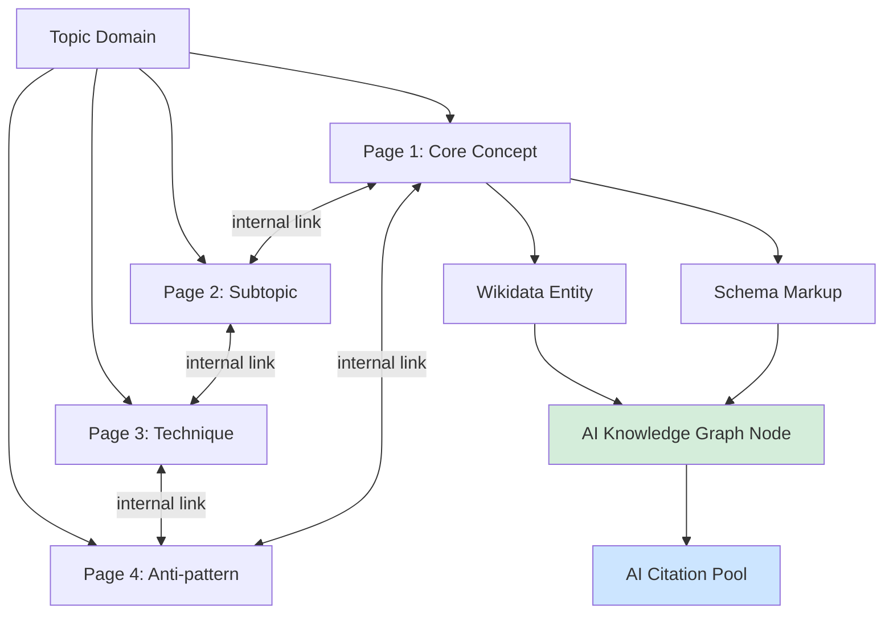

# Topical Authority

> Comprehensive coverage of a topic domain drives persistent AI citation presence. A site with many interconnected pages on one subject consistently outperforms a site with one excellent page on a subtopic.

AI systems map sources to topic domains and surface the domain most associated with a subject — topical authority determines whether your site is recognized as the authoritative entity.

## Core Concept

Topical authority means AI systems recognize your domain as a trusted node for a subject area — mapping your site to concepts, evaluating coverage breadth, and weighting citations accordingly. The key shift from SEO thinking:

| SEO frame | GEO frame |
|-----------|-----------|
| Optimize the best page per keyword | Cover the full concept map of a domain |
| Backlinks signal authority | Entity consistency and coverage signal authority |
| Rank individual pages | Become the recognized entity for a subject |
| Linear returns per page | Compounding returns as coverage grows |

Brand search volume is a stronger predictor of AI citation rates than backlinks ([Digital Bloom 2025 AI Citation Report](https://thedigitalbloom.com/learn/2025-ai-citation-llm-visibility-report/)). Topical authority drives brand recall, which drives citations.

## How It Works

### Entity Recognition

AI systems identify your site as an authority by mapping it to known entities. Consistent terminology across many pages creates stable entity entries AI can reliably retrieve. Content with many interconnected entities is selected more frequently than entity-sparse content.

### Coverage Breadth vs. Depth

Deep coverage of one subtopic is not equivalent to broad coverage of a domain. AI systems reward consistent publishing within a topic area — a niche-relevant source outperforms a generic high-authority site lacking topic alignment once the citation threshold is met.

### Internal Linking as Semantic Graph Construction

Internal links are semantic relationships between entities and topics — not navigational cues. The authority formula:

```
Topical Authority = Content Engineering + Information Architecture + Internal Linking
```

All three must be present. Strong content without link structure leaves the entity graph incomplete; link structure around thin content degrades authority signals. Body links outweigh navigation or footer links ([iPullRank: How Does Internal Linking Impact Topical Authority?](https://ipullrank.com/internal-linking-topical-authority)).

### Knowledge Graph Participation

External knowledge infrastructure amplifies entity recognition:

- **Wikidata**: Underlies Google's Knowledge Graph. An entry with Label, Description, Aliases, and Website registers your site as a distinct entity that AI systems can merge into a single authoritative node.
- **Schema markup**: An About page, a README, and an API spec pointing to the same `Organization` schema entry give generative systems confidence to treat them as one source.
- **Multi-platform consistency**: Consistent presence across multiple platforms reinforces entity mapping. Signals across GitHub, Stack Overflow, and relevant communities increase the probability of AI system recognition.

## Why It Works

AI systems are trained on large corpora where authoritative sources appear repeatedly across many documents on the same subject. When a domain publishes many interconnected pages on one topic, its content appears more frequently in training data and retrieval indexes for that subject area — making it more likely to be selected when a query touches the domain. Retrieval-augmented systems weight sources by topical relevance signals built from co-occurrence patterns: a source cited alongside a concept many times accumulates stronger association weights than a source cited once with high authority but lacking topic depth. Internal linking reinforces this by creating a navigable semantic graph that retrieval systems can traverse, surfacing related entities and strengthening the association between domain and topic.

## Diagram



These three inputs combine into a single authoritative node AI systems draw from across varied queries.

## The Compounding Effect

Topical authority grows non-linearly. Each new page adds query surface, strengthens the link graph, and increases the probability a novel query hits the domain.

The Authority Flywheel:

```
Original research → Structured data → Earned media mentions → Entity reinforcement → More citations → More authority
```

Topical coverage feeds the "original research" and "entity reinforcement" inputs.

## Trade-offs

| Approach | Pros | Cons |
|----------|------|------|
| Deep coverage of one subtopic | Authoritative single page, faster to produce | Doesn't establish domain authority; vulnerable to single-page content drift |
| Broad shallow coverage | Establishes entity map quickly | Weak individual pages fail content quality thresholds; may not pass citation gate |
| Systematic comprehensive coverage | Compounding citation gains; entity recognition across varied queries | High production investment; requires consistent taxonomy and internal link maintenance |

## Example

This site's GEO section is a live application of topical authority strategy. Rather than one long GEO overview, the section builds entity coverage across:

- Foundations: what GEO is, how it differs from SEO, how citation works mechanically
- Content techniques: [answer-first writing](answer-first-writing.md), [assertion density](assertion-density.md), [atomic chunking](atomic-pages-and-chunking.md)
- Technical: [crawler policy](ai-crawler-policy.md), structured data, [llms.txt](llms-txt.md)
- Measurement and strategy: performance metrics, topical authority (this page), technical docs application

Each page is a distinct entity (a named concept AI can retrieve independently). Internal links between them construct the semantic graph. The combination signals to AI systems that this domain covers GEO comprehensively — not just mentions it.

A single "GEO Overview" page covering all of the above would not achieve the same citation distribution across the varied queries developers ask.

## Related

- [How AI Engines Cite](how-ai-engines-cite.md) — how citation selection operates at the platform level
- [Schema and Structured Data](schema-and-structured-data.md) — implementing knowledge graph participation via structured markup
- [SEO vs GEO](seo-vs-geo.md) — signal comparison between traditional and generative optimization
- [What Is GEO](what-is-geo.md) — foundations of generative engine optimization and how it differs from SEO
- [Measuring GEO Performance](measuring-geo-performance.md) — tracking citation presence and coverage metrics
- [GEO for Technical Docs](geo-for-technical-docs.md) — applying topical authority strategy to developer documentation

## Sources

- [Digital Bloom: 2025 AI Citation & LLM Visibility Report](https://thedigitalbloom.com/learn/2025-ai-citation-llm-visibility-report/)
- [LLMRefs: Generative Engine Optimization Guide](https://llmrefs.com/generative-engine-optimization)
- [IDX: The Authority Flywheel](https://www.idx.inc/newsroom/the-authority-flywheel)
- [Awisee: How to Earn LLM Citations](https://awisee.com/blog/earn-llm-citations/)
- [iPullRank: How Does Internal Linking Impact Topical Authority?](https://ipullrank.com/internal-linking-topical-authority)
- [Search Engine Land: What is Generative Engine Optimization?](https://searchengineland.com/what-is-generative-engine-optimization-geo-444418)
