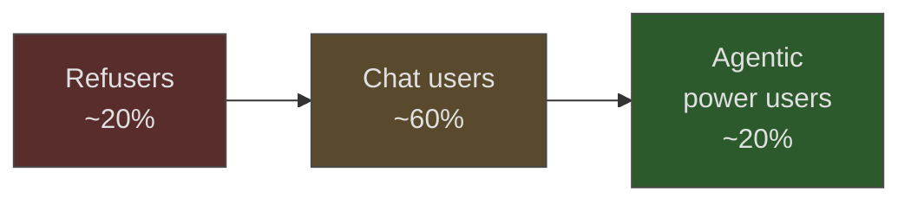

# AI Adoption Footprint: The Segmented Shape of Engineering Orgs

> Engineering orgs do not adopt AI uniformly. Usage concentrates in a small power-user segment, a large chat-tool middle, and a refuser tail — and the shape, not the headline adoption number, is what determines where enablement and tooling investment pays back.

## The Pattern

Steve Yegge's April 2026 post described a Google contact's view as "20% agentic power users, 20% outright refusers, 60% still using Cursor or equivalent chat tool," and claimed "most of the industry has the same internal adoption curve" ([Simon Willison](https://simonwillison.net/2026/Apr/13/steve-yegge/)). Addy Osmani cited "over 40K SWEs use agentic coding weekly" at Google; Demis Hassabis called the post "pure clickbait" ([VentureBeat](https://venturebeat.com/orchestration/google-leaders-including-demis-hassabis-push-back-on-claim-of-uneven-ai-adoption-internally)).

The dispute is about threshold placement, not shape. Weekly agentic headcount and multi-agent orchestration depth are different measurements. Under either, adoption is segmented, not flat.

The exact percentages are one practitioner's estimate; the segmentation pattern is corroborated by independent measurement.

## What the Segmented Data Shows

Headline adoption hides the distribution. The Pragmatic Engineer 2026 survey (~3,000 respondents) reports 95% weekly AI use and 55% regular agent use — but only 15% run five or more tools, and 56% do 70%+ of work with AI against a long tail that does far less ([Pragmatic Engineer](https://newsletter.pragmaticengineer.com/p/ai-tooling-2026)).

DORA 2025 finds 90% adoption with a median two hours/day, and inverts by seniority: juniors adopt fastest, Staff+ have the **lowest adoption rates** yet report the **largest time savings** (4.4 hours/week) ([DORA 2025](https://dora.dev/dora-report-2025/)). Segments reflect what each group extracts, not willingness.

Rob Bowley's read of DX 2025 adds the plateau: "Time savings have plateaued around 4 hours even as adoption climbed from ~50% to 91%" ([Rob Bowley](https://blog.robbowley.net/2025/11/05/findings-from-dxs-2025-report-ai-wont-save-you-from-your-engineering-culture/)). Broad adoption has outrun capability gains — the shape a chat-tool middle produces.

## The Mechanism: Capability Layering

Agentic workflows stack skills — prompt scaffolding, harness design, verification discipline, context engineering — and each layer filters the adopter pool. A 20% power-user ceiling coexists with 95% weekly usage because almost everyone clears the first gate (chat, autocomplete); far fewer clear the gate into multi-agent orchestration.

Yegge's 8-level framework formalizes the stack: tab completion, IDE agents with supervision, IDE-less development, multi-agent orchestration. The architectural break is at Level 5 — one synchronous agent against your context window gives way to multiple agents running asynchronously with their own ([Pragmatic Engineer](https://newsletter.pragmaticengineer.com/p/from-ides-to-ai-agents-with-steve)).

Osmani's "human 30%" supplies the floor mechanism: the tasks the 60% cannot delegate to chat tools — edge-case discovery, review, debugging, cross-team communication — are exactly where agentic workflows pay off, and those workflows require harness skill the middle has not built ([Addy Osmani](https://addyo.substack.com/p/beyond-the-70-maximizing-the-human)).

The refuser segment is not one population. It mixes principled non-adopters, practitioners in domains with weak tool coverage, and engineers under data-egress restrictions.

## Planning Implications

### Enablement Returns Compound in the Middle

Training a refuser to use chat completion and a chat user to design an agent harness both unlock new capability. Training a refuser to design a harness skips a layer and usually fails. Enablement pays back highest in the 60% middle, where the next layer is in reach.

The refuser tail rarely converts under direct investment. Mandates produce surface compliance (license activation, weekly usage) without capability change — the plateau Bowley identifies when adoption climbs but time savings flatline.

### Tooling Decisions Serve One Segment at a Time

Optimizing a harness or CLI for the 20% power users often harms the 60% middle. Default-on agent modes, aggressive context auto-loading, and multi-agent primitives raise the floor for power users and raise the learning curve for chat users. Chat-first defaults make it harder for power users to operate at Level 5+.

Platform teams should know which segment they serve. A tool that "serves everyone" usually serves the 60% and leaves the 20% on personal stacks.

### Measurement Without Self-Reporting Bias

METR found a 39-point perception gap — developers estimated they were 20% faster while running 19% slower ([METR](https://metr.org/blog/2025-07-10-early-2025-ai-experienced-os-dev-study/)). Adoption surveys inherit this. Observable proxies work better:

- **Tool telemetry distribution**: per-engineer agent invocations or tokens consumed. A segmented org shows a heavy-tailed histogram, not a normal curve.
- **Workflow depth signals**: project-level config files (`AGENTS.md`, `CLAUDE.md`, `.cursor/rules`), custom skill or hook definitions — artifacts chat users do not produce.
- **PR-level attribution**: fraction of PRs with agentic-authorship evidence (scaffolded commits, agent-generated test suites), by author.

## When the Pattern Does Not Apply

- **Small teams (< 10 engineers)**: percentages have no statistical meaning; one person shifting segment swings the distribution 10–20%. The shape is a large-org planning input.
- **Domain-specific teams**: ML, systems, and security teams often show higher refuser concentration driven by tool coverage gaps, not identity.
- **Pre-agent-tooling orgs**: orgs without agentic CLIs or IDE agents deployed cannot produce a 20% power-user segment — the ceiling is tooling, not willingness.
- **Heavy-regulation environments**: finance, healthcare, and defense orgs with data-egress restrictions collapse into two modes (air-gapped or unused), not a 20/60/20 curve.

## Key Takeaways

- The three-segment distribution — power users, chat-tool middle, refusers — holds across 2026 sources even as specific percentages are contested.
- Segment boundaries reflect capability layering, not willingness: each step up the stack filters the adopter pool.
- Enablement compounds in the middle; refusers rarely convert under direct investment.
- A tool optimized for the 20% often harms the 60%, and vice versa — platform teams should know which segment they serve.
- Measure with telemetry and workflow artifacts, not self-reporting — the METR perception gap invalidates speed surveys.
- The pattern is a large-org heuristic; small teams, niche domains, pre-agent-tooling stacks, and regulated environments deviate predictably.

## Related

- [AI Abundance Reshapes Software Engineering Identity](../articles/ai-abundance-engineering-identity.md) — the builder-vs-coder fault line that predicts which engineers move up the capability stack
- [Skill Atrophy](skill-atrophy.md) — cognitive offloading mechanism that stalls chat-tool users at the middle segment
- [Bottleneck Migration](bottleneck-migration.md) — why the 20% power users hit a different bottleneck than the 60%
- [Cognitive Load, AI Fatigue, and Sustainable Agent Use](cognitive-load-ai-fatigue.md) — sustainability constraints that cap how long even power users operate at Level 5+
- [AI Development Maturity Model](../workflows/ai-development-maturity-model.md) — granular seven-phase practitioner model that refines the three-segment footprint
