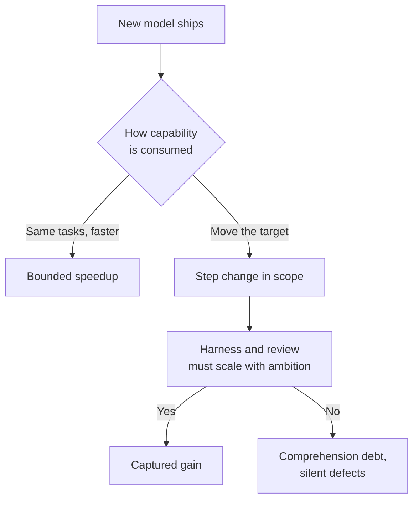

# Ambition Scaling

> When a new model clears a previously-uneconomic task, the right response is usually not "do the same work faster" but "expand what you attempt" — provided the harness, review capacity, and feedback loops scale with the target.

## The Boundary Is an Economic Line

Each developer carries an implicit delegation frontier: tasks on one side are "reasonable to hand to an agent", tasks on the other are "not yet". When a model release moves the frontier, the gain is consumed in one of two ways:

- **Hold ambition constant** — same tasks, faster. Gain is bounded speedup.
- **Move the target** — rescope previously-uneconomic tasks. Gain is a step change in what gets attempted.

Cursor's March 2026 telemetry across 500 companies on Opus 4.5 and GPT-5.2 shows both: weekly messages per user rose 44% immediately, but "high complexity" messages surged **+68% after a 4–6 week lag**, versus only +22% for "low complexity" ([Melas-Kyriazi, 2026](https://cursor.com/blog/better-models-ambitious-work)). The authors frame this as Jevons-paradox-shaped: "gains in efficiency increase total consumption rather than reducing it."

## What Actually Moves

Task growth is domain-asymmetric. Cursor's data shows documentation +62%, architecture +52%, code review +51%, learning +50% — versus UI/styling only +15% ([Melas-Kyriazi, 2026](https://cursor.com/blog/better-models-ambitious-work)). Capability gains accrue first to higher-order work where the prior boundary was set by reasoning, not by typing speed. At the extreme, Cursor's agent scaling report documents multi-week projects previously infeasible becoming tractable: a from-scratch web browser (1M+ lines, 1,000 files), a 3-week framework migration (+266K/−193K) ([Cursor, 2026](https://cursor.com/blog/scaling-agents)).

The underlying capability curve is measurable: METR's time-horizon benchmark shows Claude 3.5 Sonnet (Oct 2024) handled ~21-minute tasks, while Opus 4.6 (Feb 2026) handles ~12-hour tasks — roughly 35x in 16 months ([METR Time Horizon 1.1](https://metr.org/blog/2026-1-29-time-horizon-1-1/)).

## The Audit, Each Release

For each model release, re-sort the task inventory across three buckets. Items shift left as capability rises:

| Bucket | Signal to move up | Evidence required |
|---|---|---|
| **Never delegate** | A comparable open benchmark moves, or a credible case study reports success on adjacent work | Observation, not trial |
| **Trial delegate** | Internal pilot on a single task shows end-to-end completion with review-worthy output | One or more scoped runs |
| **Routine delegate** | Pilot metrics (defect rate, intervention rate) match or beat existing routine work | Instrumented baseline from [Empirical Baseline](empirical-baseline-agentic-config.md) |

The practice, from Anthropic's PM playbook: "deliberately ask [the model] to do things you think are too hard. When they succeed, that's a signal the product needs to catch up" ([Wu, 2026](https://claude.com/blog/product-management-on-the-ai-exponential)). Side quests and short-cycle pilots cost an afternoon; holding a multi-quarter plan on stale assumptions costs more.

## Ambition Requires Harness Investment

Moving the target is not a prompt change. Cursor's 4–6 week discovery lag is where harness rework happens — tests that catch new failure modes, sandboxes that contain broader action scope, review loops that keep pace with larger diffs ([Melas-Kyriazi, 2026](https://cursor.com/blog/better-models-ambitious-work)). This is the supply-side counterpart to [bottleneck migration](bottleneck-migration.md): expanding attempt rate without expanding review capacity converts capability gain into comprehension debt.

[Progressive Autonomy](progressive-autonomy-model-evolution.md) governs the autonomy level at which a task runs; ambition scaling governs task scope at a given level. The dials move independently.

## When Holding Ambition Constant Is Correct

The recommendation to move the target is conditional. Evidence supports holding the line in specific contexts:

- **Mature, high-context codebases with weak harness.** A randomized trial of experienced open-source developers on complex tasks in their own repos found they were **19% slower** with AI, while reporting they felt faster ([METR, 2025](https://metr.org/blog/2025-07-10-early-2025-ai-experienced-os-dev-study/)). Ambition scaling amplifies this penalty.
- **Domains where the last 20% is where risk lives.** The "80% problem" — agents produce 80% of the code, but the remaining 20% requires deep context, architecture, and trade-off judgement ([Osmani, 2026](https://addyo.substack.com/p/the-80-problem-in-agentic-coding)). Security, payments, regulated finance, and medical domains concentrate asymmetric downside in that last 20%.
- **Pre-production orgs.** A March 2026 enterprise survey found 78% of organisations run agent pilots but only 14% scale to production ([DigitalApplied, 2026](https://www.digitalapplied.com/blog/ai-agent-scaling-gap-march-2026-pilot-to-production)). The cap is governance and evaluation infrastructure; chasing ambition before installing evals produces silent failures.
- **Teams already carrying comprehension debt.** Osmani: "the growing gap between how much code exists in your system and how much of it any human being genuinely understands" ([Osmani, 2026](https://addyosmani.com/blog/comprehension-debt/)). Scaling ambition compounds the gap; pay the debt down first.

Bank the speed-up on existing work, invest the savings in harness and review infrastructure, and defer the target move until the feedback loop is strong enough to tell success from silent failure.

## Example

A backend team on Claude Opus 4.5 routinely delegates focused bug fixes and small features (~30-minute tasks, 4.2% defect escape rate). Opus 4.6 ships with METR reporting a 12-hour task horizon.

**Constant-ambition response (rejected):** Push the same task mix through Opus 4.6 and capture a 30% speedup. Total captured gain: one-time throughput bump.

**Ambition-scaling response (applied):**

1. **Task audit, week 1.** The lead re-sorts the backlog. "Never delegate" items like a multi-service refactor move to "trial delegate" based on METR data plus Cursor's published case studies. "Trial delegate" items like end-to-end feature implementations move to "routine delegate".
2. **Harness investment, weeks 2–4.** Before running trials, the team expands the CI harness: cross-service contract tests, a sandboxed staging environment, and PR size caps at 500 LOC (per [bottleneck migration](bottleneck-migration.md)). Review capacity is audited — defect escape rate on the new category must stay within 5% of current routine work or the trial rolls back.
3. **Trial pilots, weeks 5–6.** Three multi-service refactors run as trial delegations. Two succeed end-to-end; one escapes a subtle data consistency bug caught in staging, not in review — the harness does what it was built for.
4. **Promotion, week 7.** Multi-service refactors move to routine delegate. The team publishes the new boundary internally so other leads can trust the calibration.

The captured gain is not a 30% speedup on old work — it is a new category of task the team now routinely delegates, while the old category continues at the pre-release speedup.

## Key Takeaways

- Each model release is a decision point — hold ambition constant and capture a bounded speedup, or move the target and capture a step change
- The capture is delayed: Cursor's telemetry shows a 4–6 week lag before complexity actually migrates, spent on task re-sorting and harness rework ([Melas-Kyriazi, 2026](https://cursor.com/blog/better-models-ambitious-work))
- Task growth is domain-asymmetric — higher-order work (architecture, documentation, review) moves first; UI/styling last
- Hold ambition constant when harness is weak, domain concentrates downside in the last 20%, or comprehension debt already exceeds review capacity
- Ambition scaling and autonomy scaling are independent dials; treat them separately

## Related

- [Progressive Autonomy with Model Evolution](progressive-autonomy-model-evolution.md) — The autonomy-level dial; ambition scaling is the scope dial at a given level
- [PM on the AI Exponential](pm-on-the-ai-exponential.md) — Product-level response to capability step changes; side quests and release-triggered feature revisits
- [The Bottleneck Migration](bottleneck-migration.md) — The review-side counterpart to ambition scaling on the supply side
- [Strategy Over Code Generation](strategy-over-code-generation.md) — Ambition without upstream strategy amplifies the wrong goal
- [Empirical Baseline for Agentic Config](empirical-baseline-agentic-config.md) — Instrumented baseline needed to justify moving tasks between buckets
- [Comprehension Debt](../anti-patterns/comprehension-debt.md) — What accumulates when ambition outruns review
- [Rigor Relocation](rigor-relocation.md) — Harness and verification effort must scale with ambition
- [Process Amplification](process-amplification.md) — Agents amplify whatever process they land in, including ambition decisions
