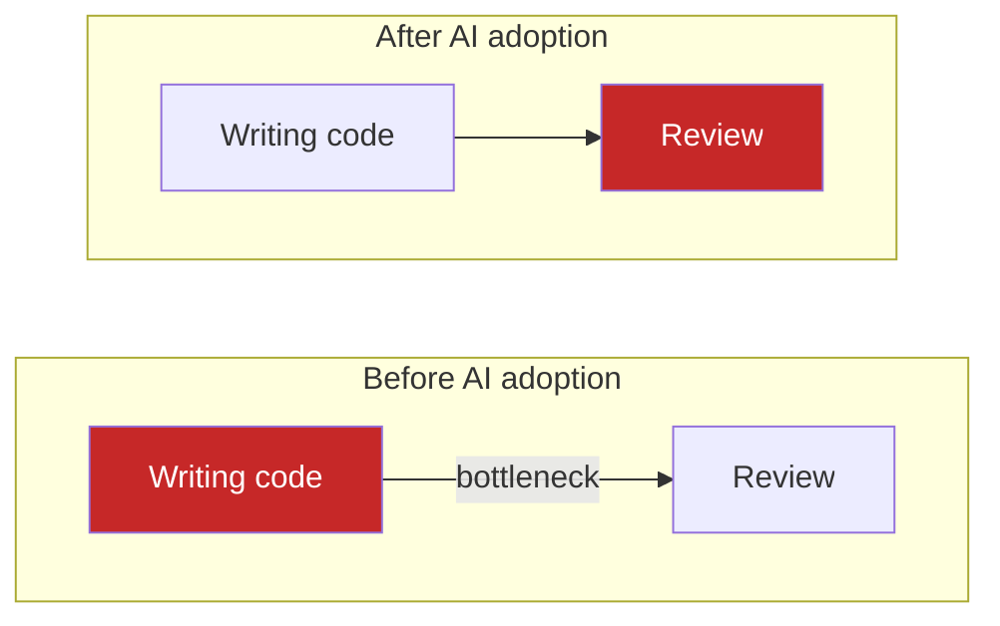
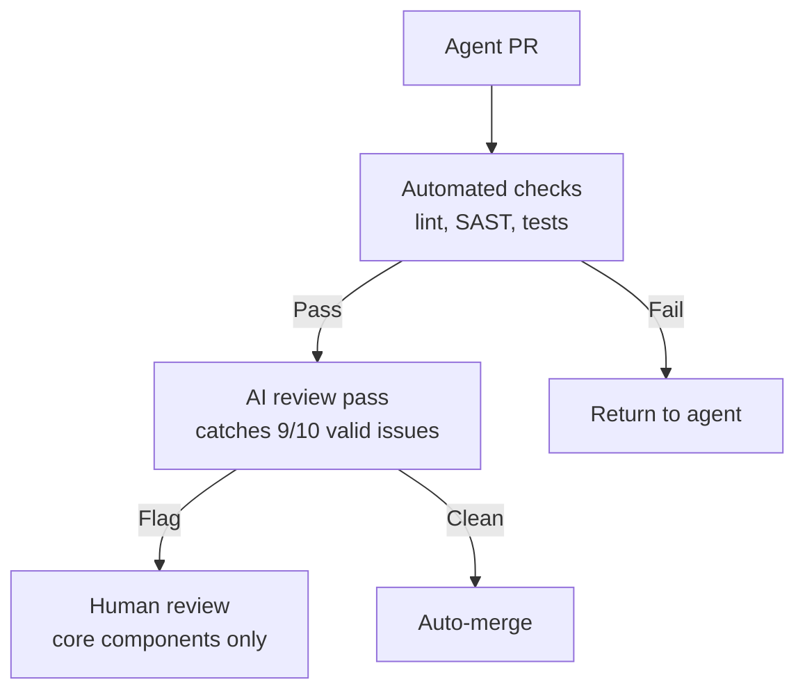

# The Bottleneck Migration

> Code generation is now cheap. Review, verification, and judgment are the new expensive bottleneck. High output volume masks organizational friction -- review time balloons, code size explodes, total workload stays flat.

## The Economics

AI coding tools create a rebound effect: time saved writing is consumed reviewing, verifying, and debugging. The bottleneck migrates.

This is Jevons paradox applied to code: cheaper production leads to more production, consuming freed capacity.

## The Data

| Metric | Change with AI adoption | Source |
|---|---|---|
| PRs merged | +98% | [Faros AI](https://www.faros.ai/ai-productivity-paradox) |
| Review time | +91% | [Faros AI](https://www.faros.ai/ai-productivity-paradox) |
| Average PR size | +154% | [Faros AI](https://www.faros.ai/ai-productivity-paradox) |
| AI-generated issues per PR vs human code | 10.83 vs 6.45 (1.7x) | [CodeRabbit](https://www.coderabbit.ai/blog/state-of-ai-vs-human-code-generation-report) |
| Logic/correctness errors | +75% | [CodeRabbit](https://www.coderabbit.ai/blog/state-of-ai-vs-human-code-generation-report) |
| Security vulnerabilities | +57% | [CodeRabbit](https://www.coderabbit.ai/blog/state-of-ai-vs-human-code-generation-report) |
| Developers who inconsistently verify AI code | 48% | [Sonar](https://www.sonarsource.com/company/press-releases/sonar-data-reveals-critical-verification-gap-in-ai-coding/) |
| Developers who find AI code harder to review | 38% | [Sonar](https://www.sonarsource.com/company/press-releases/sonar-data-reveals-critical-verification-gap-in-ai-coding/) |
| Net workload decrease reported | ~0% | [Atlassian 2025](https://www.atlassian.com/blog/developer/developer-tools-survey-2025) |

Developers report significant time savings on writing tasks, yet aggregate engineering hours stay flat — the time shifts to review and verification rather than disappearing.

## Why the Bottleneck Shifts

The shift occurs because the constraint on software delivery is not a single resource — it is the slowest stage. When AI reduces generation time dramatically, generation stops being the bottleneck. Review, which scales with human attention rather than compute, becomes the new binding constraint. Jevons' original 1865 observation was that cheaper coal energy caused total coal consumption to rise, because lower cost enabled uses previously uneconomic; the same structural dynamic applies: cheaper code generation enables more features, which drive more review load, consuming the freed capacity and then some.

## Why Review Gets Harder

**Volume inflation.** AI generates substantially more code for equivalent tasks — producing boilerplate, error handling, and defensive branches a human author would omit. Review surface area expands accordingly.

**[Comprehension debt](../anti-patterns/comprehension-debt.md).** When agents write code you cannot explain, you accumulate understanding gaps that erode review competence.

**Law of Triviality inversion.** Small changes receive scrutiny; massive AI-generated diffs bypass careful review. See [Law of Triviality in AI PRs](../anti-patterns/law-of-triviality-ai-prs.md).

## Three Response Strategies

### 1. Tiered review

AI handles the first pass; humans review core components and architectural decisions only.

This model emerges naturally when PR volume outpaces reviewer capacity — automation handles the high-frequency, low-stakes review work so human attention concentrates where ownership matters.

### 2. Structural enforcement

Embed verification in the codebase, not in downstream review. Linters, structural tests, and CI gates catch bug classes mechanically -- [harness engineering](../agent-design/agent-harness.md) applied to review. See [Rigor Relocation](rigor-relocation.md).

### 3. Scope discipline

Constrain agent output so it remains reviewable:

- Atomic PRs under 400 LOC — defect detection drops measurably as diff size grows beyond the range a reviewer can hold in working memory ([SmartBear/Cisco study](https://static0.smartbear.co/support/media/resources/cc/book/code-review-cisco-case-study.pdf))
- Diff-first review with abstracted code representation
- Stacked PRs to decouple progress from review

Apply constraints at generation time. See [PR Scope Creep](../anti-patterns/pr-scope-creep-review-bottleneck.md).

## Industry Signals

- **Graphite** built stacked PR and tiered review tooling explicitly in response to agent-generated volume
- **CodeRabbit** launched AI-first review that gates human attention on flagged changes
- **LinearB** [published data](https://linearb.io/resources/software-engineering-benchmarks-report) showing teams with high AI adoption have 4.6x longer review wait times alongside 98% more PRs merged

## When This Backfires

The three strategies impose their own costs:

- **Tiered review adds process overhead.** A CI-based AI review step adds latency to every PR. On small teams with tight feedback loops, this slows junior developers more than it helps senior ones.
- **Scope discipline constrains genuine progress.** Hard LOC caps can fragment logically unified changes, making each atomic PR pass review while the assembled feature remains unreviewed as a whole. Architectural changes that span many files resist artificial splitting.
- **Structural enforcement creates false confidence.** Expanding linter and CI coverage to catch AI-specific bug classes works until the AI learns the lint rules — newer models generate code that passes the gates while still introducing semantic errors the gates were never designed to catch.

Apply these strategies when PR volume visibly strains human review capacity. In low-volume teams or early-stage products where speed of iteration matters more than defect rate, the overhead may exceed the benefit.

## Key Takeaways

- The bottleneck migrates from writing to reviewing -- total workload stays flat
- [Comprehension debt](../anti-patterns/comprehension-debt.md) accumulates when agents write code developers cannot explain
- Combine tiered review, structural enforcement, and scope discipline to manage the shift

## Example

A team using Claude Code to generate features [doubles PR volume](../code-review/agent-pr-volume-vs-value.md) in 30 days. Review cycle time climbs from 4 hours to 9 hours. Total engineering hours stay flat -- the time saved on writing is absorbed by reviewing.

They apply all three strategies in combination:

1. **Tiered review**: Add a CI step that runs an AI reviewer (e.g., `claude -p "review this diff for logic errors"`) and posts a summary comment. Human review is required only for files touching auth, payments, or core data models.
2. **Structural enforcement**: Expand the linter ruleset to catch the bug classes most common in AI output (missing null checks, incorrect async patterns). New CI gates block merges when structural rules fail.
3. **Scope discipline**: Configure the agent to open PRs capped at 300 LOC by splitting tasks at natural boundaries. Stacked PRs (using a tool like Graphite) let review proceed in parallel with continued generation.

After 60 days: review cycle time returns to 5 hours, defect rate drops 30%, and total throughput doubles compared to the pre-AI baseline.

## Related

- [Law of Triviality in AI PRs](../anti-patterns/law-of-triviality-ai-prs.md) -- reviewer psychology with large AI diffs
- [PR Scope Creep](../anti-patterns/pr-scope-creep-review-bottleneck.md) -- stalled PRs compound review bottleneck
- [Rigor Relocation](rigor-relocation.md) -- discipline moves from code to scaffolding
- [Agentic Code Review Architecture](../code-review/agentic-code-review-architecture.md) -- tiered review system design
- [Tiered Code Review](../code-review/tiered-code-review.md) -- AI-first with human escalation
- [Signal Over Volume in AI Review](../code-review/signal-over-volume-in-ai-review.md) -- high-signal over exhaustive comments
- [Agent Harness](../agent-design/agent-harness.md) -- structural enforcement via harness engineering
- [Harness Engineering](../agent-design/harness-engineering.md) -- environments where agents succeed by default
- [Diff-Based Review](../code-review/diff-based-review.md) -- reviewing behavior changes, not raw diffs
- [Attention Management with Parallel Agents](attention-management-parallel-agents.md) -- review capacity in parallel workflows
- [Cognitive Load and AI Fatigue](cognitive-load-ai-fatigue.md) -- review burden on senior engineers
- [Process Amplification](process-amplification.md) -- agents amplify practices including review
- [Skill Atrophy](skill-atrophy.md) -- AI reliance erodes review capabilities
- [AI Abundance Reshapes Software Engineering Identity](../articles/ai-abundance-engineering-identity.md) -- identity shift from bottleneck migration
- [Convenience Loops and AI-Friendly Code](convenience-loops-ai-friendly-code.md) -- AI-friendly patterns reduce review load
- [The Addictive Flow State of Agent-Assisted Development](addictive-flow-agent-development.md) -- flow state reduces scrutiny
- [Safe Command Allowlisting](safe-command-allowlisting.md) -- reducing approval fatigue
- [The Context Ceiling](context-ceiling.md) -- context limits interact with bottleneck migration
- [Distributed Computing Parallels](distributed-computing-parallels.md) -- distributed systems bottleneck analogies
- [Empirical Baseline](empirical-baseline-agentic-config.md) -- managing writing-to-review balance
- [Strategy Over Code Generation](strategy-over-code-generation.md) -- focus shifts from output to strategy
- [Developer Control Strategies](developer-control-strategies-ai-agents.md) -- maintaining oversight as agent output grows
- [Progressive Autonomy](progressive-autonomy-model-evolution.md) -- graduated trust gates review burden
- [Domain-Specific Agent Challenges](domain-specific-agent-challenges.md) -- domain complexity amplifies review load
- [Suggestion Gating](suggestion-gating.md) -- filtering suggestions to reduce review volume
