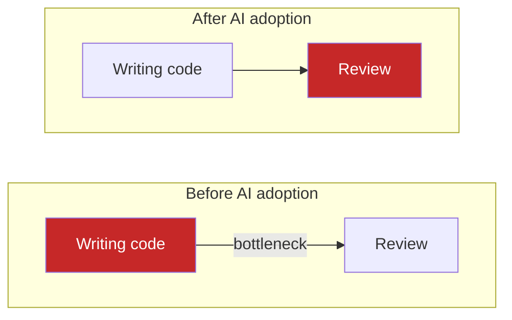
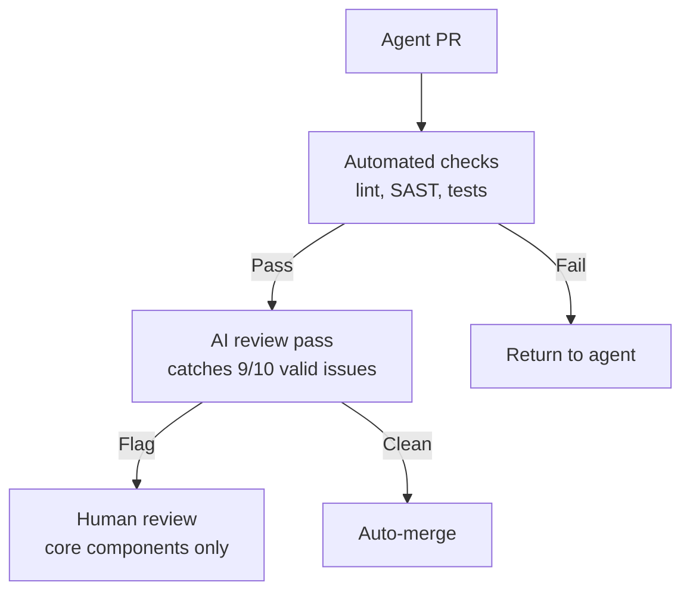

# The Bottleneck Migration

> Code generation is now cheap. Review, verification, and judgment are the new expensive bottleneck. High output volume masks organizational friction -- review time balloons, code size explodes, total workload stays flat.

## The Economics

AI coding tools create a rebound effect: time saved on writing is consumed by reviewing, verifying, and debugging what was written. The bottleneck migrates.

This is Jevons paradox applied to code: cheaper production leads to more production, consuming freed capacity and often exceeding it.

## The Data

| Metric | Change with AI adoption | Source |
|---|---|---|
| PRs merged | +98% | Faros AI |
| Review time | +91% | Faros AI |
| Average PR size | +154% | Faros AI |
| Time reviewing AI suggestion vs human code | 4.3 min vs 1.2 min (3.6x) | LogRocket `[unverified]` |
| AI-generated bugs per 100 PRs | 194 (1.7x human rate) | Stack Overflow `[unverified]` |
| Logic/correctness errors | +75% | Stack Overflow `[unverified]` |
| Security vulnerabilities | +50-100% | Stack Overflow `[unverified]` |
| Developers who inconsistently verify AI code | 48% | Osmani |
| Developers who find AI code harder to review | 38% | Osmani |
| Net workload decrease reported | ~0% | Atlassian 2025 survey |

99% of AI-using developers reported saving 10+ hours weekly, yet most reported no decrease in overall workload `[unverified]` -- the time was reinvested, not recovered.

## Why Review Gets Harder

**Volume inflation.** AI writes 2-6x more code for equivalent tasks `[unverified]`. A REST API endpoint: 186 lines (AI) vs 29 lines (human) `[unverified]`.

**[Comprehension debt](../anti-patterns/comprehension-debt.md).** When agents write code you cannot explain, you accumulate understanding gaps. Review competence decouples from writing ability.

**Law of Triviality inversion.** Small changes receive scrutiny; massive AI-generated diffs bypass careful review. See [Law of Triviality in AI PRs](../anti-patterns/law-of-triviality-ai-prs.md).

## Three Response Strategies

### 1. Tiered review

AI handles the first pass; humans review core components and architectural decisions only.

OpenAI Codex uses this model: "the number of PRs is so large that the traditional PR flow is starting to crack." `[unverified]`

### 2. Structural enforcement

Embed verification in the codebase, not in downstream review. Linters, structural tests, and CI gates catch bug classes mechanically. This is [harness engineering](../agent-design/agent-harness.md) applied to the review problem. See [Rigor Relocation](rigor-relocation.md).

### 3. Scope discipline

Constrain agent output so it remains reviewable:

- Atomic PRs under 400 LOC (the threshold where defect detection drops sharply) `[unverified]`
- Diff-first review with abstracted code representation
- Stacked PRs to decouple progress from review

Constraints apply at generation time, not review time. See [PR Scope Creep](../anti-patterns/pr-scope-creep-review-bottleneck.md).

## Industry Signals

- **Anthropic** shipped Claude Code features addressing the review bottleneck `[unverified]`
- **Cursor** partnered with Graphite, signaling review infrastructure as a strategic constraint `[unverified]`
- **OpenAI** built tiered review into Codex `[unverified]`

## Key Takeaways

- The bottleneck migrates from writing to reviewing -- total workload stays flat despite velocity gains
- [Comprehension debt](../anti-patterns/comprehension-debt.md) accumulates when agents write code developers cannot explain
- Three strategies: tiered review (AI first pass), structural enforcement (harness engineering), scope discipline (constrain output)

## Example

A team using Claude Code to generate features [doubles PR volume](../code-review/agent-pr-volume-vs-value.md) in 30 days. Review cycle time climbs from 4 hours to 9 hours. Total engineering hours stay flat — the time saved on writing is absorbed by reviewing.

They apply all three strategies in combination:

1. **Tiered review**: Add a CI step that runs an AI reviewer (e.g., `claude -p "review this diff for logic errors"`) and posts a summary comment. Human review is required only for files touching auth, payments, or core data models.
2. **Structural enforcement**: Expand the linter ruleset to catch the bug classes most common in AI output (missing null checks, incorrect async patterns). New CI gates block merges when structural rules fail.
3. **Scope discipline**: Configure the agent to open PRs capped at 300 LOC by splitting tasks at natural boundaries. Stacked PRs (using a tool like Graphite) let review proceed in parallel with continued generation.

After 60 days: review cycle time returns to 5 hours, defect rate drops 30%, and total throughput (features shipped) doubles compared to the pre-AI baseline.

## Related

- [Law of Triviality in AI PRs](../anti-patterns/law-of-triviality-ai-prs.md) -- reviewer psychology with large AI diffs
- [PR Scope Creep](../anti-patterns/pr-scope-creep-review-bottleneck.md) -- how stalled PRs compound the review bottleneck
- [Rigor Relocation](rigor-relocation.md) -- engineering discipline moves from code to scaffolding
- [Agentic Code Review Architecture](../code-review/agentic-code-review-architecture.md) -- tiered review system design
- [Tiered Code Review](../code-review/tiered-code-review.md) -- AI-first with human escalation for critical paths
- [Signal Over Volume in AI Review](../code-review/signal-over-volume-in-ai-review.md) -- high-signal feedback over exhaustive commenting
- [Agent Harness](../agent-design/agent-harness.md) -- structural enforcement via harness engineering
- [Harness Engineering](../agent-design/harness-engineering.md) -- designing environments where agents succeed by default
- [Diff-Based Review](../code-review/diff-based-review.md) -- reviewing behavior changes, not raw diffs
- [Attention Management with Parallel Agents](attention-management-parallel-agents.md) -- review capacity as the bottleneck in parallel agent workflows
- [Cognitive Load and AI Fatigue](cognitive-load-ai-fatigue.md) -- how review burden concentrates on senior engineers
- [Process Amplification](process-amplification.md) -- how agents amplify existing engineering practices, including the review bottleneck
- [Skill Atrophy](skill-atrophy.md) -- how AI reliance erodes the review and debugging capabilities needed to handle increased code volume
- [AI Abundance Reshapes Software Engineering Identity](../articles/ai-abundance-engineering-identity.md) -- professional identity consequences of bottleneck migration
- [Convenience Loops and AI-Friendly Code](convenience-loops-ai-friendly-code.md) -- how AI-friendly code patterns reduce review overhead at the source
- [The Addictive Flow State of Agent-Assisted Development](addictive-flow-agent-development.md) -- how flow state reduces the scrutiny applied during review
- [Safe Command Allowlisting](safe-command-allowlisting.md) -- reducing approval fatigue as review volume increases
- [The Context Ceiling](context-ceiling.md) -- how context limits interact with bottleneck migration as agent output scales
- [Distributed Computing Parallels](distributed-computing-parallels.md) -- analogies between distributed systems bottlenecks and agent verification patterns
- [Empirical Baseline](empirical-baseline-agentic-config.md) -- how developers configure AI coding tools to manage the writing-to-review balance
