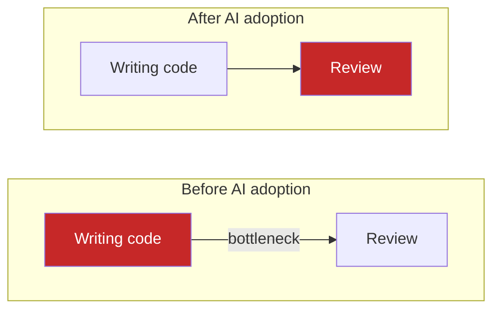
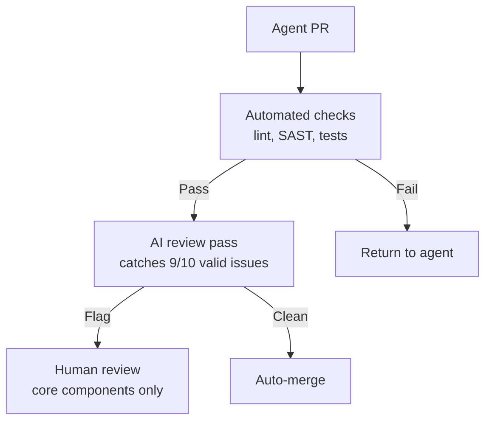

# The Bottleneck Migration

> Code generation is now cheap, so the bottleneck migrates to review, verification, and judgment -- output volume balloons while total workload stays flat.

## The economics

AI coding tools create a rebound effect. The time you save writing code goes into reviewing, verifying, and debugging it. The bottleneck migrates.

```mermaid
flowchart LR
    subgraph Before["Before AI adoption"]
        direction LR
        W1[Writing code] -->|bottleneck| R1[Review]
    end
    subgraph After["After AI adoption"]
        direction LR
        W2[Writing code] --> R2[Review]
    end

    style W1 fill:#c62828,color:#fff
    style R2 fill:#c62828,color:#fff
```

This is Jevons paradox applied to code: cheaper production leads to more production, which consumes the freed capacity. [Ambition scaling](ambition-scaling.md) is the supply-side decision behind that extra production. It moves the task boundary as model capability rises.

## The data

| Metric | Change with AI adoption | Source |
|---|---|---|
| PRs merged | +98% | [Faros AI](https://www.faros.ai/ai-productivity-paradox) |
| Review time | +91% | [Faros AI](https://www.faros.ai/ai-productivity-paradox) |
| Average PR size | +154% | [Faros AI](https://www.faros.ai/ai-productivity-paradox) |
| AI-generated issues per PR vs human code | 10.83 vs 6.45 (1.7x) | [CodeRabbit](https://www.coderabbit.ai/blog/state-of-ai-vs-human-code-generation-report) |
| Logic/correctness errors | +75% | [CodeRabbit](https://www.coderabbit.ai/blog/state-of-ai-vs-human-code-generation-report) |
| Security vulnerabilities | +57% | [CodeRabbit](https://www.coderabbit.ai/blog/state-of-ai-vs-human-code-generation-report) |
| Developers who inconsistently verify AI code | 48% | [Sonar](https://www.sonarsource.com/company/press-releases/sonar-data-reveals-critical-verification-gap-in-ai-coding/) |
| Developers who find AI code harder to review | 38% | [Sonar](https://www.sonarsource.com/company/press-releases/sonar-data-reveals-critical-verification-gap-in-ai-coding/) |
| Net workload decrease reported | ~0% | [Atlassian 2025](https://www.atlassian.com/blog/developer/developer-tools-survey-2025) |

Developers report large time savings on writing tasks, yet total engineering hours stay flat. The time shifts to review and verification rather than disappearing.

## Why the bottleneck shifts

The bottleneck shifts because the constraint on software delivery is the slowest stage, not a single resource. When AI cuts generation time sharply, generation stops being the bottleneck. Review then becomes the binding constraint, because it scales with human attention rather than compute. Rachel Laycock traces the same migration through the software delivery lifecycle in [Conductor Developer](https://martinfowler.com/rachels-ramblings/conductor-developer.html) on martinfowler.com (July 2026).

Laycock puts the same migration in organizational terms, [assigning the work to citizens, agents, and experts](https://martinfowler.com/rachels-ramblings/citizens-agents-experts.html) on martinfowler.com in August 2026: "Citizens build. Agents execute. Experts govern." The [citizen-agent-expert operating model](citizens-agents-experts-operating-model.md) develops that split into who may originate work and where the production gate sits. What is scarce, the piece argues, is "knowing what good looks like, understanding the risks and knowing when something that works is actually safe to trust". On that account experts become "dramatically more leveraged", and their job turns into "creating the environment in which thousands of features can be built safely by other people and by agents".

Which decisions land at the new bottleneck, and on what conditions, is [judgment relocation](judgment-relocation.md).

The same structural dynamic drove Jevons' original 1865 observation. Cheaper coal energy raised total coal consumption, because the lower cost made new uses worthwhile. Cheaper code generation works the same way: it enables more features, which drive more review load, which consumes the freed capacity and then some.

## Why review gets harder

- Volume inflation: AI generates much more code for the same tasks. It produces boilerplate, error handling, and defensive branches a human author would omit, so the review surface area expands.
- [Comprehension debt](../patterns/anti-patterns/comprehension-debt.md): when agents write code you cannot explain, you build up understanding gaps that erode your review competence.
- Law of Triviality inversion: small changes get scrutiny, while large AI-generated diffs bypass careful review. See [Law of Triviality in AI PRs](../patterns/anti-patterns/law-of-triviality-ai-prs.md).

## Three response strategies

### 1. Tiered review

AI handles the first pass; humans review core components and architectural decisions only.

```mermaid
flowchart TD
    A[Agent PR] --> B[Automated checks<br/>lint, SAST, tests]
    B -->|Pass| C[AI review pass<br/>catches 9/10 valid issues]
    C -->|Flag| D[Human review<br/>core components only]
    C -->|Clean| E[Auto-merge]
    B -->|Fail| F[Return to agent]
```

This model emerges when PR volume outpaces reviewer capacity — automation handles the high-frequency, low-stakes review work so human attention concentrates where ownership matters.

### 2. Structural enforcement

Embed verification in the codebase, not in downstream review. Linters, structural tests, and CI gates catch bug classes mechanically -- [harness engineering](../patterns/agent-design/agent-harness.md) applied to review. See [Rigor Relocation](rigor-relocation.md).

### 3. Scope discipline

Constrain agent output so it remains reviewable:

- Atomic PRs under 400 LOC — defect detection drops measurably as diff size grows beyond the range a reviewer can hold in working memory ([SmartBear/Cisco study](https://static0.smartbear.co/support/media/resources/cc/book/code-review-cisco-case-study.pdf))
- Diff-first review with abstracted code representation
- Stacked PRs to decouple progress from review

Apply constraints at generation time. See [PR Scope Creep](../patterns/anti-patterns/pr-scope-creep-review-bottleneck.md).

## Industry signals

- Graphite built stacked-PR and tiered-review tooling in direct response to agent-generated volume
- CodeRabbit launched AI-first review that gates human attention on flagged changes
- LinearB [published benchmark data](https://linearb.io/resources/software-engineering-benchmarks-report) showing teams with high AI adoption have 4.6x longer review wait times alongside 98% more PRs merged

## When this backfires

The three strategies impose their own costs:

- Tiered review adds process overhead. A CI-based AI review step adds latency to every PR. On small teams with tight feedback loops, it slows junior developers more than it helps senior ones.
- [Scope discipline](../patterns/anti-patterns/pr-scope-creep-review-bottleneck.md) constrains genuine progress. Hard LOC caps can fragment logically unified changes, so each atomic PR passes review while the assembled feature stays unreviewed as a whole. Architectural changes that span many files resist artificial splitting.
- [Structural enforcement](../patterns/agent-design/agent-harness.md) creates false confidence. Expanding linter and CI coverage to catch AI-specific bug classes works until the AI learns the lint rules. Newer models generate code that passes the gates while still introducing semantic errors the gates were never designed to catch.

Apply these strategies when PR volume visibly strains human review capacity. In low-volume teams or early-stage products where speed of iteration matters more than defect rate, the overhead may exceed the benefit.

## Key Takeaways

- The bottleneck migrates from writing to reviewing -- total workload stays flat
- [Comprehension debt](../patterns/anti-patterns/comprehension-debt.md) accumulates when agents write code developers cannot explain
- Combine tiered review, structural enforcement, and scope discipline to manage the shift

## Example

A team using Claude Code to generate features [doubles PR volume](../code-review/agent-pr-volume-vs-value.md) in 30 days. Review cycle time climbs from 4 hours to 9 hours. Total engineering hours stay flat -- the time saved on writing is absorbed by reviewing.

They apply all three strategies in combination:

1. Tiered review: add a CI step that runs an AI reviewer (for example, `claude -p "review this diff for logic errors"`) and posts a summary comment. Human review is required only for files touching auth, payments, or core data models.
2. Structural enforcement: expand the linter ruleset to catch the bug classes most common in AI output, such as missing null checks and incorrect async patterns. New CI gates block merges when structural rules fail.
3. Scope discipline: configure the agent to open PRs capped at 300 LOC by splitting tasks at natural boundaries. Stacked PRs (using a tool like Graphite) let review proceed in parallel with continued generation.

After 60 days: review cycle time returns to 5 hours, defect rate drops 30%, and total throughput doubles compared to the pre-AI baseline.

## FAQ

**How much does review load actually grow after AI adoption?**

Teams merge 98% more PRs while review time rises 91% and average PR size grows 154% ([Faros AI](https://www.faros.ai/ai-productivity-paradox)), and benchmark data shows 4.6x longer review wait times where AI adoption is high ([LinearB](https://linearb.io/resources/software-engineering-benchmarks-report)). AI-generated PRs also carry more defects: 10.83 issues per PR against 6.45 for human code ([CodeRabbit](https://www.coderabbit.ai/blog/state-of-ai-vs-human-code-generation-report)).

**What does Jevons paradox have to do with code review?**

Jevons observed in 1865 that cheaper coal energy raised total coal consumption, because the lower cost made new uses worthwhile. Cheaper code generation behaves the same way: it enables more features, which drive more review load, which consumes the freed capacity and then some. The saving is real per task and invisible in aggregate — reported net workload change is roughly zero.

**Why can a hard line-count cap on PRs make review worse?**

Because it fragments logically unified changes. Each atomic PR passes review on its own while the assembled feature is never reviewed as a whole. Architectural changes spanning many files resist artificial splitting. Scope discipline still helps once volume strains reviewer capacity, but apply the constraint at generation time and split at natural boundaries rather than at an arbitrary line count.

## Related

- [Law of Triviality in AI PRs](../patterns/anti-patterns/law-of-triviality-ai-prs.md) -- reviewer psychology with large AI diffs
- [PR Scope Creep](../patterns/anti-patterns/pr-scope-creep-review-bottleneck.md) -- stalled PRs compound review bottleneck
- [Rigor Relocation](rigor-relocation.md) -- discipline moves from code to scaffolding
- [Tiered Code Review](../code-review/tiered-code-review.md) -- AI-first review with human escalation
- [Agentic Code Review Architecture](../code-review/agentic-code-review-architecture.md) -- tiered review system design
- [Comprehension Debt](../patterns/anti-patterns/comprehension-debt.md) -- understanding gaps that erode review competence
- [Cognitive Load and AI Fatigue](cognitive-load-ai-fatigue.md) -- review burden on senior engineers
- [Author-to-Reviewer Role Inversion](author-to-reviewer-role-inversion.md) -- the team-level staffing and measurement shift this economic migration produces
- [Language Selection Scored on Review Cost](language-selection-review-cost.md) -- the technology-selection consequence: score a language on review cost once generation is cheap
