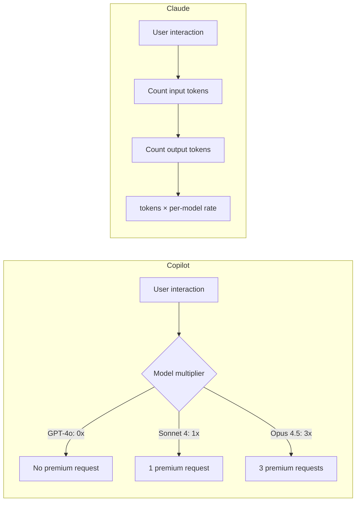
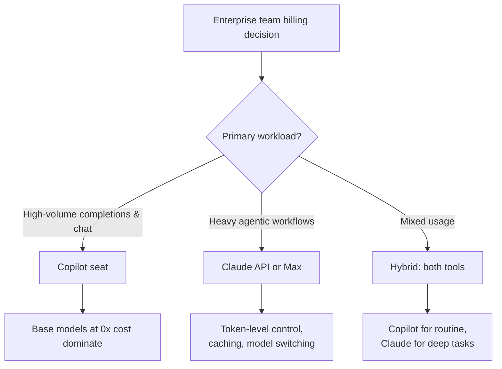

# Copilot vs Claude Billing Semantics

> Copilot bills in abstract "premium requests" with model multipliers; Claude bills per-token or per-seat. Understanding the gap prevents budget surprises when enterprise teams run both tools.

## Two Metering Philosophies

**Copilot: request-level abstraction.** Each interaction counts as one premium request regardless of length. Model choice determines the multiplier, but token volume is invisible to billing.

**Claude: token-level proportionality.** Every input and output token is metered. Caching, batching, and model selection shift the per-token rate, giving direct cost levers.

## Seat Pricing Comparison

| Plan | Price | What You Get |
|------|-------|-------------|
| **Copilot Business** | $19/seat/mo | 300 premium requests/mo, base models unlimited |
| **Copilot Enterprise** | $39/seat/mo | 1,000 premium requests/mo, knowledge bases |
| **Copilot Pro+** | $39/mo | 1,500 premium requests/mo |
| **Claude Team** | $25/seat/mo | Claude.ai access, limited usage |
| **Claude Max 5x** | $100/mo | 5x Pro usage of Claude.ai + Claude Code |
| **Claude Max 20x** | $200/mo | 20x Pro usage of Claude.ai + Claude Code |
| **Claude API** | Per-token | Full control, no seat cap |

## Premium Request Multipliers

| Model | Multiplier (paid plans) | Auto-selection |
|-------|------------------------|----------------|
| GPT-4.1, GPT-4o, GPT-5 mini | 0x (included) | — |
| Claude Sonnet 4 | 1x | 0.9x |
| Claude Opus 4.5/4.6 | 3x | 2.7x |
| o1, Gemini 2.5 Pro | 1x | 0.9x |

**Zero-cost base models are Copilot's key advantage.** GPT-4o and GPT-4.1 consume no premium requests on paid plans. Claude has no equivalent zero-cost tier.

Auto model selection gives a 10% discount ([GitHub Docs: Copilot requests](https://docs.github.com/en/copilot/concepts/billing/copilot-requests)). Overages cost $0.04 per premium request; unused requests reset on the first of each calendar month and do not roll over ([GitHub Docs: Premium requests](https://docs.github.com/en/billing/concepts/product-billing/github-copilot-premium-requests)).

## Claude API Token Pricing

| Model | Input (per MTok) | Output (per MTok) | Cache hits |
|-------|------------------|-------------------|------------|
| Opus 4.6 | $5 | $25 | $0.50 (90% off) |
| Sonnet 4.6 | $3 | $15 | $0.30 (90% off) |
| Haiku 4.5 | $1 | $5 | $0.10 (90% off) |

Batch API cuts costs 50%; [prompt caching](../context-engineering/prompt-caching-architectural-discipline.md) saves up to 90% on cache hits.

Typical Claude Code costs via API: **~$6/developer/day** average, under $12/day for 90% of users ([Anthropic: Manage costs effectively](https://code.claude.com/docs/en/costs)).

## When Each Model Wins

**Copilot seat wins** when most usage is routine completions (GPT-4o at 0x) and predictable billing matters.

**Claude API/Max wins** when agentic workflows dominate or workloads are spiky — billing scales to zero when idle.

**Hybrid** is the default: Copilot for completions, Claude for agentic sessions.

## Cost Management Levers

| Lever | Copilot | Claude |
|-------|---------|--------|
| Model selection | Choose via multiplier | Switch mid-session |
| Spend limits | Monthly quota only | Per-org limits |
| Rate limiting | Not configurable | TPM/RPM per org |
| Caching | Not exposed | Prompt caching (90% savings) |
| Batch discounts | Not available | 50% via Batch API |
| Idle cost | Seat cost regardless | Scales to zero |

## Agentic Session Billing

Copilot coding agent sessions consume 1 premium request per session (multiplied by model rate); autonomous tool calls within a session do not add additional premium requests ([GitHub community: Coding Agent now uses one Premium Request per session](https://github.com/orgs/community/discussions/165798)). Coding agent and Spark use separate SKUs tracked from November 2025.

Claude Code sessions are billed by total tokens consumed — costs scale with codebase size and conversation length.

## Example

**Scenario:** 10 developers, 22 working days, mixed workload: 80% routine completions and chat, 20% agentic coding sessions.

### Copilot Enterprise — $390/month (10 × $39)

| Usage type | Model | Multiplier | Sessions/dev/day | Monthly premium requests |
|-----------|-------|-----------|-----------------|--------------------------|
| Routine completions & chat | GPT-4o | 0× | ~40 | 0 (free) |
| Agentic sessions | Claude Sonnet 4 | 1× | ~3 | 660 |
| **Total** | | | | **660 of 10,000 quota** |

$390/month flat. 9,340 premium requests unused.

### Claude API — ~$1,200–1,500/month

Using the $6/dev/day average from typical Claude Code usage:
10 developers × $6/day × 22 days = **$1,320/month** (uncached, all agentic).
With prompt caching covering repeated system prompts: ~$900–1,000/month.

### Hybrid — ~$430/month

- Copilot Business (routine completions): 10 × $19 = **$190/month**
- Claude API (agentic 20% of sessions): ~**$240/month** ($1.20/dev/day on focused tasks)
- Total: **~$430/month**

**The takeaway:** Copilot's 0× base models absorb routine work at no marginal cost. Claude API adds token-level control where it matters — the 20% of sessions where agentic depth justifies the metering overhead. A pure Claude API setup costs 3–4× more unless usage is predominantly agentic.

## When This Backfires

**Copilot overages spike with premium model adoption.** Teams that shift even a fraction of routine usage to Claude Opus (3× multiplier) or o1 can exhaust monthly premium request quotas before mid-month. The 0× base model advantage disappears if GPT-4o is deprecated, repriced, or policy-restricted at your organization.

**Managing two billing models adds overhead.** Hybrid setups (Copilot seat + Claude API) require separate cost dashboards, budget owners, and approval workflows. For teams below ~10 developers or shops running purely agentic workloads, the operational cost of dual vendors may exceed any savings.

**Token-level billing is unpredictable for spiky teams.** Claude API costs scale with codebase size and conversation length, not headcount. A single large refactor or multi-hour agentic session can cost $50–100 alone. Teams without per-developer spend limits risk unexpected monthly totals.

**Idle seat cost is unavoidable with Copilot.** Developers on leave, onboarding, or working in non-IDE contexts still consume seat fees. Claude API, which scales to zero when idle, is more economical for contractors or teams with variable active developer counts.

## Related

- [Cost-Aware Agent Design](../agent-design/cost-aware-agent-design.md)
- [GitHub Copilot: Model Selection & Routing](../training/copilot/model-selection.md) — multipliers, Auto mode discount, cascade routing
- [Cross-Tool Translation](cross-tool-translation.md)
- [Copilot Spaces (Context Curation)](../tools/copilot/copilot-spaces.md)
