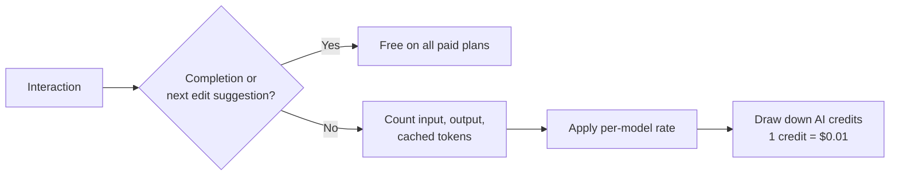

# Copilot vs Claude Billing Semantics

> Copilot and Claude both meter tokens now; a Copilot seat fee buys included credits, governance, and free completions, not cheaper tokens.

## The metering models converged

On 1 June 2026 GitHub replaced premium request units with GitHub AI Credits. The cost of an interaction now depends on the model and the number of input, output, and cached tokens it consumes, priced at the listed API rates for that model ([GitHub: Copilot is moving to usage-based billing](https://github.blog/news-insights/company-news/github-copilot-is-moving-to-usage-based-billing/)). One AI credit equals $0.01 ([GitHub Docs: Models and pricing](https://docs.github.com/en/copilot/reference/copilot-billing/models-and-pricing)).

Request quotas and model multipliers are gone. They survive only for Pro and Pro+ subscribers mid-way through an annual plan on 1 June, who drop to Copilot Free when it ends ([GitHub Docs: What changed with billing](https://docs.github.com/en/copilot/reference/copilot-billing/request-based-billing-legacy/what-changed-with-billing)).

Code completions and next edit suggestions are the exception: they consume no AI credits and stay unlimited on every paid plan.

```mermaid
flowchart LR
    A[Interaction] --> B{Completion or<br/>next edit suggestion?}
    B -->|Yes| C[Free on all paid plans]
    B -->|No| D[Count input, output,<br/>cached tokens]
    D --> E[Apply per-model rate]
    E --> F[Draw down AI credits<br/>1 credit = $0.01]
```

## Seat pricing and included usage

At standard rates, included credits are denominated at exactly the seat price, so a paid seat is a floor on spend rather than a discount on it. The promotional allowances running to 1 September 2026 break that parity in the buyer's favor: a $19 Business seat currently carries $30 of credits.

| Plan | Price | Included credits/month | Notes |
|------|-------|------------------------|-------|
| Copilot Pro | $10/mo | 1,000 base + 500 flex | Individual |
| Copilot Pro+ | $39/mo | 3,900 base + 3,100 flex | Individual |
| Copilot Business | $19/user/mo | 1,900/user | 3,000/user promotionally, 1 June–1 Sept 2026 |
| Copilot Enterprise | $39/user/mo | 3,900/user | 7,000/user promotionally, same window |
| Claude Pro | $20/mo ($17 annual) | Per-seat allowance | Rolling 5-hour + weekly windows |
| Claude Team | $25/seat/mo standard; $125 premium | Per-seat allowance | Premium seat is 5× standard |
| Claude API | Per-token | None | No seat floor; scales to zero |

Sources: [GitHub Docs: Usage-based billing for organizations](https://docs.github.com/en/copilot/concepts/billing/usage-based-billing-for-organizations-and-enterprises), [GitHub Docs: Usage-based billing for individuals](https://docs.github.com/en/copilot/concepts/billing/usage-based-billing-for-individuals), [Claude: Plans and pricing](https://claude.com/pricing).

## Token rates are near-identical

Because Copilot bills at published API rates, the same Claude model costs roughly the same through either channel.

| Model | Copilot: input / cached / output (per MTok) | Anthropic API: input / output |
|-------|--------------------------------------------|-------------------------------|
| Claude Haiku 4.5 | $1.00 / $0.10 / $5.00 | $1.00 / $5.00 |
| Claude Sonnet 5 | $2.00 / $0.20 / $10.00 | $3.00 / $15.00 list; $2.00 / $10.00 through 31 Aug 2026 |
| Claude Opus 5 | $5.00 / $0.50 / $25.00 | $5.00 / $25.00 |
| GPT-5 mini | $0.25 / $0.025 / $2.00 | — |
| GPT-5.4 | $2.50 / $0.25 / $15.00 | — |
| Gemini 2.5 Pro | $1.25 / $0.125 / $10.00 | — |

Cached input is discounted 90% on both sides. Copilot's Sonnet 5 rate currently matches Anthropic's introductory price; if it tracks list pricing after 31 August, that line rises by half.

Copilot's own lever is [auto model selection](../patterns/agent-design/auto-model-selection.md), which takes 10% off model costs on individual plans. Anthropic's levers are the Batch API (50% off) and explicit [prompt caching](../context-engineering/prompt-caching-architectural-discipline.md) control; Copilot applies caching automatically but publishes no batch tier and exposes no cache-TTL setting.

## What the seat fee buys

Three things, none of them a token discount.

### Pooled allowances

Business and Enterprise credits pool at the billing entity, not per user — 100 Business seats give one 190,000-credit pool. Adding licenses grows it immediately; removals apply next cycle. Nothing rolls over: the pool resets at 00:00:00 UTC on the first of each month and unused credits are forfeited.

### Budget controls

Limits can be set at user, cost-center, organization, and enterprise level. When the pool is exhausted, policy decides whether usage continues at published rates or is blocked until the next cycle.

### The wrapper

GitHub enumerates what direct API access leaves a team to build for itself: prompts, retrieval, routing, retry logic, logging, security model, and billing controls ([GitHub: Copilot vs raw API access](https://github.blog/ai-and-ml/github-copilot/copilot-vs-raw-api-access-what-are-you-actually-paying-for/)). Now that the token rates match, that engineering — plus unlimited completions — is what the seat premium actually covers.

## Cost management levers

| Lever | Copilot | Claude |
|-------|---------|--------|
| Model selection | Per-model rate; 10% auto-selection discount | Switch mid-session |
| Spend limits | User, cost center, org, enterprise | Per-org, per-workspace, per-member |
| Rate limiting | Not configurable | TPM/RPM per org |
| Caching | Automatic, 90% off cached input | Explicit control, 90% off cached reads |
| Batch discounts | None published | 50% via Batch API |
| Idle cost | Seat fee regardless of usage | API scales to zero |
| Unused allowance | Forfeited monthly | No allowance to forfeit on API |

## Example

Ten developers, 22 active days, agentic coding. Anthropic reports Claude Code averaging about $13 per developer per active day across enterprise deployments ([Anthropic: Manage costs effectively](https://code.claude.com/docs/en/costs)); assume a Copilot team drives an equivalent workload. Monthly spend: 10 × 22 × $13 = $2,860, or 286,000 AI credits.

| Channel | Included | Metered | Total |
|---------|----------|---------|-------|
| Copilot Business | 19,000 credits ($190 of seats) | $2,670 | $2,860 |
| Copilot Enterprise | 39,000 credits ($390 of seats) | $2,470 | $2,860 |
| Copilot Business, promotional | 30,000 credits | $2,560 | $2,750 |
| Claude API | — | $2,860 | $2,860 |

The three standard-rate rows land in the same place, because included credits are priced at exactly the seat fee; only the promotional allowance, which expires on 1 September 2026, breaks the tie. The comparison only separates at the edges: below the allowance a Copilot seat is a floor you pay anyway, while API spend scales to zero; above it, Anthropic's batch and caching levers have no Copilot equivalent.

## Agentic session billing

Both tools bill agentic work by total tokens, so cost scales with codebase size and session length, not session count. Copilot's old flat rates — one premium request per coding agent session, four per Spark prompt, 13 per code review — apply only on legacy plans. The [cost-aware design](../token-engineering/cost-aware-agent-design.md) levers are now identical on both sides.

## When this backfires

Forfeited allowances punish uneven teams. A pooled Business allowance resets monthly with no rollover, so a team that under-uses in July and over-runs in August pays the overage in full. Variable-headcount and contractor-heavy teams pay a seat floor for developers who are on leave or not in an IDE.

Rate parity is not a guarantee. Copilot's published rates track upstream API pricing, which moves — the Sonnet 5 line is currently an introductory rate. A comparison built on today's table needs re-checking at each price change, not annually.

Token-level billing is unpredictable for spiky teams. A single large refactor or multi-hour session can dominate a day's spend; without per-user limits, monthly totals are hard to forecast on either side.

Running both still adds overhead — separate dashboards, budget owners, approval workflows. For teams under roughly ten developers that overhead can exceed any saving, now that the rates converge.

## Key Takeaways

- Copilot has metered tokens, not requests, since 1 June 2026; premium request units and model multipliers are legacy.
- One AI credit is $0.01, and each plan's included credits equal its seat price — the seat is a spend floor, not a discount.
- Copilot bills Claude models at published API rates, so channel choice no longer changes the token bill materially.
- Copilot's differentiators are unlimited completions, pooled allowances, tiered budget controls, and the wrapper; Anthropic's are batch pricing, explicit caching, and scaling to zero.
- Included credits expire monthly with no rollover, which penalizes uneven usage.

## Related

- [Cost-Aware Agent Design](../token-engineering/cost-aware-agent-design.md)
- [GitHub Copilot: Model Selection & Routing](../training/copilot/model-selection.md) — model choice and routing under the new rates
- [Cross-Tool Translation](cross-tool-translation.md)
- [Copilot Spaces (Context Curation)](../tools/copilot/copilot-spaces.md)
