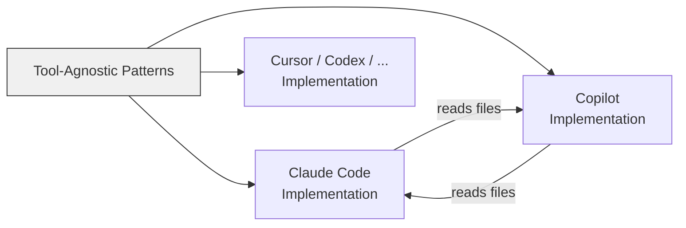

# Cross-Tool Translation: Learning from Multiple AI Assistants

> Open standards and shared file formats make agentic patterns portable across AI coding tools — learn concepts once, apply them everywhere.

Cross-tool translation means learning agentic concepts from the clearest documentation available — regardless of which tool wrote it — then applying them in every AI assistant you use. Two open standards ([Agent Skills](https://agentskills.io) and [AGENTS.md](https://agents.md)) and cross-tool file compatibility make skills and instruction files portable across 30+ tools.

## Open Standards Enable Portability

Two formal standards make cross-tool translation concrete:

**Agent Skills (agentskills.io)** — Adopted by 30+ tools (Claude Code, Copilot, VS Code, Cursor, Codex, Gemini CLI, Junie, Roo Code, Goose). A single `SKILL.md` works across all compatible agents.

**AGENTS.md** — Under the Linux Foundation's Agentic AI Foundation, supported by 20+ platforms. Provides build steps, test commands, and conventions to any agent.

## Cross-Tool File Compatibility

Tools actively read each other's configuration files:

- **VS Code reads `.claude/agents/*.md`** — maps Claude-specific tool names to its own system, so one agent definition works in both
- **Copilot reads `.claude/skills/`** — discovers skills in Claude's directories alongside `.github/skills/` paths
- **MCP servers** — both Claude Code and Copilot support the Model Context Protocol using the same server ecosystem

Investing in one tool's configuration format yields benefits across multiple tools.

## Terminology Translation Table

The same underlying patterns use different names across tools:

| Concept | Claude Code | GitHub Copilot | Cross-Tool Standard |
|---|---|---|---|
| Project instructions | `CLAUDE.md` | `.github/copilot-instructions.md` | `AGENTS.md` |
| Custom agents | `.claude/agents/*.md` | `.agent.md` / VS Code custom agents | — |
| Reusable skills | `.claude/skills/SKILL.md` | `.github/skills/SKILL.md` | [Agent Skills](https://agentskills.io) |
| Lifecycle hooks | `settings.json` hook events | `hooks.json` (`sessionStart`, `sessionEnd`) | — |
| Tool extensibility | MCP servers | MCP servers | [MCP Protocol](../standards/mcp-protocol.md) |
| Task delegation | [Sub-agents](../tools/claude/sub-agents.md) | [Agent mode](../tools/copilot/agent-mode.md) with tools | Isolated task delegation |
| Multi-agent coordination | [Agent teams](../tools/claude/agent-teams.md) | No equivalent yet | Coordinated composition |

Both agent and skill definitions use markdown with YAML frontmatter — the format is converging even where no formal standard exists.

## Learning from the Best Docs

Claude Code's docs explain sub-agents with clear semantics; Copilot's docs excel at configuration specifics.

- **Concept unclear?** Read whichever tool documents it best
- **Need configuration?** Use your target tool's reference material
- **Patterns transfer** — [context engineering](../context-engineering/context-engineering.md) principles ([prompt altitude](../instructions/system-prompt-altitude.md), JIT loading, sub-agent architectures) apply identically across tools



## Asking the Tool to Translate

AI assistants can perform concept translation directly:

```text
In Copilot, .github/copilot-instructions.md sets project-wide behavior.
What's the Claude Code equivalent and what differences should I expect?
```

The assistant maps `CLAUDE.md` to the instructions file and explains additional capabilities. This works because the underlying architecture is shared [unverified].

## Anti-Pattern: Isolated Learning

The failure mode is learning each tool in a silo without recognizing you are learning the same patterns twice. Teams that cross-pollinate documentation report faster ramp-up because they recognize patterns rather than learning from scratch [unverified].

## Gaps in Translation

Not all concepts have equivalents:

- **Agent teams** (multi-agent coordination with shared task lists) exist in Claude Code but have no Copilot equivalent yet
- **Hooks** have similar concepts across tools but different event models
- Translation works best for foundational patterns; advanced features may remain tool-specific

## Example

A team writes a `SKILL.md` for their deployment checklist in Claude Code:

```markdown
---
name: deploy-checklist
description: Run pre-deploy checks and push to staging
tools: [Bash, Read]
---

# Deploy Checklist

1. Run `npm test` and confirm all tests pass
2. Run `npm run lint` with zero warnings
3. Check `CHANGELOG.md` has an entry for the current version
4. Build with `npm run build` and confirm no errors
5. Push to staging branch: `git push origin HEAD:staging`
```

The same file works without modification in Copilot, Cursor, and any Agent Skills-compatible tool. When the team switches to Copilot for a project, they run:

```text
We use this SKILL.md for deploys in Claude Code. Walk me through
how Copilot discovers and runs it, and flag any behavioral differences.
```

Copilot finds the skill in `.claude/skills/` (or `.github/skills/`), maps `Bash` and `Read` to its own tool names, and executes the same steps. The team learns deploy automation once and applies it across every tool in their stack.

## Key Takeaways

- **Open standards make skills and agents portable** — Agent Skills and AGENTS.md work across 30+ tools without modification
- **Tools read each other's files** — VS Code reads `.claude/agents/`, Copilot discovers `.claude/skills/`
- **Learn concepts, not tool syntax** — [context engineering](../context-engineering/context-engineering.md) principles apply regardless of which tool runs them
- **Use AI assistants to translate** — ask the tool itself to map concepts between ecosystems

## Sources

- [Agent Skills open standard](https://agentskills.io) — Cross-tool skill portability spec, adopted by 30+ AI coding tools
- [AGENTS.md open standard](https://agents.md) — Cross-tool project instruction format under the Linux Foundation
- [Claude Code: Sub-agents](https://code.claude.com/docs/en/sub-agents) — Isolated task delegation, context preservation, tool restrictions
- [Claude Code: Agent teams](https://code.claude.com/docs/en/agent-teams) — Experimental parallel agent coordination
- [GitHub Copilot: Agent skills](https://docs.github.com/en/copilot/concepts/agents/about-agent-skills) — Copilot's implementation of Agent Skills
- [VS Code: Custom agents](https://code.visualstudio.com/docs/copilot/customization/custom-agents) — Reads `.claude/agents/` format
- [Anthropic: Context engineering for AI agents](https://www.anthropic.com/engineering/effective-context-engineering-for-ai-agents) — Tool-agnostic patterns

## Unverified Claims

- AI assistants mapping cross-tool concepts accurately because the underlying architecture is shared [unverified]
- Teams that cross-pollinate documentation spending less time on ramp-up [unverified]

## Related

- [Copilot vs Claude Billing Semantics](copilot-vs-claude-billing-semantics.md)
- [Initiatives and Community](initiatives-community.md)
- [Instruction File Ecosystem](../instructions/instruction-file-ecosystem.md)
- [Agent Skills Standard](../standards/agent-skills-standard.md)
- [AGENTS.md Standard](../standards/agents-md.md)
- [Cognitive Load and AI Fatigue](cognitive-load-ai-fatigue.md)
- [Context Ceiling](context-ceiling.md)
