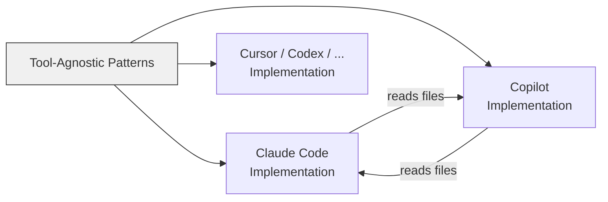

# Cross-Tool Translation: Learning from Multiple AI Assistants

> Open standards and shared file formats make agentic patterns portable across AI coding tools — learn concepts once, apply them everywhere.

Cross-tool translation is the practice of learning agentic concepts from the clearest documentation available — regardless of which tool wrote it — then applying those concepts across every AI assistant you use. Two open standards ([Agent Skills](https://agentskills.io) and [AGENTS.md](https://agents.md)) and explicit cross-tool file compatibility now make this more than a learning technique: skills, agents, and instruction files are literally portable across 30+ tools.

## Open Standards Enable Portability

Two formal standards have emerged that make cross-tool translation concrete rather than conceptual:

**Agent Skills (agentskills.io)** — Originally developed by Anthropic, now adopted by 30+ tools including Claude Code, GitHub Copilot, VS Code, Cursor, OpenAI Codex, Gemini CLI, JetBrains Junie, Roo Code, and Goose. A single `SKILL.md` file works across all compatible agents without modification.

**AGENTS.md** — Stewarded by the Agentic AI Foundation under the Linux Foundation. Works with 20+ platforms including Copilot, Claude Code, Codex, Cursor, Devin, and Windsurf. A single `AGENTS.md` file provides build steps, test commands, and conventions to any agent.

These standards mean cross-tool knowledge transfer is not just a learning strategy — it is a write-once-run-anywhere capability for agent configuration.

## Cross-Tool File Compatibility

Beyond standards, tools actively read each other's configuration files:

- **VS Code reads `.claude/agents/*.md`** — VS Code maps Claude-specific tool names to its own tool system, so a single agent definition works in both Claude Code and VS Code Copilot without modification
- **Copilot reads `.claude/skills/`** — Copilot discovers skills stored in Claude's directories (`.claude/skills/`) alongside its own `.github/skills/` and `.agents/skills/` paths. Personal skills at `~/.claude/skills/` are also discovered
- **MCP servers** — Both Claude Code and Copilot support the Model Context Protocol for tool extensibility using the same server ecosystem

This convergence means investing in one tool's configuration format often yields benefits across multiple tools automatically.

## Terminology Translation Table

The same underlying patterns use different names across tools:

| Concept | Claude Code | GitHub Copilot | Cross-Tool Standard |
|---|---|---|---|
| Project instructions | `CLAUDE.md` | `.github/copilot-instructions.md` | `AGENTS.md` |
| Custom agents | `.claude/agents/*.md` | `.agent.md` / VS Code custom agents | — |
| Reusable skills | `.claude/skills/SKILL.md` | `.github/skills/SKILL.md` | [Agent Skills](https://agentskills.io) |
| Lifecycle hooks | `settings.json` hook events | `hooks.json` (`sessionStart`, `sessionEnd`) | — |
| Tool extensibility | MCP servers | MCP servers | [MCP Protocol](../standards/mcp-protocol.md) |
| Task delegation | [Sub-agents](../tools/claude/sub-agents.md) | [Agent mode](../tools/copilot/agent-mode.md) with tools | Isolated task delegation |
| Multi-agent coordination | [Agent teams](../tools/claude/agent-teams.md) | No equivalent yet | Coordinated composition |

Both agent and skill definitions use markdown with YAML frontmatter and support tool restrictions and model selection — the format is converging even where no formal standard exists.

## Learning from the Best Docs

Documentation quality varies by concept and tool. Claude Code's docs explain sub-agents with clear semantics: isolated context, explicit task boundaries, and result handoff. Copilot's docs excel at configuration specifics and workflow integration.

The productive approach:

- **Concept unclear?** Read whichever tool documents it most thoroughly
- **Need configuration?** Use your target tool's reference material
- **Patterns transfer** — [context engineering](../context-engineering/context-engineering.md) principles (prompt altitude, JIT loading, compaction, sub-agent architectures) apply identically across tools



## Asking the Tool to Translate

AI assistants can perform concept translation directly:

```text
In Copilot, .github/copilot-instructions.md sets project-wide behavior.
What's the Claude Code equivalent and what differences should I expect?
```

The assistant maps `CLAUDE.md` to the instructions file and explains additional capabilities (tool permissions, memory files). This technique works because the underlying architecture is shared [unverified].

## Anti-Pattern: Isolated Learning

The failure mode is learning each tool in a silo — Copilot knowledge in the Copilot mental box, Claude knowledge in the Claude box — without recognizing that you are learning the same patterns twice. Teams that cross-pollinate documentation report faster ramp-up because they recognize patterns rather than learning them from scratch [unverified].

## Gaps in Translation

Not all concepts have equivalents in every tool:

- **Agent teams** (multi-agent coordination with shared task lists and inter-agent messaging) exist in Claude Code but have no Copilot equivalent yet
- **Hooks** have similar concepts across tools but different event models — Claude Code exposes 27+ hook events; Copilot's model is simpler
- Translation works best for foundational patterns; advanced features may remain tool-specific

## Key Takeaways

- **Open standards make skills and agents portable** — Agent Skills and AGENTS.md work across 30+ tools without modification, turning cross-tool learning into write-once configuration
- **Tools already read each other's files** — VS Code reads `.claude/agents/`, Copilot discovers `.claude/skills/`, reducing the cost of multi-tool setups
- **Learn concepts, not tool syntax** — context engineering principles (prompt altitude, JIT loading, sub-agent isolation) apply identically regardless of which tool executes them
- **Use AI assistants to translate** — ask the tool itself to map concepts between ecosystems when switching tools

## Sources

- [Agent Skills open standard](https://agentskills.io) — Cross-tool skill portability spec, adopted by 30+ AI coding tools
- [AGENTS.md open standard](https://agents.md) — Cross-tool project instruction format under the Linux Foundation
- [Claude Code: Sub-agents](https://code.claude.com/docs/en/sub-agents) — Isolated task delegation, context preservation, tool restrictions
- [Claude Code: Agent teams](https://code.claude.com/docs/en/agent-teams) — Experimental parallel agent coordination
- [GitHub Copilot: Agent skills](https://docs.github.com/en/copilot/concepts/agents/about-agent-skills) — Copilot's implementation of Agent Skills
- [VS Code: Custom agents](https://code.visualstudio.com/docs/copilot/customization/custom-agents) — Reads `.claude/agents/` format
- [Anthropic: Context engineering for AI agents](https://www.anthropic.com/engineering/effective-context-engineering-for-ai-agents) — Tool-agnostic patterns

## Unverified Claims

- AI assistants mapping cross-tool concepts accurately because the underlying architecture is shared [unverified]
- Teams that cross-pollinate documentation spending less time on ramp-up [unverified]

## Related

- [Copilot vs Claude Billing Semantics](copilot-vs-claude-billing-semantics.md)
- [Initiatives and Community](initiatives-community.md)
- [Instruction File Ecosystem](../instructions/instruction-file-ecosystem.md)
- [Agent Skills Standard](../standards/agent-skills-standard.md)
- [AGENTS.md Standard](../standards/agents-md.md)
