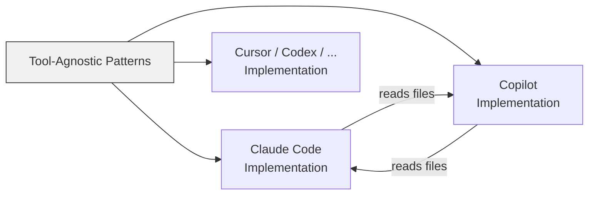

# Cross-Tool Translation: Learning from Multiple AI Assistants

> Open standards and shared file formats make agentic patterns portable across AI coding tools — learn concepts once, apply them everywhere.

Cross-tool translation means learning agentic concepts from the clearest documentation available, regardless of which tool wrote it. You then apply them in every AI assistant you use. Two open standards ([Agent Skills](https://agentskills.io) and [AGENTS.md](https://agents.md)) and cross-tool file compatibility make skills and instruction files portable across 30+ tools.

## Open standards enable portability

Two formal standards make cross-tool translation concrete:

Agent Skills (agentskills.io) is adopted by 30+ tools: Claude Code, Copilot, VS Code, Cursor, Codex, Gemini CLI, Junie, Roo Code, and Goose. A single `SKILL.md` works across all compatible agents.

AGENTS.md sits under the Linux Foundation's Agentic AI Foundation, supported by 20+ platforms. It gives any agent build steps, test commands, and conventions.

## Cross-tool file compatibility

Tools read each other's configuration files:

- VS Code reads `.claude/agents/*.md` and maps Claude-specific tool names to its own system, so one agent definition works in both
- Copilot reads `.claude/skills/` and discovers skills in Claude's directories alongside `.github/skills/` paths
- Both Claude Code and Copilot support the Model Context Protocol using the same set of servers

Configure one tool's format and the work pays off across several tools.

## Terminology translation table

The same underlying patterns use different names across tools:

| Concept | Claude Code | GitHub Copilot | Cross-Tool Standard |
|---|---|---|---|
| Project instructions | `CLAUDE.md` | `.github/copilot-instructions.md` | `AGENTS.md` |
| Custom agents | `.claude/agents/*.md` | `.agent.md` / VS Code custom agents | — |
| Reusable skills | `.claude/skills/SKILL.md` | `.github/skills/SKILL.md` | [Agent Skills](https://agentskills.io) |
| Lifecycle hooks | `settings.json` hook events | `hooks.json` (`sessionStart`, `sessionEnd`) | — |
| Tool extensibility | MCP servers | MCP servers | [MCP Protocol](../standards/mcp-protocol.md) |
| Task delegation | [Sub-agents](../tools/claude/sub-agents.md) | [Agent mode](../tools/copilot/agent-mode.md) with tools | Isolated task delegation |
| Multi-agent coordination | [Agent teams](../tools/claude/agent-teams.md) | No equivalent yet | Coordinated composition |

Both agent and skill definitions use markdown with YAML frontmatter — the format is converging even where no formal standard exists.

## Learning from the best docs

Claude Code's docs explain sub-agents with clear semantics. Copilot's docs are strongest on configuration specifics.

- When a concept is unclear, read whichever tool documents it best
- When you need configuration detail, use your target tool's reference material
- Patterns transfer: [context engineering](../context-engineering/context-engineering.md) principles such as [prompt altitude](../instructions/system-prompt-altitude.md), just-in-time loading, and sub-agent architectures apply the same way across tools


```mermaid
graph LR
    A[Tool-Agnostic Patterns] --> B[Claude Code<br>Implementation]
    A --> C[Copilot<br>Implementation]
    A --> D[Cursor / Codex / ...<br>Implementation]
    B -- "reads files" --> C
    C -- "reads files" --> B
    style A fill:#f0f0f0,stroke:#333
```

## Asking the tool to translate

AI assistants can translate concepts directly:

```text
In Copilot, .github/copilot-instructions.md sets project-wide behavior.
What's the Claude Code equivalent and what differences should I expect?
```

The assistant maps `CLAUDE.md` to the instructions file and explains the extra capabilities. This works because both tools expose project instructions as a single context-injected file — the mechanism is the same even when the filename differs.

## Anti-pattern: isolated learning

The failure mode is learning each tool in a silo without noticing you are learning the same patterns twice. Teams that share documentation across tools ramp up faster, because they recognize patterns they already know instead of treating each tool as entirely new.

## Gaps in translation

Not all concepts have equivalents:

- Agent teams (multi-agent coordination with shared task lists) exist in Claude Code but have no Copilot equivalent yet
- Hooks have similar concepts across tools but use different event models
- Translation works best for foundational patterns. Advanced features may stay tool-specific

## When this backfires

Cross-tool translation fails in three recurring scenarios:

- Execution-model mismatch: tools differ in token budgets, tool-call approval flows, and sandboxing policies. A skill that runs silently in Claude Code may surface approval prompts or fail outright in Copilot because the permission models differ.
- Tool-name mapping gaps: when VS Code reads `.claude/agents/*.md`, it maps Claude tool names to its own equivalents. If the agent references a tool with no counterpart, for example a Claude-specific built-in, the definition loads but behaves differently or fails silently.
- Standard version drift: Agent Skills and AGENTS.md are still evolving. A `SKILL.md` written against one tool's reading of the spec may rely on a feature another tool has not implemented yet. Test portability claims. Do not assume them.

## Example

A team writes a `SKILL.md` for their deployment checklist in Claude Code:

```markdown
---
name: deploy-checklist
description: Run pre-deploy checks and push to staging
tools: [Bash, Read]
---

# Deploy Checklist

1. Run `npm test` and confirm all tests pass
2. Run `npm run lint` with zero warnings
3. Check `CHANGELOG.md` has an entry for the current version
4. Build with `npm run build` and confirm no errors
5. Push to staging branch: `git push origin HEAD:staging`
```

The same file works without modification in Copilot, Cursor, and any Agent Skills-compatible tool. When the team switches to Copilot for a project, they run:

```text
We use this SKILL.md for deploys in Claude Code. Walk me through
how Copilot discovers and runs it, and flag any behavioral differences.
```

Copilot finds the skill in `.claude/skills/` (or `.github/skills/`), maps `Bash` and `Read` to its own tool names, and executes the same steps. The team learns deploy automation once and applies it across every tool in their stack.

## Key Takeaways

- Open standards make skills and agents portable — Agent Skills and AGENTS.md work across 30+ tools without modification
- Tools read each other's files — VS Code reads `.claude/agents/`, Copilot discovers `.claude/skills/`
- Learn concepts, not tool syntax — [context engineering](../context-engineering/context-engineering.md) principles apply regardless of which tool runs them
- Use AI assistants to translate — ask the tool itself to map concepts between ecosystems

## Sources

- [Agent Skills open standard](https://agentskills.io) — Cross-tool skill portability spec, adopted by 30+ AI coding tools
- [AGENTS.md open standard](https://agents.md) — Cross-tool project instruction format under the Linux Foundation
- [Claude Code: Sub-agents](https://code.claude.com/docs/en/sub-agents) — Isolated task delegation, context preservation, tool restrictions
- [Claude Code: Agent teams](https://code.claude.com/docs/en/agent-teams) — Experimental parallel agent coordination
- [GitHub Copilot: Agent skills](https://docs.github.com/en/copilot/concepts/agents/about-agent-skills) — Copilot's implementation of Agent Skills
- [VS Code: Custom agents](https://code.visualstudio.com/docs/copilot/customization/custom-agents) — Reads `.claude/agents/` format
- [Anthropic: Context engineering for AI agents](https://www.anthropic.com/engineering/effective-context-engineering-for-ai-agents) — Tool-agnostic patterns

## Related

- [Copilot vs Claude Billing Semantics](copilot-vs-claude-billing-semantics.md)
- [Initiatives and Community](initiatives-community.md)
- [Instruction File Ecosystem](../instructions/instruction-file-ecosystem.md)
- [Agent Skills Standard](../standards/agent-skills-standard.md)
- [AGENTS.md Standard](../standards/agents-md.md)
- [Empirical Baseline: Agentic AI Coding Tool Configuration](../instructions/empirical-baseline-agentic-config.md)
- [Cognitive Load and AI Fatigue](cognitive-load-ai-fatigue.md)
- [Context Ceiling](context-ceiling.md)
