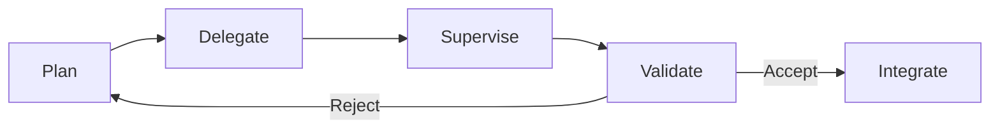

# Developer Control Strategies for AI Coding Agents

> Experienced developers do not vibe code in production. They plan tasks before delegating, supervise execution, and validate every output — a control loop that explains why agents accelerate some developers and slow others.

## The Evidence

[Huang et al. (2025)](https://arxiv.org/abs/2512.14012) conducted 13 field observations and 99 qualitative surveys of professional developers (3–25 years experience) using AI coding agents. The central finding: experienced developers "carefully control the agents through planning and supervision" rather than adopting hands-off [vibe coding](../workflows/vibe-coding.md) approaches.

This aligns with related empirical work:

| Study | Design | Key Finding |
|-------|--------|-------------|
| [Huang et al. (2025)](https://arxiv.org/abs/2512.14012) | 13 observations + 99 surveys | Developers plan, supervise, and validate — they do not vibe |
| [METR (2025)](https://metr.org/blog/2025-07-10-early-2025-ai-experienced-os-dev-study/) | RCT, 16 experienced OSS devs | AI made developers 19% slower, yet they estimated 20% faster |
| [Anthropic (2026)](https://www.anthropic.com/research/AI-assistance-coding-skills) | RCT, 52 junior engineers | AI-assisted group scored ~17 points lower on comprehension |

The METR perception gap (~39 points between actual and perceived speed) suggests that developers who skip control strategies may not notice the productivity loss.

## The Plan-Supervise-Validate Loop

The study identifies planning and supervision as core control mechanisms. In practice, experienced developers apply a consistent loop:

### Plan Before Delegating

Developers decompose work before handing it to the agent. They do not type a vague request and hope for the best. Planning includes:

- **Scoping the task** — defining what the agent should change and what it should not touch
- **Specifying constraints** — naming files, APIs, or patterns the agent must follow
- **Choosing the right granularity** — breaking complex work into smaller, verifiable units

This is the same decomposition that makes [execution-first delegation](../agent-design/execution-first-delegation.md) effective: the developer writes a contract (goal + boundaries), not a script.

### Supervise During Execution

Developers do not walk away while the agent runs. They monitor output, catch early divergence, and redirect before the agent goes deep in the wrong direction. This maps directly to [human-in-the-loop placement](../workflows/human-in-the-loop.md) — gating on irreversible actions while letting reversible steps proceed.

### Validate Every Output

No agent output ships without review. Developers read diffs, run tests, and verify behavior against the original intent. The validation step is what separates controlled agent use from the [comprehension debt](../anti-patterns/comprehension-debt.md) that accumulates when developers accept code they do not understand.

## Task Suitability

The study found agents effective for **well-described, straightforward tasks** and ineffective for **complex tasks requiring nuanced judgment**:

| Agent-Suitable | Agent-Unsuitable |
|---------------|-----------------|
| Code generation from clear specs | Architectural decisions |
| Debugging with reproducible errors | Cross-cutting design changes |
| Boilerplate and repetitive patterns | Tasks requiring implicit domain knowledge |
| Well-scoped refactoring | Novel problem exploration |

This mirrors the [vibe coding](../workflows/vibe-coding.md) applicability boundary: vibe coding works for low-risk, well-scoped work; control strategies are required for everything else.

## Why Control Works

Developers in the study retained agency over design and implementation decisions because they insist on fundamental software quality attributes. The control loop works because it:

1. **Catches errors early** — planning surfaces ambiguity before the agent wastes tokens on the wrong approach
2. **Preserves comprehension** — reviewing every output prevents the [skill atrophy](skill-atrophy.md) that comes from blind acceptance
3. **Builds calibrated trust** — repeated validate cycles teach developers which tasks the agent handles reliably, enabling [progressive disclosure](../agent-design/progressive-disclosure-agents.md) of autonomy

## Developer Sentiment

Despite the overhead of control, developers are positive about agents. One 20-year veteran stated: "there is no way I'll EVER go back to coding by hand." The key qualifier: satisfaction is conditional on maintaining control. Developers who feel in control report agents as a productivity multiplier; those who lose control report frustration and rework.

Approximately 25% of professional developers use AI agents weekly (StackOverflow 2025 survey, cited in paper) [unverified against original survey].

## Practical Implications

**For developers:**

- Invest time in task decomposition before prompting — the planning step is where experienced developers get their edge
- Review every diff, even when the agent's output looks correct — this is what prevents [comprehension debt](../anti-patterns/comprehension-debt.md)
- Match task complexity to agent capability — delegate boilerplate, retain architectural decisions

**For tool designers:**

- Support planning workflows — agents that help decompose tasks before executing them align with how experienced developers actually work
- Make supervision cheap — real-time output visibility, easy rollback, and diff-first review reduce the cost of the control loop
- Surface confidence signals — help developers calibrate trust by indicating which outputs the agent is confident about versus uncertain

## Key Takeaways

- Experienced developers use a plan-supervise-validate loop, not vibe coding, for production work
- The control overhead is what makes agents productive — skipping it creates a perception gap where developers think they are faster but are not
- Agent-suitable tasks are well-scoped and straightforward; complex architectural work still requires human judgment
- Satisfaction with agents is conditional on maintaining control — the tool is a copilot, not an autopilot

## Related

- [Vibe Coding](../workflows/vibe-coding.md) — the outcome-oriented approach this paper's developers explicitly reject for production work
- [Skill Atrophy](skill-atrophy.md) — the comprehension loss that accumulates when developers skip the validate step
- [Human-in-the-Loop Placement](../workflows/human-in-the-loop.md) — where to place supervision gates in agent pipelines
- [Execution-First Delegation](../agent-design/execution-first-delegation.md) — the contract-based delegation pattern that aligns with how experienced developers plan tasks
- [Comprehension Debt](../anti-patterns/comprehension-debt.md) — the debt that builds when developers accept agent output without review
