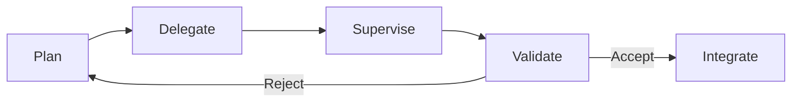

# Developer Control Strategies for AI Coding Agents

> Experienced developers do not vibe code in production. They plan tasks before delegating, supervise execution, and validate every output — a control loop that explains why agents accelerate some developers and slow others.

## The Evidence

[Huang et al. (2025)](https://arxiv.org/abs/2512.14012) observed 13 professional developers and surveyed 99 more (3–25 years experience). The central finding: experienced developers "carefully control the agents through planning and supervision" rather than adopting hands-off [vibe coding](../workflows/vibe-coding.md).

| Study | Design | Key Finding |
|-------|--------|-------------|
| [Huang et al. (2025)](https://arxiv.org/abs/2512.14012) | 13 observations + 99 surveys | Developers plan, supervise, and validate — they do not vibe |
| [METR (2025)](https://metr.org/blog/2025-07-10-early-2025-ai-experienced-os-dev-study/) | RCT, 16 experienced OSS devs | AI made developers 19% slower, yet they estimated 20% faster |
| [Anthropic (2026)](https://www.anthropic.com/research/AI-assistance-coding-skills) | RCT, 52 junior engineers | AI-assisted group scored ~17 points lower on comprehension |

The METR perception gap (~39 points) suggests developers who skip control may not notice the productivity loss.

## The Plan-Supervise-Validate Loop

Experienced developers follow this loop:

### Plan Before Delegating

Developers decompose work before delegating. Planning includes:

- **Scoping the task** — what the agent should change and what it must not touch
- **Specifying constraints** — files, APIs, or patterns the agent must follow
- **Choosing granularity** — breaking complex work into smaller, verifiable units

This is the decomposition that makes [execution-first delegation](../agent-design/execution-first-delegation.md) effective: a contract (goal + boundaries), not a script.

### Supervise During Execution

Developers monitor output and redirect before the agent commits to the wrong direction. This maps to [human-in-the-loop placement](../workflows/human-in-the-loop.md) — gating on irreversible actions while letting reversible steps proceed.

### Validate Every Output

Developers read diffs, run tests, and verify behavior against original intent. Validation separates controlled agent use from [comprehension debt](../anti-patterns/comprehension-debt.md) that accumulates when developers accept unreviewed code.

## Task Suitability

Agents proved effective for **well-described, straightforward tasks** and ineffective for **complex tasks requiring nuanced judgment**.

| Agent-Suitable | Agent-Unsuitable |
|---------------|-----------------|
| Code generation from clear specs | Architectural decisions |
| Debugging with reproducible errors | Cross-cutting design changes |
| Boilerplate and repetitive patterns | Tasks requiring implicit domain knowledge |
| Well-scoped refactoring | Novel problem exploration |

This mirrors the [vibe coding](../workflows/vibe-coding.md) boundary: vibe coding works for low-risk, well-scoped work; control strategies cover everything else.

## Why Control Works

The control loop works because it:

1. **Catches errors early** — planning surfaces ambiguity before the agent pursues the wrong approach
2. **Preserves comprehension** — reviewing every output prevents the [skill atrophy](skill-atrophy.md) from blind acceptance
3. **Builds calibrated trust** — repeated validate cycles teach developers which tasks the agent handles reliably, enabling [progressive disclosure](../agent-design/progressive-disclosure-agents.md) of autonomy

## When This Backfires

Control overhead is not free. The loop costs more than it saves when:

- **Work is trivial or throwaway** — one-line fixes or prototypes rarely repay the planning step. For low-risk, reversible work, [vibe coding](../workflows/vibe-coding.md) is the better default.
- **Supervision is theatre** — rubber-stamping diffs without real review is nominal control only, and recreates [comprehension debt](../anti-patterns/comprehension-debt.md) under a veneer of diligence.
- **Plans ossify against changing requirements** — over-specifying exploratory work locks the agent out of useful pivots.
- **Agent count exceeds attention budget** — too many parallel agents degrades validation across all of them; see [attention management](attention-management-parallel-agents.md).

Apply the full loop when work is production-bound, touches shared surfaces, or is hard to revert. Relax it when work is cheap to throw away.

## Developer Sentiment

Despite the overhead, developers are positive. One 20-year veteran: "there is no way I'll EVER go back to coding by hand." Satisfaction depends on maintaining control — developers in control report a productivity multiplier; those who lose control report frustration and rework.

About 23% of developers already use AI agents at least weekly, per the [2025 Stack Overflow Developer Survey](https://survey.stackoverflow.co/2025/ai) — a sizeable minority, but still well short of majority adoption.

## Practical Implications

**For developers:** decompose tasks before prompting, review every diff, and match task complexity to agent capability — delegate boilerplate, retain architectural decisions.

**For tool designers:** support planning workflows, make supervision cheap with real-time output and diff-first review, and surface confidence signals for trust calibration.

## Example

A developer needs to add input validation to a REST endpoint. Rather than prompting "add validation to the user endpoint," they apply the control loop:

**Plan**: "Add Zod schema validation to `POST /users`. Validate `email` (format), `name` (non-empty string, max 100 chars), and `role` (enum: admin, member). Return 422 with field-level errors. Do not modify the database layer or existing tests."

**Delegate**: Submit the scoped prompt to the agent.

**Supervise**: Watch the agent's output. It starts modifying the database model — interrupt and redirect: "Stop. Only modify `src/routes/users.ts` and add `src/schemas/user.ts`. Do not touch the database layer."

**Validate**: Review the diff. Run `npm test`. Confirm 422 responses include field-level error messages. Check that the agent did not silently change error formats in other endpoints.

The planning step took two minutes but prevented a scope creep that would have required reverting database migrations — the same batching dynamic that causes [PR scope creep](../anti-patterns/pr-scope-creep-review-bottleneck.md) at review time.

## Key Takeaways

- Experienced developers use a plan-supervise-validate loop, not vibe coding, for production work
- Control overhead is what makes agents productive — skipping it creates a perception gap where developers feel faster but aren't
- Agent-suitable tasks are well-scoped; complex architectural work still requires human judgment

## Related

- [Vibe Coding](../workflows/vibe-coding.md) — the approach these developers explicitly reject for production work
- [Skill Atrophy](skill-atrophy.md) — comprehension loss from skipping the validate step
- [Human-in-the-Loop Placement](../workflows/human-in-the-loop.md) — where to place supervision gates
- [Execution-First Delegation](../agent-design/execution-first-delegation.md) — contract-based delegation that aligns with how experienced developers plan
- [Comprehension Debt](../anti-patterns/comprehension-debt.md) — debt from accepting agent output without review
- [Addictive Flow in Agent Development](addictive-flow-agent-development.md) — the flow state that tempts developers to skip validation
- [Attention Management for Parallel Agents](attention-management-parallel-agents.md) — supervision strategies for multiple concurrent agents
- [Progressive Autonomy and Model Evolution](progressive-autonomy-model-evolution.md) — how calibrated trust feeds progressive delegation
- [Cognitive Load, AI Fatigue, and Sustainable Agent Use](cognitive-load-ai-fatigue.md) — the supervision and review burden that control strategies impose
- [Rigor Relocation](rigor-relocation.md) — where engineering discipline moves when agents write the code
- [Strategy Over Code Generation](strategy-over-code-generation.md) — why planning matters more than generation speed
