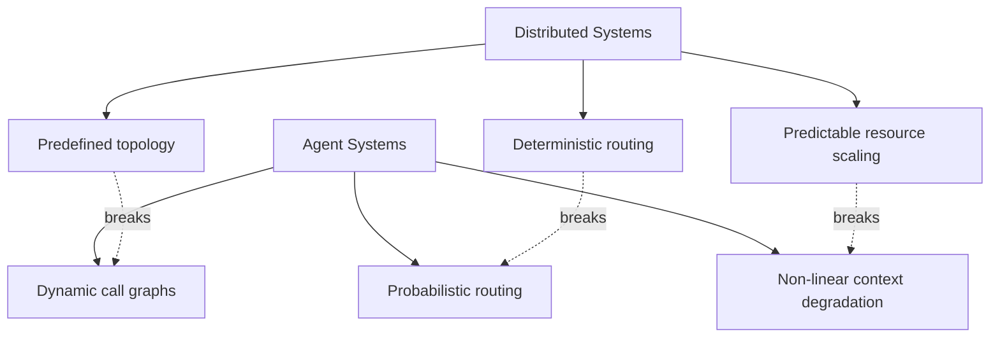

# Distributed Computing Parallels in Agent Architecture

> Agent architectures reuse structural patterns from distributed systems — recognizing the mapping lets you apply decades of operational wisdom instead of relearning it.

## The Mapping

Coding agent systems solve the same coordination problems that distributed systems solved: task decomposition, failure handling, state management, and isolation.

| Distributed Systems Pattern | Agent Architecture Equivalent | This Site |
|-----|-----|-----|
| **Fan-out / Fan-in** (Scatter-Gather) | Sub-agent parallelism with result synthesis | [Fan-Out Synthesis](../multi-agent/fan-out-synthesis.md) |
| **Orchestrator / Worker** | Lead agent decomposes task, delegates to specialists | [Orchestrator-Worker](../multi-agent/orchestrator-worker.md) |
| **Pipeline** (Pipes & Filters) | Sequential agent chaining ([prompt chaining](../context-engineering/prompt-chaining.md)) | [Prompt Chaining](../context-engineering/prompt-chaining.md) |
| **Circuit Breaker** | Loop detection, iteration limits, backpressure | [Circuit Breakers](../observability/circuit-breakers.md), [Agent Backpressure](../agent-design/agent-backpressure.md) |
| **Saga** (Compensating Transactions) | Multi-step workflows with git-based rollback | [Rollback-First Design](../agent-design/rollback-first-design.md) |
| **Bulkhead Isolation** | Worktree isolation, per-agent permission scoping | [Worktree Isolation](../workflows/worktree-isolation.md), [Blast Radius Containment](../security/blast-radius-containment.md) |
| **Sidecar / Ambassador** | Parallel process enforcing filesystem and network boundaries | [Dual-Boundary Sandboxing](../security/dual-boundary-sandboxing.md) |
| **Event-Driven Choreography** | File-based coordination, hooks, pub-sub triggers | [File-Based Agent Coordination](../multi-agent/file-based-agent-coordination.md) |
| **Two-Phase Commit** | Pre-completion checklists, HITL approval gates | [Pre-Completion Checklists](../verification/pre-completion-checklists.md), [HITL Confirmation Gates](../security/human-in-the-loop-confirmation-gates.md) |
| **Deadlock Detection** | Loop detection middleware tracking per-file edit counts | [Loop Detection](../observability/loop-detection.md) |
| **MapReduce** | Sub-agent fan-out returning condensed summaries | [Sub-Agents Fan-Out](../multi-agent/sub-agents-fan-out.md) |
| **Garbage Collection** | Context compaction and summarization | [Context Compression](../context-engineering/context-compression-strategies.md) |
| **Lazy Evaluation** | JIT context loading — load at runtime, not upfront | [Semantic Context Loading](../context-engineering/semantic-context-loading.md) |
| **Data Sharding** | Context partitioning across sub-agent windows | [Context Budget Allocation](../context-engineering/context-budget-allocation.md) |
| **Write-Ahead Logging** | Progress files and git commits as recovery checkpoints | [Agent Harness](../agent-design/agent-harness.md), [Feature List Files](../instructions/feature-list-files.md) |
| **Service Mesh / API Gateway** | Coordinator dispatching to sub-agents by capability | [Agent Composition Patterns](../agent-design/agent-composition-patterns.md) |
| **Consensus Protocols** | Generator-critic loops, voting, quorum review | [Evaluator-Optimizer](../agent-design/evaluator-optimizer.md), [Committee Review](../code-review/committee-review-pattern.md), [Voting / Ensemble Pattern](../multi-agent/voting-ensemble-pattern.md) |
| **Load Balancing** | Reasoning budget allocation across planning, execution, verification | [Reasoning Budget Allocation](../agent-design/reasoning-budget-allocation.md) |

## Where the Analogy Breaks

The mapping is structural, not exact. Three divergences matter:

**Dynamic call graphs.** Microservices have predefined topologies — see the [Multi-Agent Topology Taxonomy](../multi-agent/multi-agent-topology-taxonomy.md) for how centralised, decentralised, and hybrid coordination each fail differently. Agents construct call graphs at runtime based on reasoning. The [Azure Architecture Center](https://learn.microsoft.com/en-us/azure/architecture/ai-ml/guide/ai-agent-design-patterns) describes patterns involving [dynamic tool selection](../anti-patterns/dynamic-tool-fetching-cache-break.md) and runtime task decomposition. When an agent calls a tool it has never called before, your [observability tooling](../standards/opentelemetry-agent-observability.md) has no historical baseline — distributed tracing tools are built around known service maps and alert thresholds derived from historical call patterns, neither of which exist for novel agent tool invocations.

**Context windows as a resource constraint.** Distributed systems manage memory, CPU, and network. Agent systems manage a fourth resource with no direct equivalent: the context window. It degrades non-linearly — performance doesn't scale down smoothly as the [context window fills](../context-engineering/context-window-dumb-zone.md), it falls off a cliff. Traditional capacity planning doesn't model this failure mode.

**Non-deterministic routing.** A load balancer routes requests based on rules. An orchestrator agent routes subtasks based on reasoning, which is probabilistic. The same input can produce different decompositions across runs. Retry logic and idempotency patterns from distributed systems assume deterministic routing — they need adaptation for [agent operations](../agent-design/idempotent-agent-operations.md).

## Why This Matters

[Redis cites a projection](https://redis.io/blog/ai-agent-orchestration/) that 40% of agentic AI projects will face cancellation by 2027 due to underestimated operational complexity — the same failure class that plagued early microservices adoption.

## Example

A multi-file refactoring agent uses three distributed patterns in a single run:

1. **Saga** — the orchestrator commits a checkpoint before each file edit, so a failed transformation triggers `git checkout -- <file>` on every previously modified file rather than leaving the codebase half-refactored.
2. **Circuit Breaker** — after the third consecutive lint failure on generated code, the agent stops retrying and surfaces the error instead of burning its remaining context on identical attempts.
3. **Fan-out / Fan-in** — the orchestrator spawns one sub-agent per module, each operating in its own worktree. Results merge only after all sub-agents report success.

Without recognizing these as known patterns, teams reinvent each mechanism ad hoc — and miss the failure modes that distributed systems engineers documented decades ago.

## Key Takeaways

- Agent architectures reuse 18 structural patterns from distributed computing — the problems are structurally identical, only the names differ
- The analogy breaks at dynamic call graphs, context window constraints, and non-deterministic routing
- Start from the equivalent distributed systems pattern and adjust for non-determinism and context limits

## Related

- [Agent Composition Patterns](../agent-design/agent-composition-patterns.md)
- [Orchestrator-Worker](../multi-agent/orchestrator-worker.md)
- [Fan-Out Synthesis](../multi-agent/fan-out-synthesis.md)
- [Circuit Breakers](../observability/circuit-breakers.md)
- [Rollback-First Design](../agent-design/rollback-first-design.md)
- [Worktree Isolation](../workflows/worktree-isolation.md)
- [Context Compression Strategies](../context-engineering/context-compression-strategies.md)
- [The Bottleneck Migration](bottleneck-migration.md)
