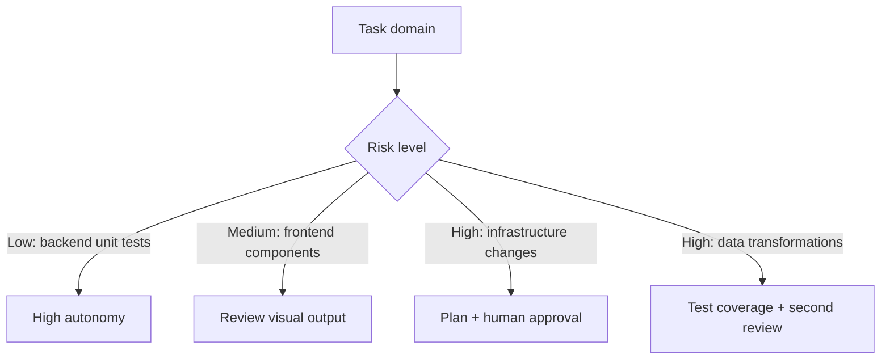

# Domain-Specific Agent Challenges

> Agent effectiveness varies by domain; frontend, infrastructure, and data engineering each impose distinct constraints that require different configurations, verification approaches, and autonomy levels.

## Backend: The Baseline

Agents perform best on backend code. The reasons are structural: backend tasks tend to be typed, testable, and specified precisely. A function signature, a test suite, and a documented API form an unambiguous target. Agents can generate code, run tests, and iterate against machine-verifiable feedback. Benchmarks such as SWE-bench and [ABC-Bench](https://arxiv.org/abs/2601.11077) measure agent performance almost exclusively on backend tasks — precisely because objective correctness criteria exist there that don't exist for visual or stateful domains.

This is the reference point. Other domains deviate from it in specific ways.

## Frontend: Subjective Correctness

Frontend work introduces a category of correctness that agents cannot evaluate: visual correctness. Whether a layout looks right requires rendering and judgment. CSS is context-dependent — the same rule has different effects across viewport sizes, browsers, and component compositions.

Matt Pocock has noted that frontend is "WAY harder for AI than backend" because the agent is "flying blind" — it cannot test code in the browser environment where it runs ([source](https://x.com/mattpocockuk/status/2010728707997278296)).

**Adaptations that reduce friction:**

- **Component libraries.** Constrain the agent's choices to a defined set of components. The agent selects from the library instead of generating arbitrary CSS. This converts a subjective problem (does this look right?) into a structural one (did the agent use an allowed component?).
- **Visual regression tests.** Automated screenshot comparison provides feedback the agent can use without requiring human review for every change.
- **Design system skills.** Encode your design system's conventions as agent skills. The agent should not derive these from first principles per task.

Reduce autonomy for visual output tasks. Increase verification frequency.

## Infrastructure: High Blast Radius

Infrastructure mistakes are expensive. A dropped database, a misconfigured security group, or an incorrect IAM policy can cause outages or data loss. Infrastructure is also stateful — the current state of a system matters to every action taken against it.

Agents reason from context, not live observation. An agent that cannot query current infrastructure state will operate on assumptions that may be wrong — it has no mechanism to detect drift between its prior knowledge and reality.

**Adaptations:**

- **Read-only analysis agents.** Grant read permissions for analysis and planning; require human approval before write operations.
- **[Plan mode](../workflows/plan-first-loop.md) mandatory.** Any agent that modifies infrastructure should produce a diff or plan step that a human reviews before apply.
- **Dry-run before apply.** Agents should always execute dry-run or `--plan` equivalents before destructive operations.
- **Blast radius scoping.** Isolate agent operations to non-production environments by default.

## Data: Silent Failures

Data engineering failures are often silent. A wrong join condition, a missed null check, or an off-by-one in a date range produces results that look plausible but are wrong. Unlike a failing test or a runtime exception, incorrect data may not surface until downstream consumers detect anomalies.

Agents are prone to generating plausible-looking queries that contain subtle errors. Meta's engineering team documented this directly: agents without full pipeline context would produce code that compiled correctly but referenced wrong intermediate field names or violated append-only identifier rules, with failures propagating silently to downstream consumers ([source](https://engineering.fb.com/2026/04/06/developer-tools/how-meta-used-ai-to-map-tribal-knowledge-in-large-scale-data-pipelines/)). The correctness bar for data work is high because the verification cost is also high.

**Adaptations:**

- **Comprehensive test fixtures.** Agents working on queries or transformations should have access to representative test data and expected outputs.
- **Schema validation as a gate.** Any agent output that touches a schema should be validated before merging.
- **Second-agent query review.** Have a separate agent critique generated queries for correctness before execution.
- **Row count and shape checks.** Automated assertions on result shape catch gross errors that semantic review might miss.

## Autonomy vs. Risk

Match agent autonomy to domain risk:



## When This Backfires

Domain-based autonomy restrictions are heuristics, not rules:

- **Over-restriction on backend.** Blanket approval gates on low-risk backend tasks waste the agent's highest-value use case.
- **Frontend with visual testing in place.** Teams with Percy, Chromatic, or Playwright visual regression have already closed the "flying blind" gap. Further restriction adds friction without reducing risk.
- **Infrastructure with policy-as-code.** Terraform + CI-enforced plans + Open Policy Agent reduce blast-radius risk substantially. Treating all infrastructure as high-risk ignores this.
- **Not all data work is silent.** Schema migrations with automatic rollback and row-count assertions behave like backend tasks.

Recalibrate when tooling closes the domain's correctness gap.

## Example

**Infrastructure agent with plan-before-apply:**

An agent managing Terraform configurations can safely operate with elevated permissions if the workflow enforces a review gate:

```yaml
# agent-config.yml
tools:
  - name: terraform_plan
    description: Run terraform plan and return the diff — read-only
    allowed: true
  - name: terraform_apply
    description: Apply the plan to infrastructure
    requires_approval: true
    approval_message: "Review the plan output above before approving apply."
```

The agent runs `terraform plan`, surfaces the diff to the human reviewer, and only proceeds with `terraform apply` after explicit approval. This pattern limits blast radius without eliminating agent utility. See [Safe Command Allowlisting](safe-command-allowlisting.md) for configuring tool-level gates.

**Frontend agent with component library constraint:**

```yaml
# agent-config.yml
system_prompt: |
  You are a frontend agent. You MUST use components from the design system at
  src/components/. Do not write custom CSS. Do not create new components — if
  no existing component fits the requirement, flag it for human review.
```

Constraining component choice converts visual judgment into a structural check: the agent either used an allowed component or it didn't.

## Key Takeaways

- Agent effectiveness is domain-dependent; backend is strongest, frontend and data have specific weaknesses
- Frontend requires structural constraints (component libraries, design systems) and automated visual feedback
- Infrastructure requires plan-before-apply patterns and read-only defaults to contain blast radius (see [Blast Radius Containment](../security/blast-radius-containment.md))
- Data work requires comprehensive test fixtures and verification gates because failures are often silent

## Related

- [Progressive Autonomy: Scaling Trust with Model Evolution](progressive-autonomy-model-evolution.md)
- [Rigor Relocation](rigor-relocation.md)
- [Safe Command Allowlisting](safe-command-allowlisting.md)
- [Blast Radius Containment](../security/blast-radius-containment.md)
- [Plan-First Loop](../workflows/plan-first-loop.md)
- [Developer Control Strategies for AI Coding Agents](developer-control-strategies-ai-agents.md)
- [Evidence-Based Allowlist Auto-Discovery](evidence-based-allowlist-auto-discovery.md)
- [Empirical Baseline: How Developers Configure Agentic AI Coding Tools](empirical-baseline-agentic-config.md)
