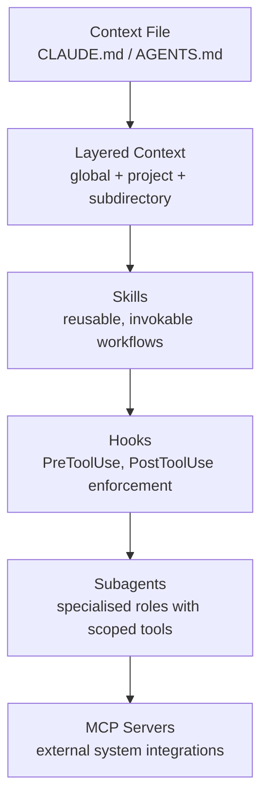

# Empirical Baseline: How Developers Configure Agentic AI Coding Tools

> A study of 2,926 GitHub repositories finds that context files dominate configuration while advanced mechanisms — Skills, Subagents, Hooks, MCP — remain shallowly adopted across every tool.

## The Study

[Galster et al. (arXiv:2602.14690)](https://arxiv.org/abs/2602.14690) analysed 2,926 public GitHub repositories using Claude Code, GitHub Copilot, Cursor, Gemini, and OpenAI Codex. The study identifies eight distinct configuration mechanisms and measures how frequently each appears in real-world repos. It is the first empirical baseline for agentic AI coding tool configuration in the wild.

The eight mechanisms are: Context Files, Skills, Subagents/Agents, Hooks, MCP servers, Memory, Permissions, and Settings/Model config.

## What the Data Shows

**Context Files dominate.** Most repositories configure the agent via a single context file and do not touch any other mechanism. AGENTS.md is emerging as the cross-tool interoperability standard — the [agents.md spec](https://agents.md) claims 60k+ open-source projects [unverified — self-reported] and support across 25+ tools [unverified — self-reported].

**Skills are shallowly adopted.** Most repositories define only 1–2 skill artifacts containing static instructions rather than executable workflows. The [Agent Skills open standard](../standards/agent-skills-standard.md) (30+ supporting tools [unverified — self-reported]) and [Claude Code's SKILL.md format](https://code.claude.com/docs/en/skills) support file bundling, subagent execution, dynamic context injection, invocation control, and hooks — yet real-world adoption exploits almost none of this [unverified].

**Subagents are rarely configured beyond defaults.** Claude Code's subagent system (`.claude/agents/`) supports per-agent model selection, tool restrictions, permission modes, hooks, preloaded skills, and persistent memory ([code.claude.com/docs/en/sub-agents](https://code.claude.com/docs/en/sub-agents)). Repos rarely configure any of these dimensions.

**Hooks are an underused automation layer.** Claude Code hooks fire at `PreToolUse`, `PostToolUse`, `SubagentStart`, `SubagentStop`, `Stop`, and `InstructionsLoaded` events and can block, transform, or log ([code.claude.com/docs/en/hooks](https://code.claude.com/docs/en/hooks)). Adoption is minimal.

**MCP servers are underrepresented.** MCP extends agent capabilities to external systems — databases, issue trackers, design tools, monitoring — configurable at local, project, user, and managed scopes ([code.claude.com/docs/en/mcp](https://code.claude.com/docs/en/mcp)). Real-world deployment remains low despite broad availability.

**Claude Code users employ the broadest range of mechanisms.** Distinct configuration cultures form around each tool, with Claude Code leading in multi-mechanism adoption.

## The Gap This Creates

Under-configuration is a self-imposed capability gap: the mechanisms exist, are documented, and work.

The CLAUDE.md hierarchy — managed policy, user, project, subdirectory, plus `.claude/rules/` for path-scoped rules ([code.claude.com/docs/en/memory](https://code.claude.com/docs/en/memory)) — is a rich configuration surface. Most repos deploy a single flat file at the project root.

## A Prioritised Adoption Ramp

Unlock the configuration surface incrementally:

**Step 1 — Layered context files.** Split the single root context file into global, project, and subdirectory layers so each scope carries only the rules it needs. See [Layer Agent Instructions by Specificity](../instructions/layered-instruction-scopes.md).

**Step 2 — Skills.** Extract repeated workflows into SKILL.md files that specify their subagent, required tools, and preloaded context. See [Skill Library Evolution](../tool-engineering/skill-library-evolution.md).

**Step 3 — Hooks.** Replace prompt-based enforcement with hooks for constraints that must not vary — a `PreToolUse` hook cannot be overridden by injected instructions. See [Hooks for Enforcement vs Prompts for Guidance](../verification/hooks-vs-prompts.md).

**Step 4 — Subagent specialisation.** Assign distinct roles with scoped tool sets so that, e.g., a reviewer subagent cannot modify files even if instructed to. See [Specialized Agent Roles](../agent-design/specialized-agent-roles.md).

**Step 5 — MCP for external systems.** Connect agents to issue trackers, documentation, observability, and design tools via structured [MCP integrations](../tools/copilot/mcp-integration.md) instead of copy-paste context.

## Key Takeaways

- Context files dominate real-world agentic AI configuration; advanced mechanisms are rarely used even among teams using agentic tools
- The gap is an awareness and adoption gap, not a capability gap — all mechanisms are documented and production-ready for you to use
- Claude Code users exhibit the broadest configuration culture; AGENTS.md is emerging as the cross-tool interoperability standard across 25+ tools [unverified — self-reported]
- Teams that adopt multiple mechanisms tend to configure each one more deeply

## Related

- [Hooks for Enforcement vs Prompts for Guidance](../verification/hooks-vs-prompts.md)
- [Hooks and Lifecycle Events: Intercepting Agent Behavior](../tool-engineering/hooks-lifecycle-events.md)
- [PostToolUse Hooks: Auto-Formatting on Every File Edit](../workflows/posttooluse-auto-formatting.md)
- [Hierarchical CLAUDE.md: Structuring Context Files at Multiple Levels](../instructions/hierarchical-claude-md.md)
- [Specialized Agent Roles](../agent-design/specialized-agent-roles.md)
- [GitHub Copilot: Model Selection & Routing](../training/copilot/model-selection.md) — per-agent model selection and routing strategies
- [Skill Library Evolution](../tool-engineering/skill-library-evolution.md)
- [Encode Project Conventions in Distributed AGENTS.md Files](../instructions/agents-md-distributed-conventions.md)
- [Cross-Tool Translation](../human/cross-tool-translation.md)
- [MCP: The Open Protocol Connecting Agents to External Tools](../standards/mcp-protocol.md)
- [Progressive Autonomy: Scaling Trust with Model Evolution](../human/progressive-autonomy-model-evolution.md)
- [The Bottleneck Migration When Humans Supervise Agents](../human/bottleneck-migration.md)
- [Initiatives and Community: Tracking the Agentic Engineering](../human/initiatives-community.md)
