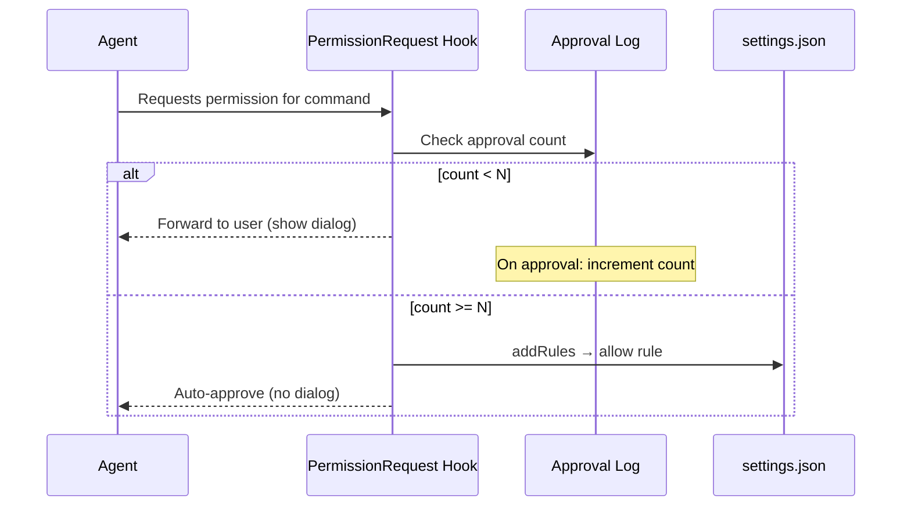

# Evidence-Based Allowlist Auto-Discovery

> You don't have to pre-configure your allowlist from scratch. Claude Code's `PermissionRequest` hook lets you turn every manual approval into a persistent rule — an allowlist that grows from real usage.

Evidence-based allowlist auto-discovery builds the allow list incrementally from real agent usage. [Manual allowlisting](safe-command-allowlisting.md) pre-authorizes known-safe commands, but teams must predict the list before they have usage data. Auto-discovery removes that requirement: each manual approval increments a counter, and once a command crosses a threshold it is written to the allow list.

## How It Works

Claude Code's `PermissionRequest` hook fires before the permission dialog is shown and can return `updatedPermissions` with `addRules` and a `destination` — writing allow rules directly to a settings file.



A `PostToolUse` hook tracks outcomes after execution. The rule is written only after a command has been manually approved N times without flagged side effects.

## The Two-Hook Implementation

`PermissionRequest` is the only hook with an `updatedPermissions` write-back path, per the [Claude Code hooks reference](https://code.claude.com/docs/en/hooks). `PostToolUse` cannot write settings via its return value; it writes to the counter log.

| Hook | Role | Can write to settings.json via API? |
|------|------|-------------------------------------|
| `PermissionRequest` | Checks count; writes allow rule when threshold met | Yes — via `updatedPermissions` |
| `PostToolUse` | Records outcome; increments counter on success | No — must write to a sidecar log file |

### PermissionRequest Hook

```bash
#!/bin/bash
# .claude/hooks/permission-request.sh
# Reads approval counts; promotes to allowlist after N approvals

THRESHOLD=5
LOG_FILE=".claude/approval-log.json"
COMMAND=$(echo "$CLAUDE_INPUT" | jq -r '.tool_input.command // empty')

[ -z "$COMMAND" ] && exit 0

# Normalize: use first token as the key (e.g. "git" from "git status --short")
KEY=$(echo "$COMMAND" | awk '{print $1}')
COUNT=$(jq -r --arg k "$KEY" '.[$k] // 0' "$LOG_FILE" 2>/dev/null || echo 0)

if [ "$COUNT" -ge "$THRESHOLD" ]; then
  # Return updatedPermissions to write an allow rule to localSettings
  jq -n \
    --arg cmd "Bash($KEY *)" \
    '{
      updatedPermissions: {
        addRules: [{ type: "allow", pattern: $cmd }],
        destination: "localSettings"
      }
    }'
fi
# Fall through: show dialog as normal
```

### PostToolUse Hook (Outcome Tracker)

```bash
#!/bin/bash
# .claude/hooks/post-tool-use-tracker.sh
# Increments approval counter on successful Bash runs

LOG_FILE=".claude/approval-log.json"
TOOL=$(echo "$CLAUDE_INPUT" | jq -r '.tool_name // empty')
SUCCESS=$(echo "$CLAUDE_INPUT" | jq -r '.tool_response.success // false')

[ "$TOOL" != "Bash" ] && exit 0
[ "$SUCCESS" != "true" ] && exit 0

COMMAND=$(echo "$CLAUDE_INPUT" | jq -r '.tool_input.command // empty')
KEY=$(echo "$COMMAND" | awk '{print $1}')
[ -z "$KEY" ] && exit 0

touch "$LOG_FILE"
CURRENT=$(jq -r --arg k "$KEY" '.[$k] // 0' "$LOG_FILE" 2>/dev/null || echo 0)
NEW=$((CURRENT + 1))
TMP=$(mktemp)
jq --arg k "$KEY" --argjson v "$NEW" '.[$k] = $v' "$LOG_FILE" > "$TMP" && mv "$TMP" "$LOG_FILE"
```

## When This Backfires

Counter-based auto-promotion assumes past approvals predict future safety. That assumption breaks under several conditions:

- **Broad key matching**: First-token normalization (`git` from `git status`) counts safe reads toward the same key as destructive variants. The [v2.1.77 Claude Code changelog](https://code.claude.com/docs/en/changelog) noted the related bug of compound bash commands saving a single rule for the full string rather than per-subcommand.
- **Scripted or CI runs**: Automated pipelines can accumulate approval counts for commands no human ever consciously reviewed, silently promoting them.
- **Accidental approvals**: Five rushed approvals promote a command permanently; threshold counts do not filter careless clicks.

Mitigations:

- Count full command fingerprints, not just first tokens, for high-risk prefixes.
- Maintain an explicit deny list (`rm`, `curl`, `wget`, `git push`, `mv`, `dd`) that always falls through to the dialog.
- For shared or version-controlled allowlists, raise the threshold and require explicit review before any auto-promoted rule lands in `projectSettings`.

```bash
NEVER_AUTO_ALLOW="rm rmdir curl wget git-push mv dd"
for blocked in $NEVER_AUTO_ALLOW; do
  [ "$KEY" = "$blocked" ] && exit 0  # Fall through to dialog
done
```

## Relationship to Static Allowlists

Static and evidence-based allowlists are additive, not competing:

| Approach | Best for |
|----------|---------|
| Static allowlist (`settings.json`) | Known-safe commands established upfront |
| Evidence-based auto-discovery | Commands that emerge from real usage |

Claude Code's default auto-approval list has itself grown over releases to include read-only utilities such as `lsof`, `pgrep`, `tput`, `ss`, `fd`, and `fdfind`, per the [Claude Code changelog](https://code.claude.com/docs/en/changelog). The "Yes, don't ask again" built-in is a manual variant; the hook-based approach automates the threshold across sessions.

## Related

- [Safe Command Allowlisting: Reducing Approval Fatigue](safe-command-allowlisting.md)
- [Permission-Gated Custom Commands](../security/permission-gated-commands.md)
- [Hook Catalog: Guardrails, Sandboxing, and CLI Enforcement](../tool-engineering/hook-catalog.md)
- [Hooks and Lifecycle Events](../tool-engineering/hooks-lifecycle-events.md)
- [PostToolUse Hook for BSD/GNU Tool Miss Detection](../tool-engineering/posttooluse-bsd-gnu-detection.md)
- [Empirical Baseline: How Developers Configure Agentic AI Coding Tools](empirical-baseline-agentic-config.md)
- [Progressive Autonomy with Model Evolution](progressive-autonomy-model-evolution.md)
