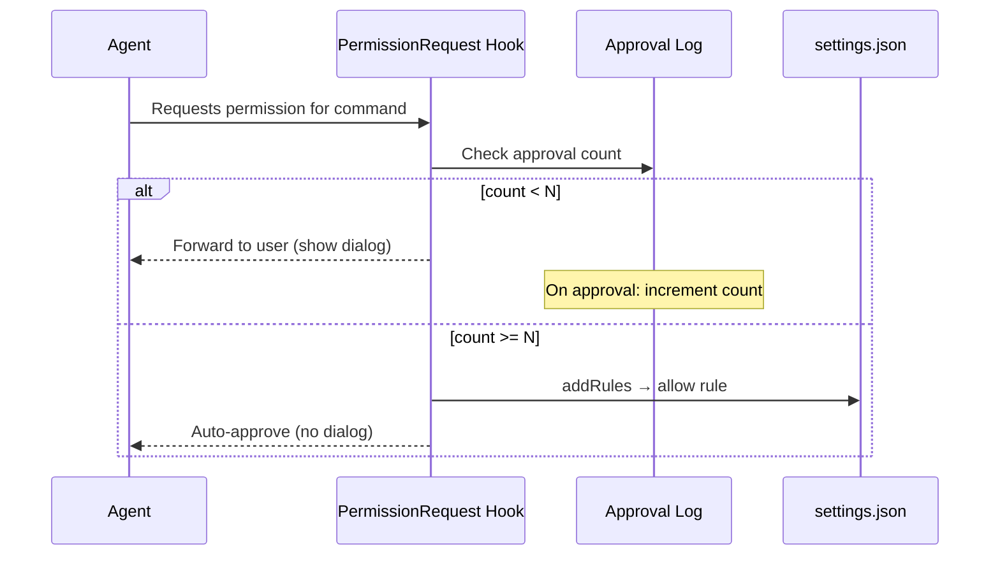

# Evidence-Based Allowlist Auto-Discovery

> You don't have to pre-configure your allowlist from scratch. Claude Code's `PermissionRequest` hook lets you turn every manual approval into a persistent rule — an allowlist that grows from real usage.

Evidence-based allowlist auto-discovery builds an allow-list incrementally from real agent usage rather than requiring teams to pre-configure it upfront. [Manual allowlisting](safe-command-allowlisting.md) eliminates noise by pre-authorizing known-safe commands, but teams must know which commands to pre-approve before they've used the agent. The auto-discovery approach removes that requirement: each manual approval increments a counter, and once a command crosses a threshold, it is automatically written to the allow list.

## How It Works

Claude Code exposes a `PermissionRequest` hook that fires before the permission dialog is shown. It receives the proposed permission and can return `updatedPermissions` with `addRules` and a `destination` to write new allow rules directly to a settings file — no manual editing required.



A `PostToolUse` hook tracks outcomes after execution. The rule is only written once a command has been manually approved N times — and only if those runs completed without flagged side effects.

## The Two-Hook Implementation

`PermissionRequest` is the only hook with a `updatedPermissions` write-back path. `PostToolUse` cannot write to settings.json via its return value; it writes to the counter log.

| Hook | Role | Can write to settings.json via API? |
|------|------|-------------------------------------|
| `PermissionRequest` | Checks count; writes allow rule when threshold met | Yes — via `updatedPermissions` |
| `PostToolUse` | Records outcome; increments counter on success | No — must write to a sidecar log file |

### PermissionRequest Hook

```bash
#!/bin/bash
# .claude/hooks/permission-request.sh
# Reads approval counts; promotes to allowlist after N approvals

THRESHOLD=5
LOG_FILE=".claude/approval-log.json"
COMMAND=$(echo "$CLAUDE_INPUT" | jq -r '.tool_input.command // empty')

[ -z "$COMMAND" ] && exit 0

# Normalize: use first token as the key (e.g. "git" from "git status --short")
KEY=$(echo "$COMMAND" | awk '{print $1}')
COUNT=$(jq -r --arg k "$KEY" '.[$k] // 0' "$LOG_FILE" 2>/dev/null || echo 0)

if [ "$COUNT" -ge "$THRESHOLD" ]; then
  # Return updatedPermissions to write an allow rule to localSettings
  jq -n \
    --arg cmd "Bash($KEY *)" \
    '{
      updatedPermissions: {
        addRules: [{ type: "allow", pattern: $cmd }],
        destination: "localSettings"
      }
    }'
fi
# Fall through: show dialog as normal
```

### PostToolUse Hook (Outcome Tracker)

```bash
#!/bin/bash
# .claude/hooks/post-tool-use-tracker.sh
# Increments approval counter on successful Bash runs

LOG_FILE=".claude/approval-log.json"
TOOL=$(echo "$CLAUDE_INPUT" | jq -r '.tool_name // empty')
SUCCESS=$(echo "$CLAUDE_INPUT" | jq -r '.tool_response.success // false')

[ "$TOOL" != "Bash" ] && exit 0
[ "$SUCCESS" != "true" ] && exit 0

COMMAND=$(echo "$CLAUDE_INPUT" | jq -r '.tool_input.command // empty')
KEY=$(echo "$COMMAND" | awk '{print $1}')
[ -z "$KEY" ] && exit 0

touch "$LOG_FILE"
CURRENT=$(jq -r --arg k "$KEY" '.[$k] // 0' "$LOG_FILE" 2>/dev/null || echo 0)
NEW=$((CURRENT + 1))
TMP=$(mktemp)
jq --arg k "$KEY" --argjson v "$NEW" '.[$k] = $v' "$LOG_FILE" > "$TMP" && mv "$TMP" "$LOG_FILE"
```

## Safety Considerations

Auto-promoting commands based on run count carries risk. The v2.1.77 Claude Code changelog fixed "overly broad rules" caused by compound command approvals — the same failure mode applies here. [unverified]

| Risk | Mitigation |
|------|-----------|
| Broad key matching promotes `rm` after N successful deletions | Exclude destructive command prefixes from the counter |
| Compound commands inflate counts for safe-looking prefixes | Count full command fingerprints, not just first tokens, for high-risk prefixes |
| Side-effect-free syntactically but harmful semantically | Add explicit deny list for prefixes that must never auto-promote (`rm`, `curl`, `wget`, `git push`) |

Add a deny list to the PermissionRequest hook before the threshold check:

```bash
NEVER_AUTO_ALLOW="rm rmdir curl wget git-push mv dd"
for blocked in $NEVER_AUTO_ALLOW; do
  [ "$KEY" = "$blocked" ] && exit 0  # Fall through to dialog
done
```

## Relationship to Static Allowlists

These two approaches are additive, not competing:

| Approach | Best for |
|----------|---------|
| Static allowlist (`settings.json`) | Known-safe commands established upfront by the team |
| Evidence-based auto-discovery | Commands that emerge from real usage over time |

Claude Code's own auto-approval list grew from `echo`, `cat`, `ls` to include `lsof`, `pgrep`, `tput`, `ss`, `fd`, `comm`, and others (v2.1.71–72) based on observed usage patterns [unverified] — static defaults and usage-derived additions coexist in the same allow list. The "Yes, don't ask again" feature is a manual variant that writes up to five subcommand rules on a single approval [unverified]; the hook-based approach automates the threshold across sessions.

## Related

- [Safe Command Allowlisting: Reducing Approval Fatigue](safe-command-allowlisting.md)
- [Hook Catalog: Guardrails, Sandboxing, and CLI Enforcement](../tool-engineering/hook-catalog.md)
- [Hooks and Lifecycle Events](../tool-engineering/hooks-lifecycle-events.md)
- [PostToolUse Hook for BSD/GNU Tool Miss Detection](../tool-engineering/posttooluse-bsd-gnu-detection.md)
- [Empirical Baseline: How Developers Configure Agentic AI Coding Tools](empirical-baseline-agentic-config.md)
- [Progressive Autonomy with Model Evolution](progressive-autonomy-model-evolution.md)
