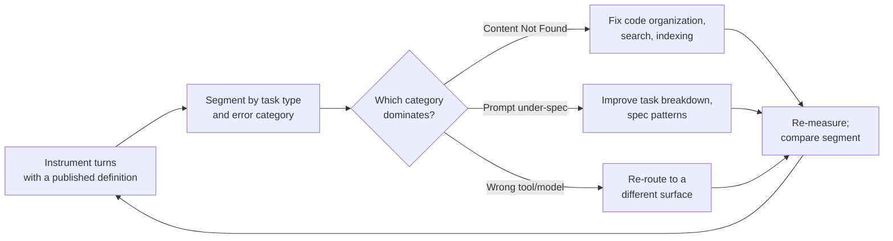

# Intervention Rate as a Diagnostic North Star, Not a Target

> Intervention rate is a segmented diagnostic signal — not a single number to minimise — and only useful paired with quality and ambition metrics.

Intervention rate — the share of turns on which a developer interrupts, corrects, or redirects the AI assistant — works as a composite diagnostic signal for prompt quality, code organization, task breakdown, and tool selection. It does not work as a Goodhart-safe target the way build times did in CI/CD: a near-zero rate often means low ambition or uncritical acceptance, and Anthropic's own data shows expert users intervene more, not less. Instrument, segment, and diagnose it — do not minimize it.

## The conditions under which it works

Treat the metric as useful only when these four conditions hold at once. Skip the practice — or expect a false signal — when any of them fails:

- The definition of "intervention" is published. Sniffly's analysis of 1,746 Claude Code commands found a 24.5% rate ([Huyen, 2025](https://x.com/chipro/status/1945527700808184115)), but the tool's README does not document how a turn is labeled an intervention ([sniffly](https://github.com/chiphuyen/sniffly)). Cross-team baselines without an operational definition anchor on a number nobody measured the same way.
- It is segmented by task type. Continue reports the rate varies between 15% and 60% by task ([Metcalf, 2025](https://blog.continue.dev/intervention-rates-are-the-new-build-times)). An aggregate hides that spread.
- It is paired with quality and ambition metrics. A single composite metric encourages gaming. Abi Noda's argument in 'No Single Metric Captures Productivity' applies here: "flattening… into a single measure makes the measure harder to understand and less actionable" ([Noda](https://newsletter.getdx.com/p/developer-productivity-metrics)). The DX Core 4 successor frames productivity across speed, effectiveness, quality, and impact ([Noda — DX Core 4](https://newsletter.getdx.com/p/introducing-the-dx-core-4)).
- The direction of correction is tracked, not just the count. Anthropic's June 2026 'Agentic coding and persistent returns to expertise' names "whether users or Claude tend to correct each other" as one of three expertise signals. The same finding shows expert users trigger about 3,200 words of Claude output per prompt versus about 600 for novices ([Anthropic, 2026](https://www.anthropic.com/research/claude-code-expertise)). A user correcting Claude through hard work looks identical to Claude correcting an over-confident user in a raw count.

## Why it works

Each intervention sits downstream of a concrete, fixable workflow input — an under-specified prompt, missing context, a task too coarse-grained, or the wrong tool or model for the work. The causal claim is not that the rate itself moves outcomes. It is that a rising rate is a cheap early signal of degraded inputs, but only if the categories underneath are surfaced. Huyen's Sniffly breakdown makes this concrete: the top error class is "Content Not Found" at 20–30%, where Claude searches for files or functions that do not exist ([Huyen, 2025](https://x.com/chipro/status/1945527700808184115)). That points the fix at code organization and search affordances, not prompt phrasing.

The build-times analogy from Continue holds at the loop level — instrument, baseline, diagnose, re-measure — but breaks at the target. Build times had no useful non-zero optimum; intervention rate plausibly does. Anthropic's expertise data is consistent with a U-shape between rate and outcome quality: very low rates correlate with low ambition or uncritical acceptance, very high rates with thrashing, and expertise concentrates in the middle band ([Anthropic, 2026](https://www.anthropic.com/research/claude-code-expertise)). The diagnostic is only as good as its category breakdown — never the bare aggregate.

## The diagnostic loop

Baseline by task type. Read the category breakdowns (Sniffly-style) before you read the aggregate rate. Make one targeted change — code organization, a prompt template, or tool routing. Re-measure the same segment. Treat aggregate intervention rate as the lagging trend that confirms the targeted change worked, not the leading metric you optimize directly.

## When this backfires

- Low-ambition workflows look excellent. A team that uses AI only for autocomplete-shaped tasks records a near-zero rate while leaving agentic value untapped. Without an ambition pair-metric — for example [ambition scaling](ambition-scaling.md) targets — the number rewards under-use.
- Goodhart-driven gaming. Once tied to performance reviews, the rate can be lowered by accepting weaker output, narrowing scope, or under-reporting ([practical-devsecops on Goodhart's Law](https://www.practical-devsecops.com/glossary/goodharts-law/)). Aviator's critique of DORA — that single composites "oversimplify… and encourage unbalanced optimization" — applies in full ([Aviator](https://www.aviator.co/blog/everything-wrong-with-dora-metrics/)).
- Expert and hard-task workflows misread. Anthropic finds that expert users have higher engagement and frequent corrections directed at Claude. Treating their 30%+ rates as a problem misreads expertise as inefficiency ([Anthropic, 2026](https://www.anthropic.com/research/claude-code-expertise)).
- Cross-tool generalization. Claude Code's intervention rate does not carry over to Copilot's autocomplete surface, where the analogous metric (acceptance rate) is measured differently and has different optimal levels. Baselines are tool-specific.
- Single-developer data treated as universal. The 24.5% figure is one practitioner's. Continue's 15–60% range is asserted without a per-task-type breakdown ([Metcalf, 2025](https://blog.continue.dev/intervention-rates-are-the-new-build-times)). Treat published numbers as anchoring hazards, not benchmarks.

## Key Takeaways

- Intervention rate is a *diagnostic* North Star, not a *target* North Star — minimising it is a Goodhart trap.
- Publish your operational definition before any baseline is comparable.
- Segment by task type and by error category; aggregate hides the spread Continue reports (15–60%).
- Pair with quality and ambition metrics; the DX Core 4 four-dimension shape is the right altitude.
- Track the *direction* of correction (user→Claude vs Claude→user), not just the count — it is the cleaner expertise signal.

## Related

- [Ambition Scaling: Moving the Target as Model Capability Increases](ambition-scaling.md) — pairs with intervention rate as the ambition axis a low-rate alone can't reveal.
- [Progressive Autonomy: Scaling Trust with Model Evolution](progressive-autonomy-model-evolution.md) — uses intervention rate as one input to the autonomy-dial decision.
- [Cohort Segmentation in the Copilot Usage Metrics API](cohort-segmentation-copilot-usage-metrics.md) — same diagnostic-over-aggregate logic applied to Copilot adoption cohorts.
- [Developer Control Strategies for AI Coding Agents](developer-control-strategies-ai-agents.md) — empirical baseline for how experienced developers actually intervene.
- [Suggestion Gating: Fewer Completions, Better DX](suggestion-gating.md) — the autocomplete-surface analogue, where acceptance rate is the corresponding signal.
