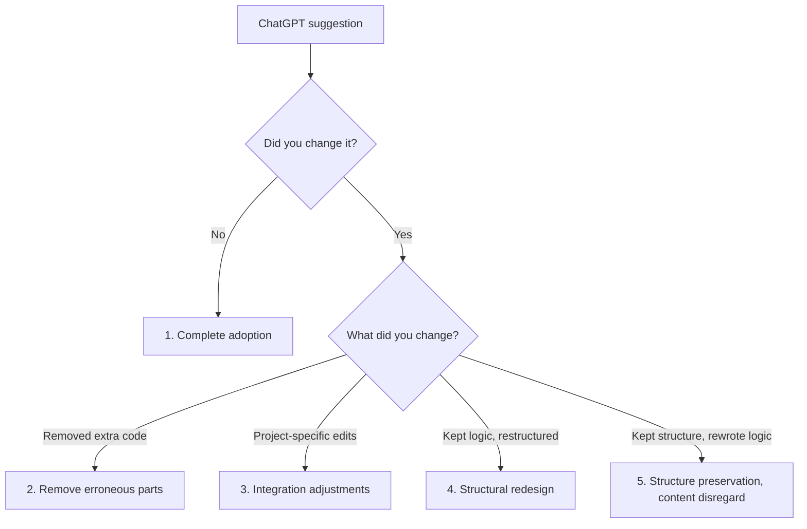
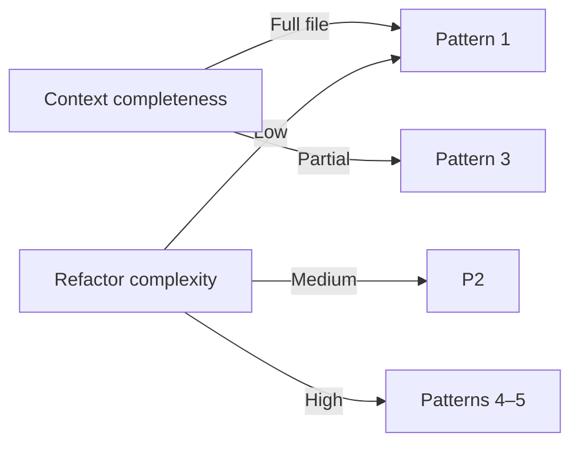

# LLM Refactoring Adoption Patterns

> Developer-initiated ChatGPT refactors committed to public repos are mostly adopted as-is — and when modified, the change falls into one of five patterns driven by prompt context completeness and refactor complexity.

## Scope and Caveats

Patterns come from [Schön et al., 2026](https://arxiv.org/abs/2605.04835) (PROMISE 2026), analysing 169 commits and 440 files from the DevGPT dataset — ChatGPT (GPT-3.5 / GPT-4), July–August 2023.

The result is **qualified, not universal**:

- **Single-repo concentration**: 143 of 169 commits come from one project (`tisztamo/Junior`) ([Schön et al., 2026](https://arxiv.org/abs/2605.04835)).
- **Adoption-biased sample**: DevGPT only captures commits where developers shared the ChatGPT link. Rejected conversations are absent ([Schön et al., 2026](https://arxiv.org/abs/2605.04835)).
- **Refactoring-only**: not ambient completion (~10% useful raw inference, see [Suggestion Gating](suggestion-gating.md)) and not AI review feedback (16.6% adoption per [arxiv:2603.15911](https://arxiv.org/abs/2603.15911)).

Read the patterns as a vocabulary for modification work, not as evidence that LLM suggestions are reliably correct.

## The Headline

Token Match Rate density concentrates above 0.9 and is minimal below 0.5 — most refactored files closely mirror the suggestion ([Schön et al., 2026](https://arxiv.org/abs/2605.04835)). Of 190 manually inspected datapoints, 96 showed any modification. Developers reach the goal in 1–4 prompts.

Refactoring activity distribution ([Schön et al., 2026](https://arxiv.org/abs/2605.04835)):

| Activity | Count |
|----------|-------|
| Rename | 44 |
| Documentation | 37 |
| Restructure | 36 |
| Logic splitting | 33 |
| Code cleaning | 29 |
| Simplification | 25 |
| Data type changes | 7 |

These are mostly **local, single-file** transformations. The findings do not extend to cross-module or interface-changing refactors.

## The Five Modification Patterns

### 1. Complete Adoption Without Modification

The suggestion is committed verbatim (similarity = 1.0). This concentrates on **low-risk, local tasks** — variable rename, file reorganisation — and on prompts that **paste the entire file as context** ([Schön et al., 2026](https://arxiv.org/abs/2605.04835)). When the prompt encodes the integration points, the suggestion lands as-is.

### 2. Removal of Erroneous Parts

Developers keep the suggestion's core but **delete additions that were never asked for** — extra `if` statements, error handling, new helper functions, copy-to-clipboard logic. Modifications are dominated by deletions ([Schön et al., 2026](https://arxiv.org/abs/2605.04835)). The pattern surfaces a recurring LLM tendency: scope inflation. The fix is editorial.

### 3. Integration Adjustments for Project Compatibility

The suggestion is correct in isolation but **wrong against the project** — wrong file paths, wrong function names, wrong import conventions. Modifications are token-level edits to align with project conventions, common in restructuring and modularity work ([Schön et al., 2026](https://arxiv.org/abs/2605.04835)). This is the cost of partial-context prompts.

### 4. Structural Redesign While Preserving Core Logic

Developers **keep the suggested logic but reshape it** — combine multiple suggested functions, split one function across files, add comments, rename for consistency ([Schön et al., 2026](https://arxiv.org/abs/2605.04835)). Substance survives; form does not. Developer judgment about code organisation outpaces what the model infers from a prompt.

### 5. Structure Preservation, Content Disregard

The inverse of pattern 4. Developers **keep the suggestion's layout** — function decomposition, file structure — but replace the logic with their own approach. Token Match Rate is low; the file is reorganised around different logic, sometimes alongside `mkdir`, `mv`, or `rm` operations ([Schön et al., 2026](https://arxiv.org/abs/2605.04835)). The suggestion functioned as a **scaffold**, not a solution.

## What Drives Which Pattern

Two axes explain the patterns ([Schön et al., 2026](https://arxiv.org/abs/2605.04835)):

- **Context completeness** — full-file context drives pattern 1; partial context drives pattern 3.
- **Refactor complexity** — simple transformations land in pattern 1 or 2; complex transformations (logic split, restructure) trigger patterns 4 and 5 because the model's planning runs out before the developer's does.

"More complex suggestions often cause errors or add unwanted behavior to the code, which requires developers to make more substantial modifications" ([Schön et al., 2026](https://arxiv.org/abs/2605.04835)).

## Implications for Practice

**Name the pattern when you modify.** Deleting code you didn't ask for is pattern 2 — push back on suggestion scope in the prompt. Translating names and paths is pattern 3 — give the model more file context next time. Rewriting logic under a kept structure is pattern 5 — the model gave you a scaffold, not a solution.

**Full-file context is the cheapest lever.** Pattern 1 tracks with whole-file prompts; the cost of pasting more context is lower than the cost of pattern-3 patching.

**Do not generalise past the dataset.** Findings cover developer-initiated, single-file, local refactors. Cross-module refactors, interface changes, and review-feedback adoption show different rates (compare [Human-AI Review Synergy](../code-review/human-ai-review-synergy.md), where AI review suggestions adopt at 16.6%).

## Example

A developer prompts ChatGPT to "split this 200-line `processOrders` function into smaller functions." They paste the surrounding file.

- **If the result lands as-is** — pattern 1. Whole-file context plus a well-scoped local refactor.
- **If they delete an unrequested logging block** the model added — pattern 2. Scope inflation, edited out.
- **If they rename `validateOrder` to `checkOrderValidity` to match project style** — pattern 3. Project-specific integration, not present in the prompt.
- **If they keep the new helper functions but merge two of them and reorder others** — pattern 4. Logic preserved, structure adjusted.
- **If they accept the four-function decomposition but rewrite each function's body** — pattern 5. Scaffold accepted, logic rejected.

The same prompt and the same suggestion can produce any of these depending on prompt completeness and refactor complexity. The pattern label tells you which lever to pull next time.

## Key Takeaways

- Most committed ChatGPT refactors in the [DevGPT dataset](https://arxiv.org/abs/2605.04835) are adopted with high similarity, but 51% of inspected datapoints show some modification — modification is the norm at the boundary, not the exception
- The five patterns (complete adoption, remove erroneous parts, integration adjustments, structural redesign, structure preservation with content disregard) are driven by prompt context completeness and refactor complexity, not LLM capability per se
- Findings are qualified by single-repo concentration (143 of 169 commits) and adoption bias (rejected conversations excluded) — generalisation requires explicit conditions
- Full-file context in the prompt is correlated with pattern 1; partial context is correlated with pattern 3
- The result does not extend to AI-generated review feedback (16.6% adoption — [arxiv:2603.15911](https://arxiv.org/abs/2603.15911)) or to ambient code completion (~10% useful raw inference — see [Suggestion Gating](suggestion-gating.md))

## Related

- [Suggestion Gating](suggestion-gating.md) — adoption rate and inference-waste data for ambient completion, the channel adjacent to chat refactoring
- [Human-AI Review Synergy](../code-review/human-ai-review-synergy.md) — AI review-suggestion adoption rates from a different study, contrasting the refactoring-specific finding here
- [Strategy Over Code Generation](strategy-over-code-generation.md) — broader context for why prompt completeness matters more than raw model speed
- [Developer Control Strategies for AI Coding Agents](developer-control-strategies-ai-agents.md) — empirical evidence on how experienced developers supervise AI output
