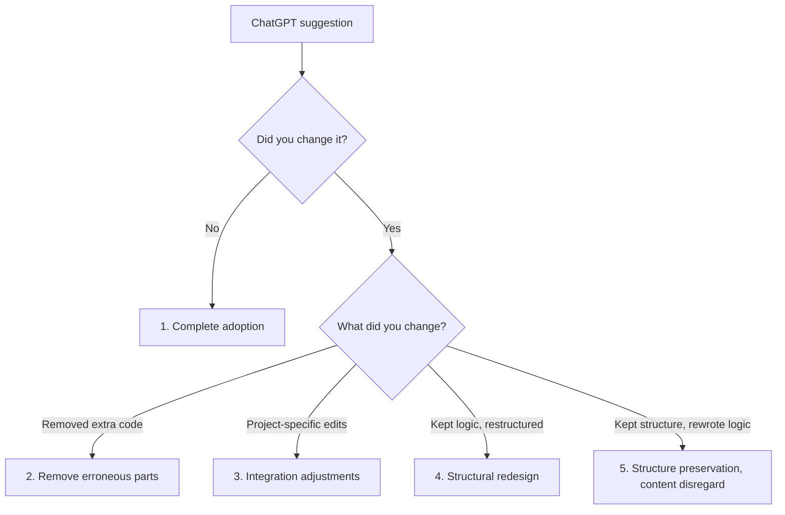
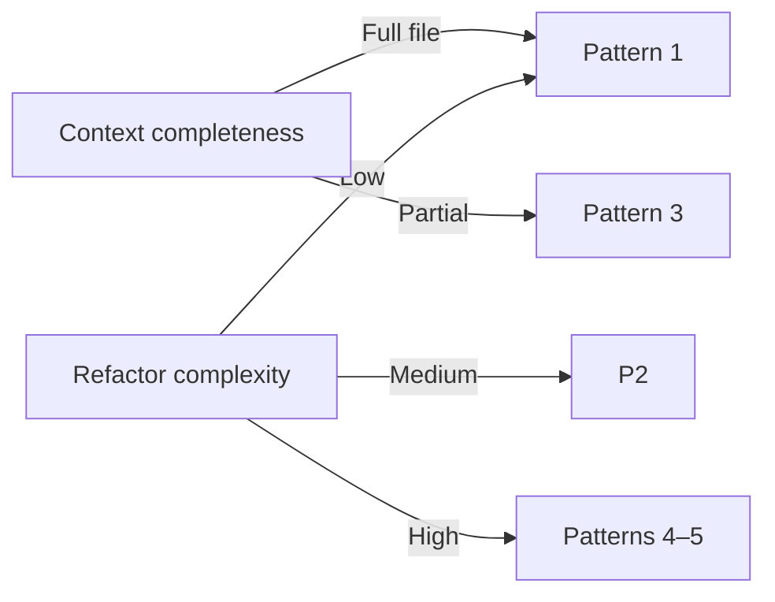

# LLM Refactoring Adoption Patterns

> Developer-initiated ChatGPT refactors are mostly adopted as-is; when modified, the change falls into one of five patterns driven by prompt context and refactor complexity.

## Scope and caveats

Patterns come from [Schön et al., 2026](https://arxiv.org/abs/2605.04835) (PROMISE 2026), which analyzed 169 commits and 440 files from the DevGPT dataset — ChatGPT (GPT-3.5 / GPT-4), July to August 2023.

The result is qualified, not universal:

- Single-repo concentration: 143 of 169 commits come from one project (`tisztamo/Junior`) ([Schön et al., 2026](https://arxiv.org/abs/2605.04835)).
- Adoption-biased sample: DevGPT only captures commits where developers shared the ChatGPT link. Rejected conversations are absent ([Schön et al., 2026](https://arxiv.org/abs/2605.04835)).
- Refactoring-only: not ambient completion (~10% useful raw inference, see [Suggestion Gating](suggestion-gating.md)) and not AI review feedback (16.6% adoption per [arxiv:2603.15911](https://arxiv.org/abs/2603.15911)).

Read the patterns as a vocabulary for modification work, not as proof that suggestions are reliable.

## The headline

Token Match Rate density concentrates above 0.9 — most refactored files closely mirror the suggestion, and developers typically reach the goal in 1 to 4 prompts ([Schön et al., 2026](https://arxiv.org/abs/2605.04835)). Of 190 manually inspected datapoints, 96 showed any modification.

Refactoring activity distribution ([Schön et al., 2026](https://arxiv.org/abs/2605.04835)):

| Activity | Count |
|----------|-------|
| Rename | 44 |
| Documentation | 37 |
| Restructure | 36 |
| Logic splitting | 33 |
| Code cleaning | 29 |
| Simplification | 25 |
| Data type changes | 7 |

These are mostly local, single-file transformations.

## The five modification patterns

```mermaid
graph TD
    S[ChatGPT suggestion] --> Q{Did you change it?}
    Q -->|No| P1[1. Complete adoption]
    Q -->|Yes| W{What did you change?}
    W -->|Removed extra code| P2[2. Remove erroneous parts]
    W -->|Project-specific edits| P3[3. Integration adjustments]
    W -->|Kept logic, restructured| P4[4. Structural redesign]
    W -->|Kept structure, rewrote logic| P5[5. Structure preservation, content disregard]
```

### 1. Complete adoption without modification

Developers commit the suggestion verbatim (similarity = 1.0). This concentrates on low-risk, local tasks — variable rename, file reorganization — and on prompts that paste the entire file as context ([Schön et al., 2026](https://arxiv.org/abs/2605.04835)). When the prompt encodes the integration points, the suggestion lands as-is.

### 2. Removal of erroneous parts

Developers keep the suggestion's core but delete additions that were never asked for — extra `if` statements, error handling, new helper functions, copy-to-clipboard logic. Deletions dominate the modifications ([Schön et al., 2026](https://arxiv.org/abs/2605.04835)). The pattern surfaces a recurring LLM tendency: scope inflation.

### 3. Integration adjustments for project compatibility

The suggestion is correct in isolation but wrong against the project — wrong file paths, wrong function names, wrong import conventions. Developers make token-level edits to align with project conventions, common in restructuring and modularity work ([Schön et al., 2026](https://arxiv.org/abs/2605.04835)) — the cost of partial-context prompts.

### 4. Structural redesign while preserving core logic

Developers keep the suggested logic but reshape it — combine multiple suggested functions, split one function across files, add comments, rename for consistency ([Schön et al., 2026](https://arxiv.org/abs/2605.04835)). Substance survives; form does not. Developer judgment about code organization outpaces what the model infers.

### 5. Structure preservation, content disregard

The inverse of pattern 4. Developers keep the suggestion's layout — function decomposition, file structure — but replace the logic with their own approach. Token Match Rate is low; the file is reorganized around different logic, sometimes alongside `mkdir`, `mv`, or `rm` operations ([Schön et al., 2026](https://arxiv.org/abs/2605.04835)). The suggestion functioned as a scaffold, not a solution.

## What drives which pattern

```mermaid
graph LR
    C[Context completeness] -->|Full file| P1[Pattern 1]
    C -->|Partial| P3[Pattern 3]
    X[Refactor complexity] -->|Low| P1
    X -->|Medium| P2
    X -->|High| P4P5[Patterns 4–5]
```

Two axes explain them ([Schön et al., 2026](https://arxiv.org/abs/2605.04835)):

- Context completeness — full-file context drives pattern 1; partial context drives pattern 3.
- Refactor complexity — simple transformations land in pattern 1 or 2; complex transformations (logic split, restructure) trigger patterns 4 and 5 because, as the authors note, "more complex suggestions often cause errors or add unwanted behavior" that requires more substantial modification ([Schön et al., 2026](https://arxiv.org/abs/2605.04835)).

## Implications for practice

Name the pattern when you modify. Deleting code you did not ask for is pattern 2: push back on suggestion scope in the prompt. Translating names and paths is pattern 3, so give the model more file context next time, since full-file context is the cheapest way to land pattern 1. Rewriting logic under a kept structure is pattern 5 — the model gave you a scaffold, not a solution.

Do not generalize past the dataset. Findings cover developer-initiated, single-file, local refactors. Cross-module refactors, interface changes, and review-feedback adoption show different rates (compare [Human-AI Review Synergy](../code-review/human-ai-review-synergy.md), where AI review suggestions adopt at 16.6%).

## Example

A developer prompts ChatGPT to "split this 200-line `processOrders` function into smaller functions." They paste the surrounding file.

- If the result lands as-is — pattern 1. Whole-file context plus a well-scoped local refactor.
- If they delete an unrequested logging block the model added — pattern 2. Scope inflation, edited out.
- If they rename `validateOrder` to `checkOrderValidity` to match project style — pattern 3. Project-specific integration, not present in the prompt.
- If they keep the new helper functions but merge two of them and reorder others — pattern 4. Logic preserved, structure adjusted.
- If they accept the four-function decomposition but rewrite each function's body — pattern 5. Scaffold accepted, logic rejected.

The same prompt and the same suggestion can produce any of these depending on prompt completeness and refactor complexity. The pattern label tells you which lever to pull next time.

## Key Takeaways

- Most committed ChatGPT refactors in the [DevGPT dataset](https://arxiv.org/abs/2605.04835) are adopted with high similarity, but 51% of inspected datapoints show some modification — modification is the norm at the boundary, not the exception
- The five patterns (complete adoption, remove erroneous parts, integration adjustments, structural redesign, structure preservation with content disregard) are driven by prompt context completeness and refactor complexity, not LLM capability per se
- Findings are qualified by single-repo concentration (143 of 169 commits) and adoption bias (rejected conversations excluded) — generalization requires explicit conditions
- Full-file context in the prompt is correlated with pattern 1; partial context is correlated with pattern 3
- The result does not extend to AI-generated review feedback (16.6% adoption — [arxiv:2603.15911](https://arxiv.org/abs/2603.15911)) or to ambient code completion (~10% useful raw inference — see [Suggestion Gating](suggestion-gating.md))

## Related

- [Suggestion Gating](suggestion-gating.md) — adoption rate and inference-waste data for ambient completion, the channel adjacent to chat refactoring
- [Human-AI Review Synergy](../code-review/human-ai-review-synergy.md) — AI review-suggestion adoption rates from a different study, contrasting the refactoring-specific finding here
- [Strategy Over Code Generation](strategy-over-code-generation.md) — broader context for why prompt completeness matters more than raw model speed
- [Developer Control Strategies for AI Coding Agents](developer-control-strategies-ai-agents.md) — empirical evidence on how experienced developers supervise AI output
