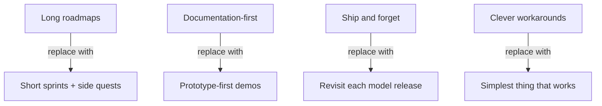

# PM on the AI Exponential

> Exponential AI model improvement breaks traditional product management assumptions. Features designed around current limitations become over-engineered when the next model ships.

## Why the Exponential Matters

Traditional PM assumes constraints stay stable through a project lifecycle. AI model capabilities do not. METR benchmarks show Claude 3.5 Sonnet (October 2024) completed software tasks requiring ~21 minutes of human work; Claude Opus 4.6 (February 2026) handles tasks requiring ~12 hours -- roughly 35x improvement in 16 months ([METR](https://metr.org/time-horizons/)).

Features designed around today's token limits, reasoning gaps, or tool limitations may be obsolete by the time they ship. The response is four concrete workflow shifts ([Wu](https://claude.com/blog/product-management-on-the-ai-exponential)).

## Short Sprints and Side Quests

Replace extended roadmaps with short planning cycles. The rate of model improvement makes multi-quarter feature plans unreliable -- constraints you designed around can vanish mid-project.

**Side quests** are self-directed afternoon experiments that test capabilities or explore ideas outside official deliverables. At Anthropic, side quests produced Claude Code Desktop, the AskUserQuestion tool, and todo lists ([Wu](https://claude.com/blog/product-management-on-the-ai-exponential)). Failed experiments are cheap; multi-month plans built on stale assumptions are expensive.

This maps directly to AI-assisted development: prompt strategies, agent configurations, and context engineering approaches optimized for one model generation may need rethinking when the next ships.

## Prototype-First Over Documentation

Demo-driven development replaces documentation-heavy planning. Build a working prototype in hours, put it in front of users, and let engagement determine what gets polished.

Bihan Jiang (Director of Product, Decagon): "Claude has raised the ceiling on what good product teams can build, and dramatically shortened the distance between idea and prototype" ([Wu](https://claude.com/blog/product-management-on-the-ai-exponential)).

The economics shift: failed prototypes cost an afternoon. Failed multi-week documentation-and-specification cycles cost alignment, momentum, and opportunity. When AI tools can generate a working proof-of-concept from a natural language description, the fastest path to validation is building, not specifying.

**Product blurring** follows: designers ship code, engineers make product decisions, PMs build prototypes and evals. Function boundaries dissolve when prototyping is cheap ([Wu](https://claude.com/blog/product-management-on-the-ai-exponential)).

## Revisit Features Each Model Release

New model capabilities may dramatically improve features built under previous constraints. Every model release is an implicit prompt to re-evaluate existing implementations.

Claude Code with Chrome emerged this way: teams were manually switching between browser and terminal. When model capabilities caught up, the manual pattern became a built-in feature ([Wu](https://claude.com/blog/product-management-on-the-ai-exponential)).

The practice: be a daily active user of your AI tools and deliberately ask them to do things you think are too hard. When they succeed, that is a signal the product needs to catch up.

Kai Xin Tai (Senior PM, Datadog) recommends studying "strengths and failure modes through offline evaluation" and designing "tight feedback loops" to surface when agent weaknesses disappear ([Wu](https://claude.com/blog/product-management-on-the-ai-exponential)).

## Simplicity-First Implementation

Avoid building clever workarounds for current model limitations. Those workarounds become unnecessary complexity -- and potentially [shadow tech debt](../anti-patterns/shadow-tech-debt.md) -- when the next model eliminates the limitation they compensate for.

Anthropic's early todo list implementation required system prompt reminders to check task completion. Newer models eliminated this hack entirely ([Wu](https://claude.com/blog/product-management-on-the-ai-exponential)).

The principle for developers: when building agent workflows, prompt chains, or context engineering strategies, prefer the simplest approach that works. Simpler implementations adapt more easily when capabilities leap forward. Optimize for capability first when prototyping (use more tokens than you think necessary), then cost-optimize once the approach is validated.

This intersects with [comprehension debt](../anti-patterns/comprehension-debt.md): simpler implementations are easier to understand, debug, and replace. Complex workarounds compound both technical and comprehension debt simultaneously.

## Key Takeaways

- Exponential model improvement (35x in 16 months per METR) makes multi-quarter feature plans unreliable
- Side quests -- afternoon experiments -- validate assumptions cheaply and have produced real shipping features
- Prototype-first workflows make failed bets economical; failed specifications waste alignment and momentum
- Every model release is a signal to revisit existing features and remove workarounds that are no longer necessary
- The simplest implementation that works adapts most easily to the next capability jump

## Related

- [Shadow Tech Debt](../anti-patterns/shadow-tech-debt.md) -- over-engineered workarounds becoming invisible debt
- [Comprehension Debt](../anti-patterns/comprehension-debt.md) -- complexity costs as capabilities shift
- [Product-as-IDE](../emerging/product-as-ide.md) -- the logical endpoint of prototype-first development
- [Progressive Autonomy](progressive-autonomy-model-evolution.md) -- scaling trust as models improve
- [The Bottleneck Migration](bottleneck-migration.md) -- where effort goes when code generation becomes cheap
- [Strategy Over Code Generation](strategy-over-code-generation.md) -- strategy clarity matters more than coding speed
