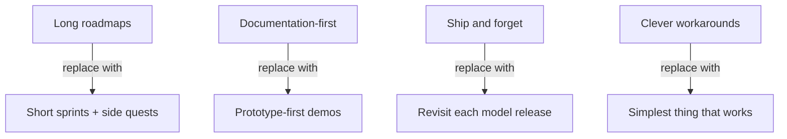

# PM on the AI Exponential

> Exponential AI model improvement breaks traditional product management assumptions. Features designed around current limitations become over-engineered when the next model ships.

## Why the Exponential Matters

Traditional PM assumes constraints stay stable through a project lifecycle. AI capabilities do not. METR benchmarks show Claude 3.5 Sonnet (October 2024) completed software tasks requiring ~21 minutes of human work; Claude Opus 4.6 (February 2026) handles ~12-hour tasks -- roughly 35x in 16 months ([METR](https://metr.org/time-horizons/), [Time Horizon 1.1](https://metr.org/blog/2026-1-29-time-horizon-1-1/)).

Features designed around today's token limits, reasoning gaps, or tool limitations may be obsolete by ship date. The response: four workflow shifts ([Wu](https://claude.com/blog/product-management-on-the-ai-exponential)).

## Short Sprints and Side Quests

Replace extended roadmaps with short planning cycles. Model improvement makes multi-quarter plans unreliable -- constraints you designed around can vanish mid-project.

**Side quests** are afternoon experiments outside official deliverables. At Anthropic, they produced Claude Code Desktop, the AskUserQuestion tool, and todo lists ([Wu](https://claude.com/blog/product-management-on-the-ai-exponential)). Failed experiments are cheap; multi-month plans on stale assumptions are expensive.

This maps to AI-assisted development: prompt strategies, agent configurations, and [context engineering](../context-engineering/context-engineering.md) approaches optimized for one model generation may need rethinking when the next ships.

## Prototype-First Over Documentation

Demo-driven development replaces documentation-heavy planning. Build a prototype in hours, put it in front of users, and let engagement decide what gets polished.

Bihan Jiang (Director of Product, Decagon): "Claude has raised the ceiling on what good product teams can build, and dramatically shortened the distance between idea and prototype" ([Wu](https://claude.com/blog/product-management-on-the-ai-exponential)).

Failed prototypes cost an afternoon; failed multi-week spec cycles cost alignment and momentum. When AI generates a working proof-of-concept from a natural-language description, the fastest path to validation is building.

**Product blurring** follows: designers ship code, engineers make product decisions, PMs build prototypes and evals ([Wu](https://claude.com/blog/product-management-on-the-ai-exponential)).

## Revisit Features Each Model Release

New capabilities may improve features built under previous constraints. Every model release is an implicit prompt to re-evaluate existing implementations.

Claude Code with Chrome emerged this way: teams were manually switching between browser and terminal. When models caught up, the manual pattern became a built-in feature ([Wu](https://claude.com/blog/product-management-on-the-ai-exponential)).

The practice: be a daily user of your AI tools and deliberately ask them to do things you think are too hard. When they succeed, that's a signal the product needs to catch up.

Kai Xin Tai (Senior PM, Datadog) recommends studying "strengths and failure modes through offline evaluation" and designing "tight feedback loops" to surface when weaknesses disappear ([Wu](https://claude.com/blog/product-management-on-the-ai-exponential)).

## Simplicity-First Implementation

Avoid building clever workarounds for current model limitations. Those workarounds become unnecessary complexity -- and potentially [shadow tech debt](../anti-patterns/shadow-tech-debt.md) -- when the next model eliminates the limitation.

Anthropic's early todo list required system-prompt reminders to check task completion. Newer models eliminated this hack entirely ([Wu](https://claude.com/blog/product-management-on-the-ai-exponential)).

For developers: when building agent workflows, prompt chains, or context strategies, prefer the simplest approach that works. Simpler implementations adapt more easily when capabilities leap. Optimize for capability first (use more tokens than you think necessary), then cost-optimize once validated.

This intersects with [comprehension debt](../anti-patterns/comprehension-debt.md): simpler implementations are easier to debug and replace. Complex workarounds compound both technical and comprehension debt.

## When This Backfires

These shifts assume the organization tolerates rapid reprioritization. Conditions that undercut them:

- **Coordination overhead**: Short sprints work for small teams. Multi-team orgs with shared roadmaps cannot drop quarterly commitments because a model shipped; realignment cost may exceed the benefit.
- **Prototypes promoted to production**: Prototype-first breaks when time pressure turns a proof-of-concept into production without architectural review.
- **Revisit fatigue**: Re-evaluating features each release creates prioritization instability. Teams with large legacy surfaces cannot affordably audit them each cycle.
- **Simplicity misapplied**: "Simplest thing that works" defers necessary complexity rather than eliminating it. Some edge cases require complex handling regardless of model capability.

These shifts are most reliable for small, fast-moving teams building AI-native products.

## Key Takeaways

- Exponential model improvement (35x in 16 months per METR) makes multi-quarter feature plans unreliable
- Side quests -- afternoon experiments -- validate assumptions cheaply and have produced real shipping features
- Prototype-first workflows make failed bets economical; failed specifications waste alignment and momentum
- Every model release is a signal to revisit existing features and remove workarounds that are no longer necessary
- The simplest implementation that works adapts most easily to the next capability jump

## Related

- [Shadow Tech Debt](../anti-patterns/shadow-tech-debt.md) -- over-engineered workarounds becoming invisible debt
- [Comprehension Debt](../anti-patterns/comprehension-debt.md) -- complexity costs as capabilities shift
- [Product-as-IDE](../emerging/product-as-ide.md) -- the logical endpoint of prototype-first development
- [Progressive Autonomy](progressive-autonomy-model-evolution.md) -- scaling trust as models improve
- [The Bottleneck Migration](bottleneck-migration.md) -- where effort goes when code generation becomes cheap
- [Strategy Over Code Generation](strategy-over-code-generation.md) -- strategy clarity matters more than coding speed
