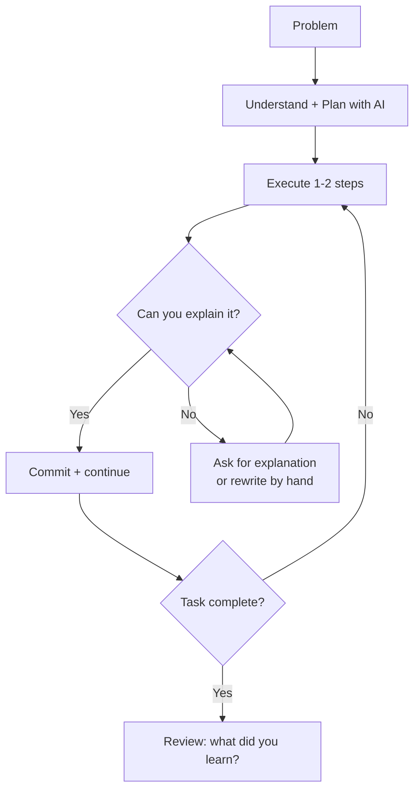

# Polya Small-Steps: Using AI to Think Better, Not Think Less

> Use AI to enhance your thinking rather than replace it — working 1–2 steps at a time with instant feedback, keeping comprehension ahead of code.

## The Problem This Solves

Most AI-assisted coding advice optimizes for throughput: generate more code faster. That optimization has a cost. A [randomized controlled trial by Anthropic (2026)](https://www.anthropic.com/research/AI-assistance-coding-skills) with 52 software engineers found that AI-assisted developers scored 17 percentage points lower on comprehension tests than those who coded by hand (50% vs 67%). The largest gap was in debugging — precisely the skill needed to supervise AI output.

The critical finding was not that AI causes skill loss. It was that **interaction mode determines outcome**. Developers who used AI as a code dispenser (delegation mode) scored below 40% ([Anthropic, 2026](https://www.anthropic.com/research/AI-assistance-coding-skills)). Developers who used AI as a thinking partner (conceptual inquiry mode) scored 65% or above — and were the second-fastest group overall, after pure delegation.

## The Four-Step Structure

George Polya's problem-solving framework from *[How to Solve It](https://en.wikipedia.org/wiki/How_to_Solve_It)* (1945) is a practitioner-applied lens for LLM-assisted coding — the mapping below is a structured application of the original four steps, not a published finding:

| Polya step | What it means with AI |
|-----------|----------------------|
| **Understand the problem** | Formulate the problem precisely before prompting. Ask AI: "What are the constraints here?" not "Write me a solution." |
| **Devise a plan** | Outline an approach with AI as a sounding board. "What algorithm would you use for this and why?" before requesting any code. |
| **Carry out the plan** | Execute 1–2 logical steps at a time with immediate feedback — run, test, or verify before proceeding. |
| **Look back** | Review what was produced. If you cannot explain every line you commit, that is your signal to ask for an explanation or rewrite it yourself. |

The discipline is explicit about the fourth step: **comprehension is the exit gate**. Code you cannot explain does not get committed.

## Why Small Steps

Working in small increments is not just about catching errors early. It keeps the developer's mental model current with the codebase. Large-batch generation produces output faster than review speed — the [velocity-comprehension gap](../anti-patterns/comprehension-debt.md) that accumulates comprehension debt. This tracks a core result from [cognitive load theory](https://journals.sagepub.com/doi/10.1177/0963721420922183): working memory is bounded, so learners build durable schemas when new material arrives in chunks small enough to process — not when it arrives faster than it can be integrated.

Small steps also expose reasoning gaps: a gap in a 3-line function is recoverable; the same gap across 200 lines of generated code is structural.

## The Comprehension Gate

The comprehension gate is the one rule that distinguishes this discipline from standard AI-assisted coding:

> If you cannot explain what the AI produced, you do not commit it. You ask for an explanation, or you rewrite it by hand with AI as a tutor.

This is not a speed optimization — it makes you slower. It is a **skill and oversight optimization**. The [Anthropic study](https://www.anthropic.com/research/AI-assistance-coding-skills) found that the "conceptual inquiry" group independently resolved more errors than the delegation group, even though they encountered more of them. The errors they fixed themselves mapped directly to quiz topics they later scored well on.



## When This Beats Delegation Mode

Use the small-steps discipline when:

- **Learning a new domain or library** — the Anthropic study used this exact scenario. Comprehension during learning compounds; delegation during learning doesn't.
- **Novel or research-grade problems** — unfamiliar solution space means you cannot evaluate whether the output is correct without understanding it.
- **High-stakes code** — authentication, data models, financial logic. Black-box code in these paths creates compounding risk.
- **Skill preservation is a goal** — deliberately maintaining capability in areas you would otherwise delegate entirely.

## When Delegation Mode Is Correct

The discipline has a cost: it is slower than pure delegation for tasks where comprehension is not the goal.

- **Boilerplate and scaffolding** — repeated structural patterns where the approach is known and the cost of error is low.
- **Permutation work** — generating variants of a proven pattern across multiple files.
- **Throwaway scripts** — one-off tooling where you discard and rewrite rather than maintain ([vibe coding](../workflows/vibe-coding.md) is appropriate here).

The distinction: **does comprehension of this specific code matter for your ability to debug, extend, or supervise it later?** If yes, small steps. If no, delegate freely.

## Example

A developer is learning `asyncio` and needs to implement a rate-limited API client. They have not used asyncio semaphores before.

**Delegation mode** (scores below 40%):

```
Prompt: "Write an async API client with rate limiting using asyncio semaphore"
```

The agent produces 60 lines. Tests pass. The developer commits without reading. Three days later the rate limiter behaves unexpectedly under burst load. They cannot debug it without asking the agent — paying off comprehension debt with more debt.

**Small-steps mode** (scores 65%+):

```
Step 1 — Understand:
"What's the right asyncio primitive for rate-limiting concurrent requests, and why?"

Agent explains: asyncio.Semaphore limits concurrent coroutines. Explains acquire/release.

Step 2 — Plan:
"How would I structure a client that limits to N concurrent requests without blocking the event loop?"

Agent outlines the approach. Developer understands the shape before touching code.

Step 3 — Execute (first step only):
"Write just the semaphore setup and one async method that acquires it — no HTTP yet."

Developer reads 8 lines, runs a trivial test, understands the acquire/release lifecycle.

Step 4 — Continue:
"Now add the HTTP call inside the semaphore context, with timeout handling."
```

At commit time, the developer can explain every line. When burst behavior appears three weeks later, they know exactly where to look.

## Key Takeaways

- AI interaction mode determines comprehension outcomes — delegation and small-steps produce opposite results for learning and oversight
- The comprehension gate (don't commit what you can't explain) is the core practice, not a guideline
- Small steps compound: errors caught at 3 lines are recoverable; errors discovered at 200 lines are structural
- Use delegation mode freely for boilerplate, permutation work, and throwaway scripts — small-steps discipline is for contexts where comprehension matters

## Related

- [Skill Atrophy](skill-atrophy.md) — cumulative capability loss when delegation mode becomes the default
- [Comprehension Debt](../anti-patterns/comprehension-debt.md) — structural gap between agent-produced code and developer understanding
- [Developer Control Strategies for AI Coding Agents](developer-control-strategies-ai-agents.md) — empirical evidence that experienced developers plan and validate rather than delegate
- [Vibe Coding](../workflows/vibe-coding.md) — the opposite workflow: appropriate for low-risk, throwaway contexts
- [Process Amplification](process-amplification.md) — strong engineering practices scale with agents; this discipline is one such practice
- [Strategy Over Code Generation](strategy-over-code-generation.md) — prioritizing understanding of the problem over speed of output
- [Deliberate AI-Assisted Learning](deliberate-ai-learning.md) — structured approach to accelerating skill acquisition without comprehension loss
- [Cognitive Load, AI Fatigue, and Sustainable Agent Use](cognitive-load-ai-fatigue.md) — managing the cognitive overhead of sustained AI-assisted work
