# Process Amplification

> Agents magnify existing engineering practices. Strong processes improve dramatically; weak processes degrade at scale. Invest in your environment before investing in your prompts.

## The Amplifier Effect

Agents do not raise or lower your engineering standards. They accelerate whatever trajectory you are already on. The [2025 DORA report](https://dora.dev/research/2025/dora-report/) frames AI as a "mirror and multiplier" of existing organizational capability ([IT Revolution analysis](https://itrevolution.com/articles/ais-mirror-effect-how-the-2025-dora-report-reveals-your-organizations-true-capabilities/)). Teams with high AI adoption [merged 98% more PRs, but review times increased 91% and PR size grew 154%](https://addyo.substack.com/p/the-80-problem-in-agentic-coding) -- organizational delivery metrics stayed flat even as individual output surged.

The gap is not the model. It is the environment the model operates in.

## Why Environment Beats Prompting

Agent output quality is a function of environment quality. At each step, an agent needs ground truth -- tool results, test output, compiler errors -- to assess progress. Without accurate signals, errors compound across turns.

The tighter the feedback loop (agent writes code, automated check verifies, agent iterates), the more trustworthy the output. The weaker the loop, the more the human becomes the bottleneck.

```mermaid
graph LR
    A[Agent writes code] --> B{Automated check}
    B -->|Pass| C[Commit]
    B -->|Fail| D[Error signal]
    D --> A

    style B fill:#2d5016,stroke:#4a8529
    style C fill:#1a3a5c,stroke:#2d6ca2
    style D fill:#5c1a1a,stroke:#a22d2d
```

## What Gets Amplified

| Vector | Strong Practice | Agent Behaviour | Weak Practice | Agent Behaviour |
|--------|----------------|-----------------|---------------|-----------------|
| Tests | High coverage, fast suite | Self-corrects on failure, iterates autonomously | No tests or slow suite | Builds on faulty premises, requires human verification |
| Conventions | Consistent patterns, style guides | Extrapolates correctly from observed code | Inconsistent, mixed styles | Invents new patterns or picks arbitrarily |
| CI pipeline | Fast, deterministic checks | Gets binary pass/fail feedback per commit | Absent or flaky | No feedback loop; errors propagate silently |
| Architecture docs | CLAUDE.md, AGENTS.md, decision records | Respects constraints it cannot infer from code | Undocumented decisions | Reverts intentional choices, adds [abstraction bloat](../anti-patterns/abstraction-bloat.md) |
| Type system | Strict, complete | Compiler errors act as backpressure | Loose or `any` types | Guesses at interfaces, propagates wrong assumptions |

## Three Failure Modes

**[Assumption propagation](../anti-patterns/assumption-propagation.md).** Without clear specs and tests, agents build on faulty premises. Each commit deepens the wrong assumption until the cascade spans multiple files.

**Abstraction bloat.** In poorly-constrained environments, agents add layers and indirection that no signal stops.

**Dead code accumulation.** Missing architecture principles let debris persist. Agents generate utilities and fallback paths that are never called but never flagged.

## Readiness Audit

Before scaling, audit your feedback infrastructure.

| Infrastructure | What It Enables for Agents | Audit Question |
|---------------|---------------------------|----------------|
| Test suite | Autonomous iteration without human review | Can an agent run tests and get a pass/fail in under 60 seconds? |
| Linter / formatter | Automatic style compliance | Does CI reject style violations before review? |
| Type checker | Compile-time constraint enforcement | Are all public interfaces fully typed? |
| Project instructions | [Non-discoverable context](../context-engineering/discoverable-vs-nondiscoverable-context.md) | Does CLAUDE.md / AGENTS.md document architectural decisions? |
| CI pipeline | Binary quality gate per commit | Does every push get automated verification? |
| Code review norms | PR size and scope expectations | Are PRs small enough for meaningful review? |

## The Compounding Problem

Agents chain errors across commits at machine speed. Without automated gates, incorrect assumptions span multiple commits before anyone catches them. The answer is better automated verification, not more human review.

## When This Backfires

Invest-in-environment-first is a default, not a law. The advice is weaker in these cases:

- **Throwaway exploration.** For spikes and prototypes that will be discarded, a pre-built test harness and CI pipeline is pure overhead. Amplification cannot cascade without downstream consumers.
- **Greenfield projects.** Day-one codebases have no conventions or tests to amplify. Agents can bootstrap the scaffolding itself — including the first test suite and CI config — before any feedback loops exist.
- **Research code where the artifact is the ground truth.** ML scripts and simulation rigs are validated by the result, not by unit tests. Agents producing wrong intermediate code but correct final artifacts can still be net-positive.
- **Legacy systems with no retrofit path.** Narrowly-scoped agent use (doc generation, localized refactors under review) can still pay off when none of this page's preconditions are met. Blocking agents on infrastructure that will never be built is worse than using them cautiously.

## Key Takeaways

- Agent output quality is determined by environment quality, not model or prompt quality
- DORA 2025 data confirms measurable amplification: high-performing teams accelerate, struggling teams degrade faster ([DORA 2025](https://dora.dev/research/2025/dora-report/); [Osmani, 2025](https://addyo.substack.com/p/the-80-problem-in-agentic-coding))
- Feedback loops (tests, linters, CI) are the highest-leverage investment for agent adoption
- Audit verification infrastructure before scaling

## Example

A team with no test suite adopts an agent to extend their payment processing module.

**Without tests**: The agent generates a function that assumes the payment gateway returns a synchronous response. No check catches this. It builds two more features on top — error handling and retry logic — each deepening the assumption. By commit 6, the wrong assumption threads through eight files. A developer catches it in code review three days later. The agent had no signal that anything was wrong.

**With a test suite**: The agent writes the same function, runs tests, gets an immediate failure — the gateway returns async. It reads the error, rewrites the function, tests again, and proceeds. No human involvement needed.

The agent did not become smarter. The environment gave it something to push against.

## Related

- [Codebase Readiness](../workflows/codebase-readiness.md)
- [Agent Backpressure](../agent-design/agent-backpressure.md)
- [Convention Over Configuration](../instructions/convention-over-configuration.md)
- [The Ralph Wiggum Loop](../agent-design/ralph-wiggum-loop.md)
- [Verification Ledger](../verification/verification-ledger.md)
- [Agent Harness](../agent-design/agent-harness.md)
- [Rigor Relocation](rigor-relocation.md)
- [Cognitive Load, AI Fatigue, and Sustainable Agent Use](cognitive-load-ai-fatigue.md)
- [The Addictive Flow State of Agent-Assisted Development](addictive-flow-agent-development.md)
- [Skill Atrophy](skill-atrophy.md)
- [Progressive Autonomy with Model Evolution](progressive-autonomy-model-evolution.md)
- [The Bottleneck Migration](bottleneck-migration.md)
- [Convenience Loops and AI-Friendly Code](convenience-loops-ai-friendly-code.md)
- [Strategy Over Code Generation](strategy-over-code-generation.md)
- [Developer Control Strategies for AI Coding Agents](developer-control-strategies-ai-agents.md)
