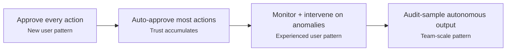

# Progressive Autonomy with Model Evolution

> Treat agent autonomy as a dial you turn up over time based on demonstrated reliability — not a switch you flip on day one.

## The Tension

Restricting autonomy limits productivity; granting too much risks costly mistakes. Progressive autonomy expands the boundary incrementally, using evidence from each stage to justify the next.

## Autonomy Levels

Major AI coding tools implement graduated autonomy levels:

| Level | Human Role | Agent Scope | Tool Examples |
|-------|-----------|-------------|---------------|
| **Suggest** | Decision-maker | Information only | Copilot Ask, tab completion |
| **Propose** | Approver (per-action) | Generates diffs for review | Copilot Edit, Claude Code interactive |
| **Execute with gates** | Monitor (approve risky actions) | Acts autonomously, escalates on risk | [Copilot Agent Mode](../tools/copilot/agent-mode.md), Claude Code with permissions |
| **Execute in sandbox** | Auditor (post-hoc review) | Full autonomy within boundaries | Claude Code sandboxed, Cursor Agent Mode |
| **Fully autonomous** | Reviewer (PR-level only) | End-to-end from issue to PR | Copilot Coding Agent, [headless Claude Code](../workflows/headless-claude-ci.md) |

## How Trust Actually Builds

Anthropic's Claude Code usage data shows how developers grant autonomy over time ([Measuring Agent Autonomy](https://www.anthropic.com/research/measuring-agent-autonomy)):

- **~20%** of newer users (<50 sessions) use full auto-approve, rising to **>40%** at ~750 sessions
- 99.9th percentile turn duration nearly doubled from <25 to >45 min (Oct 2025 – Jan 2026)
- Experienced users show a paradox: **higher auto-approval AND higher interruption rates** (~9% vs ~5%) — shifting to a monitoring-and-intervening model

Progressive autonomy shifts oversight from per-action approval to exception-based monitoring.

## Selecting the Right Autonomy Level

Match autonomy level to task characteristics:

| Factor | Lower Autonomy (Suggest/Propose) | Higher Autonomy (Execute/Autonomous) |
|--------|----------------------------------|--------------------------------------|
| **Task clarity** | Ambiguous, exploratory | Well-defined, scoped |
| **Risk tolerance** | Low (production, security) | Higher (feature branches, tests) |
| **Domain familiarity** | Unfamiliar codebase | Well-understood system |
| **Test coverage** | Sparse | Comprehensive |
| **Reversibility** | Hard to undo | Easy to revert |

Levels 1–3 are synchronous; 4–5 are asynchronous — assign work and review at PR time ([Coding Agent vs Agent Mode](https://github.blog/developer-skills/github/less-todo-more-done-the-difference-between-coding-agent-and-agent-mode-in-github-copilot/)). Asynchronous modes require comprehensive tests, clear specs, and documented conventions.

## The Escalation Ladder

| Stage | Mode | Advance when |
|-------|------|-------------|
| **1. Read-Only / Suggest** | Information only | Team reliably identifies wrong suggestions |
| **2. Supervised Execution** | Additive low-risk work (tests, docs, config) with per-action approval | Error rate on approved changes acceptable |
| **3. Gated Autonomy with Sandboxing** | Broader execution in sandbox; 84% fewer permission prompts ([Anthropic](https://www.anthropic.com/engineering/claude-code-sandboxing)) | Sandboxed quality matches supervised output |
| **4. Autonomous with Monitoring** | High-autonomy modes; post-hoc audit sampling | Disagreement rate within tolerance; rollback tested |
| **5. Asynchronous Delegation** | End-to-end from issue to PR | Comprehensive tests, clear specs, documented conventions |

**Rollback trigger:** Rising defect rate, CI failures, or reviewer disagreement above threshold.

## Metrics That Justify Escalation

Define these **before** expanding autonomy.

| Metric | Escalation Signal |
|--------|-------------------|
| Approval rate | Consistently >95% → reduce gates |
| Intervention rate | Declining → increase autonomy |
| Defect escape rate | Must stay flat or improve |
| Audit disagreement | Below threshold (e.g., <5%) → full autonomy |
| Turn duration | Increasing duration reflects growing trust |

## Rollback Mechanisms

- **Automatic scope reduction:** Narrow permitted actions when error rate exceeds threshold
- **Canary rollout:** Test policy changes on a subset before rollout
- **Kill switches:** Org-level controls (managed settings, MDM) that restrict capabilities
- **Agent self-calibration:** Claude Code requests clarification 2x more on complex tasks ([Anthropic](https://www.anthropic.com/research/measuring-agent-autonomy))

## When This Backfires

Progressive autonomy assumes measurable signals — when those don't exist, the model breaks down:

- **Metrics don't exist yet.** Approval rate and defect escape rate require an instrumented workflow. Teams without CI or code review tooling have no signal to justify escalation; advancing by calendar creates phantom trust.
- **Task distribution shifts.** Autonomy earned on scoped feature work doesn't transfer to greenfield architecture or security-sensitive domains. Treating it as a global setting rather than per-task-class causes regressions on unfamiliar work.
- **Trust resets asymmetrically.** A single production incident erases accumulated trust and forces a full restart of the escalation sequence — teams that advanced quickly are disproportionately exposed.
- **Thresholds need calibration before incidents, not after.** Rollback thresholds set reactively are often too permissive to prevent recurrence or too strict to allow useful work.

## Key Takeaways

- Autonomy is a dial, not a switch — expand incrementally using evidence
- Progressive autonomy repositions oversight (per-action → monitoring); it never eliminates it
- Trust resets on a single failure — staged rollout limits blast radius (see [Blast Radius Containment](../security/blast-radius-containment.md))
- Define escalation metrics before granting autonomy; include rollback triggers
- Match autonomy level to task clarity, risk, familiarity, test coverage, and reversibility

## Example

A team adopting Claude Code for a Django codebase progresses through the escalation ladder over six weeks:

**Week 1–2 (Stage 1 — Suggest):** The team uses Claude Code in ask-only mode to explore unfamiliar modules. They measure how often suggestions are accepted vs. rejected. Acceptance rate: 72%.

**Week 3–4 (Stage 2 — Supervised Execution):** They enable Claude Code to write and apply test files with per-action approval. The team tracks defect escape rate on approved changes. Three incidents occur; all are caught in review. Error rate: acceptable.

**Week 5 (Stage 3 — Gated Autonomy with Sandboxing):** They enable broader autonomy in a sandboxed dev environment. Claude Code runs autonomously but cannot touch production secrets or deploy. Sandboxed output quality matches week 3–4 supervised output. Approval rate: 94%.

**Week 6 (Stage 4 — Autonomous with Monitoring):** The team shifts to post-hoc audit sampling — reviewing 20% of PRs for disagreement. Disagreement rate: 3%, below the 5% threshold. They are ready to trial Stage 5 for well-specified issues.

This trajectory is not guaranteed — a production incident in week 5 would have triggered rollback to Stage 2. The key is that the team set exit criteria before each stage, not after.

## Related

- [Human-in-the-Loop Confirmation Gates](../security/human-in-the-loop-confirmation-gates.md)
- [Human-in-the-Loop Placement: Where and How to Supervise](../workflows/human-in-the-loop.md)
- [Delegation Decision](../agent-design/delegation-decision.md)
- [Risk-Based Task Sizing](../verification/risk-based-task-sizing.md)
- [AI Development Maturity Model](../workflows/ai-development-maturity-model.md)
- [Safe Command Allowlisting](../human/safe-command-allowlisting.md)
- [Empirical Baseline for Agentic Config](../human/empirical-baseline-agentic-config.md)
- [Rigor Relocation](../human/rigor-relocation.md)
- [Process Amplification](../human/process-amplification.md)
- [Cognitive Load and AI Fatigue](../human/cognitive-load-ai-fatigue.md)
- [Evidence-Based Allowlist Auto-Discovery](../human/evidence-based-allowlist-auto-discovery.md)
- [Skill Atrophy](../human/skill-atrophy.md)
- [Developer Control Strategies for AI Coding Agents](../human/developer-control-strategies-ai-agents.md)
- [Agent-Driven Greenfield Product Development](../workflows/agent-driven-greenfield.md)
- [The Bottleneck Migration](../human/bottleneck-migration.md)
- [Domain-Specific Agent Challenges](../human/domain-specific-agent-challenges.md)
- [Suggestion Gating](../human/suggestion-gating.md)
