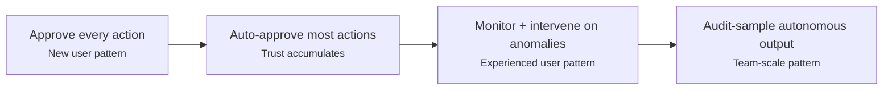

# Progressive Autonomy: Scaling Trust with Model Evolution

> Treat agent autonomy as a dial you turn up over time based on demonstrated reliability — not a switch you flip on day one.

## The tension

Restricting autonomy limits productivity. Granting too much risks costly mistakes. Progressive autonomy expands the boundary one stage at a time. Each stage produces evidence that justifies the next. Autonomy is one dial. [Ambition scaling](../human/ambition-scaling.md) (task scope) is the other.

## Autonomy levels

Major AI coding tools implement graduated autonomy levels:

| Level | Human Role | Agent Scope | Tool Examples |
|-------|-----------|-------------|---------------|
| Suggest | Decision-maker | Information only | Copilot Ask, tab completion |
| Propose | Approver (per-action) | Generates diffs for review | Copilot Edit, Claude Code interactive |
| Execute with gates | Monitor (approve risky actions) | Acts autonomously, escalates on risk | [Copilot Agent Mode](../tools/copilot/agent-mode.md), Claude Code with permissions |
| Execute in sandbox | Auditor (post-hoc review) | Full autonomy within boundaries | Claude Code sandboxed, Cursor Agent Mode |
| Fully autonomous | Reviewer (PR-level only) | End-to-end from issue to PR | Copilot Coding Agent, [headless Claude Code](../workflows/headless-claude-ci.md) |

## How trust actually builds

Anthropic's Claude Code usage data shows how developers grant autonomy over time ([Measuring Agent Autonomy](https://www.anthropic.com/research/measuring-agent-autonomy)):

- About 20% of newer users (under 50 sessions) use full auto-approve. This rises above 40% at around 750 sessions.
- The 99.9th percentile turn duration nearly doubled, from under 25 to over 45 minutes (October 2025 to January 2026).
- Experienced users show a paradox: higher auto-approval and higher interruption rates (about 9% versus 5%). They shift to a monitoring-and-intervening model.

```mermaid
graph LR
    A["Approve every action<br><small>New user pattern</small>"] --> B["Auto-approve most actions<br><small>Trust accumulates</small>"]
    B --> C["Monitor + intervene on anomalies<br><small>Experienced user pattern</small>"]
    C --> D["Audit-sample autonomous output<br><small>Team-scale pattern</small>"]
```

## Selecting the right autonomy level

Match autonomy level to task characteristics:

| Factor | Lower Autonomy (Suggest/Propose) | Higher Autonomy (Execute/Autonomous) |
|--------|----------------------------------|--------------------------------------|
| Task clarity | Ambiguous, exploratory | Well-defined, scoped |
| Risk tolerance | Low (production, security) | Higher (feature branches, tests) |
| Domain familiarity | Unfamiliar codebase | Well-understood system |
| Test coverage | Sparse | Comprehensive |
| Reversibility | Hard to undo | Easy to revert |

Levels 1 to 3 are synchronous. Levels 4 and 5 are asynchronous: you assign work and review it at PR time ([Coding Agent vs Agent Mode](https://github.blog/developer-skills/github/less-todo-more-done-the-difference-between-coding-agent-and-agent-mode-in-github-copilot/)). Asynchronous modes need comprehensive tests, clear specs, and documented conventions.

## The escalation ladder

| Stage | Mode | Advance when |
|-------|------|-------------|
| 1. Read-Only / Suggest | Information only | Team reliably identifies wrong suggestions |
| 2. Supervised Execution | Additive low-risk work (tests, docs, config) with per-action approval | Error rate on approved changes acceptable |
| 3. Gated Autonomy with Sandboxing | Broader execution in sandbox; 84% fewer permission prompts ([Anthropic](https://www.anthropic.com/engineering/claude-code-sandboxing)) | Sandboxed quality matches supervised output |
| 4. Autonomous with Monitoring | High-autonomy modes; post-hoc audit sampling | Disagreement rate within tolerance; rollback tested |
| 5. Asynchronous Delegation | End-to-end from issue to PR | Comprehensive tests, clear specs, documented conventions |

Rollback trigger: a rising defect rate, CI failures, or reviewer disagreement above the threshold.

## Metrics that justify escalation

Define these before expanding autonomy.

| Metric | Escalation Signal |
|--------|-------------------|
| Approval rate | Consistently >95% → reduce gates |
| Intervention rate | Declining → increase autonomy |
| Defect escape rate | Must stay flat or improve |
| Audit disagreement | Below threshold (e.g., <5%) → full autonomy |
| Turn duration | Increasing duration reflects growing trust |

## Rollback mechanisms

- Automatic scope reduction: narrow the permitted actions when the error rate exceeds the threshold
- Canary rollout: test policy changes on a subset before a wider rollout
- Kill switches: org-level controls (managed settings, MDM) that restrict capabilities
- Agent self-calibration: Claude Code requests clarification twice as often on complex tasks ([Anthropic](https://www.anthropic.com/research/measuring-agent-autonomy))

## When this backfires

Progressive autonomy assumes measurable signals. When those signals do not exist, the model breaks down:

- Metrics do not exist yet. Approval rate and defect escape rate need an instrumented workflow. Teams without CI or code review tooling have no signal to justify escalation, so advancing by calendar creates phantom trust.
- Task distribution shifts. Autonomy earned on scoped feature work does not transfer to greenfield architecture or [security-sensitive domains](../agent-design/domain-specific-agent-challenges.md). Treating it as a global setting rather than a per-task-class one causes regressions on unfamiliar work.
- Trust resets asymmetrically. A single production incident erases accumulated trust and forces a full restart of the escalation sequence, so teams that advanced quickly are most exposed.
- Thresholds need calibration before incidents, not after. Rollback thresholds set reactively are often too permissive to prevent recurrence, or too strict to allow useful work.

## Key Takeaways

- Autonomy is a dial, not a switch — expand incrementally using evidence
- Progressive autonomy repositions oversight (per-action → monitoring); it never eliminates it
- Trust resets on a single failure — staged rollout limits blast radius (see [Blast Radius Containment](../security/blast-radius-containment.md))
- Define escalation metrics before granting autonomy; include rollback triggers
- Match autonomy level to task clarity, risk, familiarity, test coverage, and reversibility

## Example

A team adopting Claude Code for a Django codebase progresses through the escalation ladder over six weeks:

Week 1 to 2 (Stage 1, Suggest): the team uses Claude Code in ask-only mode to explore unfamiliar modules. They measure how often suggestions are accepted or rejected. Acceptance rate: 72%.

Week 3 to 4 (Stage 2, Supervised Execution): they let Claude Code write and apply test files with per-action approval. The team tracks the defect escape rate on approved changes. Three incidents occur, and review catches all of them. Error rate: acceptable.

Week 5 (Stage 3, Gated Autonomy with Sandboxing): they enable broader autonomy in a sandboxed dev environment. Claude Code runs autonomously but cannot touch production secrets or deploy. Sandboxed output quality matches the week 3 to 4 supervised output. Approval rate: 94%.

Week 6 (Stage 4, Autonomous with Monitoring): the team shifts to post-hoc audit sampling, reviewing 20% of PRs for disagreement. Disagreement rate: 3%, below the 5% threshold. They are ready to trial Stage 5 for well-specified issues.

This trajectory is not guaranteed. A production incident in week 5 would have triggered rollback to Stage 2. What matters is that the team set exit criteria before each stage, not after.

## Related

- [Human-in-the-Loop Confirmation Gates](../security/human-in-the-loop-confirmation-gates.md)
- [Human-in-the-Loop Placement: Where and How to Supervise](../workflows/human-in-the-loop.md)
- [Delegation Decision](../agent-design/delegation-decision.md)
- [Risk-Based Task Sizing](../verification/risk-based-task-sizing.md)
- [AI Development Maturity Model](../workflows/ai-development-maturity-model.md)
- [Developer Control Strategies for AI Coding Agents](../human/developer-control-strategies-ai-agents.md)
- [Domain-Specific Agent Challenges](../agent-design/domain-specific-agent-challenges.md)
- [Suggestion Gating](../human/suggestion-gating.md)
