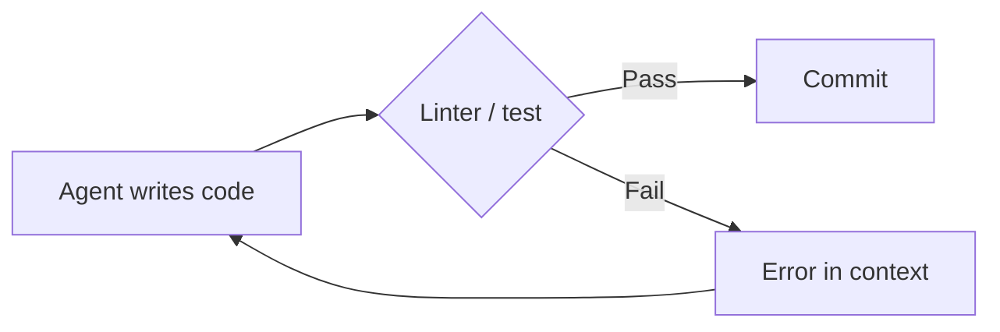
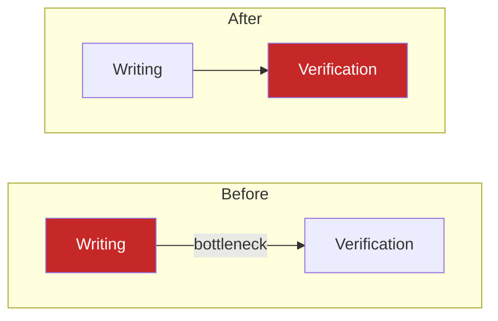

# Rigor Relocation

> Engineering discipline does not disappear when agents write the code -- it relocates from code style and abstractions to scaffolding, feedback loops, and constraint enforcement.

## The Shift

When agents write the code, the human's leverage point moves. Code quality becomes a function of environment quality.

Teams that invest in scaffolding outperform teams that invest in [prompt engineering](../training/foundations/prompt-engineering.md). LangChain's Terminal Bench improvements and Datadog's harness-first methodology both demonstrate gains from environment investment rather than model or prompt changes.

## Old Rigor vs. New Rigor

| Traditional discipline | Relocated discipline |
|----------------------|---------------------|
| Clean code, good abstractions | Clean harness, good tool design |
| Code review catches bugs | Automated verification catches bug classes |
| Style guides enforce consistency | Linters-as-prompts enforce constraints mechanically |
| Manual QA validates behavior | Feedback loops validate continuously |
| Architecture docs guide humans | Structured docs guide agents |
| Type systems constrain code | Schemas and guardrails constrain agent output |

The right column is the same engineering instinct applied to a different surface.

## Why Environment Beats Prompts

LangChain improved their coding agent from **rank 30 to rank 5** on Terminal Bench 2.0 without changing the model. The interventions were pure [harness engineering](../agent-design/harness-engineering.md): [pre-completion checklists](../verification/pre-completion-checklists.md), [loop detection middleware](../observability/loop-detection.md), and structured verification ([LangChain](https://blog.langchain.com/improving-deep-agents-with-harness-engineering/)).

OpenAI shipped roughly one million lines of agent-written production code over five months using machine-readable documentation, mechanical architectural boundaries, and telemetry-driven iteration ([InfoQ](https://www.infoq.com/news/2026/02/openai-harness-engineering-codex/)) -- [agent-first software design](../agent-design/agent-first-software-design.md) at scale.

Better models *increase* infrastructure demands -- more autonomy requires better guardrails ([Lavaee](https://alexlavaee.me/blog/harness-engineering-why-coding-agents-need-infrastructure/)).

**Why this works**: Prompts degrade across long contexts -- instructions given at session start lose salience as context fills. Environment constraints have no such decay: a failing test returns the same signal on step 1 and step 100. The mechanism is enforcement locality -- the constraint fires at the exact moment the agent generates non-compliant output, before that output propagates further. Prompts create compliance pressure at session start; harnesses create compliance pressure at each decision point.

## Mechanical Enforcement Beats Documentation

Written conventions rely on agents reading and following instructions. Custom linters, structural tests, and CI guardrails enforce constraints mechanically -- the agent cannot proceed without satisfying them.

When a linter fails, its error message enters the agent's context at the moment of decision -- structured feedback delivered precisely when the agent must act on it.

DOM snapshots, visual regression tests, log queries, and metrics inspection serve as feedback signals -- agents work autonomously until objective criteria are met ([Lavaee](https://alexlavaee.me/blog/openai-agent-first-codebase-learnings/)).

## The Verification Bottleneck Inversion

Agents can now produce software faster than any team can verify it. The bottleneck has moved from *writing* code to *trusting* what was written.

Formal verification methods -- historically too expensive -- become cost-effective when agents generate and iterate on proofs. The verification pyramid (symbolic/TLA+, DST, model checking, bounded verification, empirical) becomes the new quality architecture ([Datadog](https://www.datadoghq.com/blog/ai/harness-first-agents/)).

## Context Engineering as Rigor Relocation

Quality shifts from "what the model knows" to "what the environment permits the model to access." JIT context loading, sub-agent isolation, and memory-as-infrastructure encode discipline into architecture rather than relying on instruction compliance ([Anthropic](https://www.anthropic.com/engineering/effective-context-engineering-for-ai-agents)).

## The Human Role Shift

The engineer's job shifts from code reviewer to harness designer:

- Set measurable verification targets
- Design constraint enforcement infrastructure
- Approve architectural decisions (not line-by-line code)
- Build feedback loops that catch bug classes, not individual bugs

A linter rule catches a dependency violation every time, in every session, for every agent -- compounding across iterations rather than catching one issue in one PR review.

## When This Backfires

Rigor relocation has real costs. The scaffolding-first bet fails or yields poor returns in several conditions:

- **Scope too narrow**: A single-task agent that runs once or twice does not recoup the investment in linters, CI guardrails, and verification pipelines. The overhead only pays off when agents run repeatedly across sessions.
- **Premature infrastructure lock-in**: Teams that build elaborate harnesses before understanding the task topology often optimize for the wrong constraints. High iteration velocity through prompt changes is faster than pipeline rewrites at early stages.
- **Harness correctness burden**: The harness itself can encode wrong invariants. A passing test suite that validates incorrect behavior is harder to debug than a failed prompt, because failures become invisible rather than explicit.
- **Skill atrophy accelerates**: Mechanical enforcement reduces the need for engineers to reason about correctness directly, which compounds over time (see [Skill Atrophy](skill-atrophy.md)).

## Related

- [Harness Engineering](../agent-design/harness-engineering.md) -- the discipline of designing agent environments for reliable results
- [Agent Harness](../agent-design/agent-harness.md) -- the specific initializer/coding-agent two-phase architecture
- [Codebase Readiness](../workflows/codebase-readiness.md) -- making code agent-friendly
- [Pre-Completion Checklists](../verification/pre-completion-checklists.md) -- verification gates before task completion
- [Progressive Disclosure for Agents](../agent-design/progressive-disclosure-agents.md) -- layered context loading
- [Convention over Configuration](../instructions/convention-over-configuration.md) -- structural enforcement of decisions
- [Context Engineering](../context-engineering/context-engineering.md) -- designing what agents can access
- [Enforcing Agent Behavior with Hooks](../instructions/enforcing-agent-behavior-with-hooks.md) -- implementing rigor relocation via deterministic shell hooks
- [Hooks for Enforcement vs Prompts for Guidance](../verification/hooks-vs-prompts.md) -- deterministic enforcement over advisory instructions
- [Bottleneck Migration](bottleneck-migration.md) -- how the review bottleneck shifts as agents accelerate code generation
- [Context Ceiling](context-ceiling.md) -- limits on what context an agent can hold and how environment design compensates
- [Process Amplification](process-amplification.md) -- how agents amplify existing processes, including rigor and verification
- [Domain-Specific Agent Challenges](domain-specific-agent-challenges.md) -- constraints and verification demands by domain
- [Progressive Autonomy Model Evolution](progressive-autonomy-model-evolution.md) -- how rigor requirements evolve with increasing agent autonomy
- [AI Abundance Reshapes Software Engineering Identity](../articles/ai-abundance-engineering-identity.md) -- how rigor relocation intersects with the broader shift in engineering identity
- [Skill Atrophy](skill-atrophy.md) -- risk of losing verification skills as agents handle more
- [Safe Command Allowlisting](safe-command-allowlisting.md) -- enforcement guardrails for agent autonomy
- [Strategy Over Code Generation](strategy-over-code-generation.md) -- prioritizing design rigor over raw output
- [Cognitive Load and AI Fatigue](cognitive-load-ai-fatigue.md) -- verification burden as agents scale
