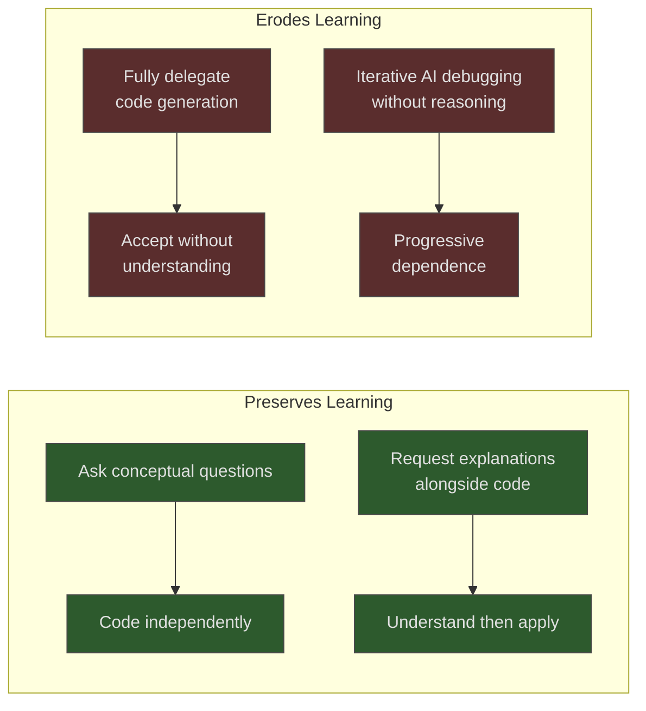

# Skill Atrophy: When AI Reliance Erodes Developer Capability

> Prolonged delegation of coding tasks to AI agents erodes the independent problem-solving skills needed to review, debug, and architect the code those agents produce. Unlike cognitive fatigue (a temporary state), skill atrophy is cumulative capability loss.

## The Mechanism: Cognitive Offloading

Delegating code generation to an AI agent bypasses the effortful practice that builds durable skill. Psychology researchers call this **cognitive offloading** — externalizing a task to a tool, reducing mental engagement. The effect is well-documented for calculators and GPS navigation; AI assistants introduce the same dynamic at higher abstraction ([Psychology Today](https://www.psychologytoday.com/us/blog/the-asymmetric-brain/202602/cognitive-offloading-using-ai-reduces-new-skill-formation)).

The critical difference: AI output is **non-deterministic**. Code can compile, pass tests, and still violate requirements in ways invisible without independent reasoning skills ([Red-Green-Code](https://www.redgreencode.com/will-ai-coding-assistants-deskill-us/)).

## The Evidence

| Study | Design | Key Finding |
|-------|--------|-------------|
| [Anthropic (Shen & Tamkin, 2026)](https://www.anthropic.com/research/AI-assistance-coding-skills) | RCT, 52 junior engineers | AI-assisted group scored ~17 pp lower on comprehension quizzes (50% vs 67%). Debugging showed steepest decline. Speed gain negligible. |
| [METR (Becker et al., 2025)](https://metr.org/blog/2025-07-10-early-2025-ai-experienced-os-dev-study/) | RCT, 16 experienced OSS developers | AI made developers 19% slower, yet they estimated they were 20% faster — a ~39-point perception gap. |

The METR perception gap compounds the problem: developers cannot self-diagnose capability loss.

## Who Is Affected

**Junior developers** are most acutely affected. The Anthropic study measured this directly — participants who fully delegated code generation showed the steepest learning deficits.

**Senior developers** are not immune. The same cognitive offloading mechanism applies when experienced engineers consistently delegate specific domains (e.g., CSS, database migrations, build configuration) — reduced practice in those areas reduces depth over time. The loss erodes the reviewer's ability to catch subtle errors in delegated areas ([Addy Osmani](https://addyo.substack.com/p/the-80-problem-in-agentic-coding)).

## Interaction Patterns That Preserve vs. Erode Skill

**How** developers used AI mattered more than **whether** they used it:



High-scoring developers used AI as a **thinking partner** — asking "why does this approach work?" before writing code themselves. Low-scoring developers used it as a **code dispenser** — accepting output and moving on.

## Mitigations

### Dual-Mode Competency

Periodically code without AI assistance — the same principle behind pilots flying manual approaches — to maintain the capability to supervise AI output independently.

### Explain-Then-Code

When using an agent, ask for an explanation of the approach *before* requesting implementation. This forces engagement with the reasoning, not just the output.

```text
Instead of:
  "Write a rate limiter for this API endpoint"

Try:
  "What rate limiting algorithm would you recommend for this endpoint and why?
  What are the tradeoffs vs alternatives?"
  Then implement yourself or request implementation after understanding
```

### Deliberate Practice Blocks

Reserve time to write code from scratch in domains you've been delegating. These blocks serve dual purpose: skill maintenance and cognitive recovery from AI-assisted work (see [Cognitive Load & AI Fatigue](cognitive-load-ai-fatigue.md)).

### Review as Skill Exercise

Treat AI-generated code review as a skill exercise, not a rubber-stamp. Before accepting, predict what the code does and verify edge cases. Persistent difficulty signals atrophy.

## Distinguishing Skill Atrophy from Related Problems

| Concept | What it is | Mechanism | Reversible? |
|---------|-----------|-----------|-------------|
| **Skill atrophy** | Loss of ability to perform independently | Reduced practice over time | Yes, with deliberate practice |
| [Cognitive load / AI fatigue](cognitive-load-ai-fatigue.md) | Mental exhaustion during AI use | Sustained oversight and review | Yes, with rest |
| [Comprehension debt](../anti-patterns/comprehension-debt.md) | Not understanding your own codebase | Accepting code without reading it | Yes, with code study |

Fatigue makes you tired *during* work; atrophy makes you less capable *between* sessions; comprehension debt makes you a stranger to your own codebase.

## Key Takeaways

- Skill atrophy is cumulative and distinct from temporary cognitive fatigue — it persists between sessions.
- Junior developers are most acutely affected; evidence shows ~17 percentage-point comprehension deficits with full delegation.
- The perception gap is the compounding danger: developers cannot self-diagnose capability loss.
- How you use AI determines outcomes: thinking-partner patterns preserve skill; code-dispenser patterns erode it.
- Mitigations (dual-mode practice, explain-then-code, deliberate practice blocks) require sustained discipline, not one-time fixes.

## Related

- [Cognitive Load & AI Fatigue](cognitive-load-ai-fatigue.md) — temporary exhaustion, distinct from cumulative capability loss
- [The Addictive Flow State of Agent-Assisted Development](addictive-flow-agent-development.md) — compulsion mechanism that accelerates atrophy by increasing delegation frequency
- [Vibe Coding](../workflows/vibe-coding.md) — the workflow pattern where atrophy risk is highest
- [Rigor Relocation](rigor-relocation.md) — engineering discipline shifts rather than disappears when agents write code
- [Process Amplification](process-amplification.md) — strong engineering practices matter more, not less, when delegating to agents
- [Progressive Autonomy Model Evolution](progressive-autonomy-model-evolution.md) — expanding delegation scope safely without losing underlying skill
- [The Bottleneck Migration](bottleneck-migration.md) — review and verification become the scarce resource when code generation is cheap
- [Developer Control Strategies for AI Agents](developer-control-strategies-ai-agents.md) — structuring delegation boundaries and autonomy levels to preserve oversight
