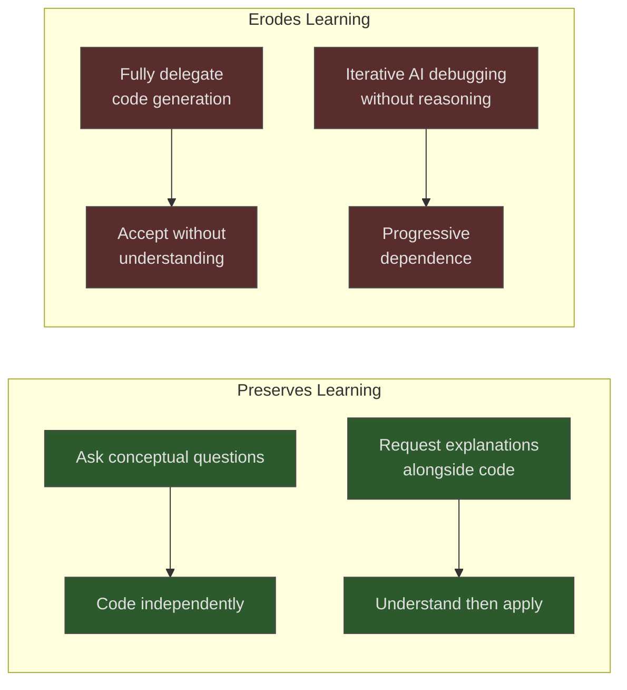

# Skill Atrophy: When AI Reliance Erodes Developer Capability

> Skill atrophy is the cumulative loss of a developer's ability to review, debug, and architect code independently, driven by prolonged delegation to AI agents.

## The mechanism: cognitive offloading

Delegating code generation to an AI agent bypasses the effortful practice that builds durable skill. Psychology researchers call this cognitive offloading: handing a task to a tool reduces your mental engagement. Researchers have documented the effect for calculators and GPS navigation, and AI assistants repeat the same pattern at a higher level of abstraction ([Psychology Today on cognitive offloading and skill formation](https://www.psychologytoday.com/us/blog/the-asymmetric-brain/202602/cognitive-offloading-using-ai-reduces-new-skill-formation)).

AI output differs in one critical way: it is non-deterministic. Code can compile, pass tests, and still break requirements in ways you cannot see without independent reasoning skills ([Red-Green-Code on whether AI assistants deskill us](https://www.redgreencode.com/will-ai-coding-assistants-deskill-us/)).

## The evidence

| Study | Design | Key finding |
|-------|--------|-------------|
| [Anthropic (Shen & Tamkin, 2026)](https://www.anthropic.com/research/AI-assistance-coding-skills) | RCT, 52 mostly junior engineers | AI-assisted group scored ~17 pp lower on comprehension quizzes (50% vs 67%). Debugging showed steepest decline. Speed gain negligible. |
| [METR (Becker et al., 2025)](https://metr.org/blog/2025-07-10-early-2025-ai-experienced-os-dev-study/) | RCT, 16 experienced OSS developers | AI made developers take 19% longer, yet they estimated they were 20% faster — a ~39-point gap between the two figures. |

The METR perception gap compounds the problem: developers cannot self-diagnose capability loss.

## Who is affected

Junior developers are most acutely affected. The Anthropic study measured this directly: participants who fully delegated code generation showed the steepest learning deficits.

Senior developers are not immune. The same cognitive offloading mechanism applies when experienced engineers consistently delegate specific domains, for example CSS, database migrations, or build configuration. Less practice in those areas reduces depth over time, so the reviewer slowly loses the ability to catch subtle errors there ([Addy Osmani on the 80% problem in agentic coding](https://addyo.substack.com/p/the-80-problem-in-agentic-coding)).

## Interaction patterns that preserve or erode skill

How developers used AI mattered more than whether they used it:


```mermaid
graph LR
    subgraph Preserves Learning
        A[Ask conceptual questions] --> B[Code independently]
        C[Request explanations<br>alongside code] --> D[Understand then apply]
    end

    subgraph Erodes Learning
        E[Fully delegate<br>code generation] --> F[Accept without<br>understanding]
        G[Iterative AI debugging<br>without reasoning] --> H[Progressive<br>dependence]
    end

    style A fill:#2d5a2d,stroke:#4a4a4a,color:#e0e0e0
    style B fill:#2d5a2d,stroke:#4a4a4a,color:#e0e0e0
    style C fill:#2d5a2d,stroke:#4a4a4a,color:#e0e0e0
    style D fill:#2d5a2d,stroke:#4a4a4a,color:#e0e0e0
    style E fill:#5a2d2d,stroke:#4a4a4a,color:#e0e0e0
    style F fill:#5a2d2d,stroke:#4a4a4a,color:#e0e0e0
    style G fill:#5a2d2d,stroke:#4a4a4a,color:#e0e0e0
    style H fill:#5a2d2d,stroke:#4a4a4a,color:#e0e0e0
```

High-scoring developers used AI as a thinking partner: they asked "why does this approach work?" before writing the code themselves. Low-scoring developers used it as a code dispenser: they accepted the output and moved on.

## Mitigations

### Dual-mode competency

Code without AI assistance from time to time, the same principle behind pilots flying manual approaches. This keeps you able to supervise AI output independently.

### Explain-then-code

When you use an agent, ask it to explain the approach before you request the implementation. This is one of the [deliberate AI-assisted learning](deliberate-ai-learning.md) interaction styles that build skill instead of eroding it. Asking first forces you to engage with the reasoning, not just the output.

```text
Instead of:
  "Write a rate limiter for this API endpoint"

Try:
  "What rate limiting algorithm would you recommend for this endpoint and why?
  What are the tradeoffs vs alternatives?"
  Then implement yourself or request implementation after understanding
```

### Deliberate practice blocks

Reserve time to write code from scratch in the domains you have been delegating. These blocks do two things: they maintain your skill and they give you cognitive recovery from AI-assisted work (see [Cognitive Load and AI Fatigue](cognitive-load-ai-fatigue.md)).

### Review as skill exercise

Treat reviewing AI-generated code as a skill exercise, not a rubber stamp. Before you accept it, predict what the code does and verify the edge cases. Persistent difficulty signals atrophy.

## Distinguishing skill atrophy from related problems

| Concept | What it is | Mechanism | Reversible? |
|---------|-----------|-----------|-------------|
| Skill atrophy | Loss of ability to perform independently | Reduced practice over time | Yes, with deliberate practice |
| [Cognitive load and AI fatigue](cognitive-load-ai-fatigue.md) | Mental exhaustion during AI use | Sustained oversight and review | Yes, with rest |
| [Comprehension debt](../patterns/anti-patterns/comprehension-debt.md) | Not understanding your own codebase | Accepting code without reading it | Yes, with code study |

Fatigue makes you tired during work. Atrophy makes you less capable between sessions. Comprehension debt makes you a stranger to your own codebase.

## Key Takeaways

- Skill atrophy is cumulative and distinct from temporary cognitive fatigue — it persists between sessions.
- Junior developers are most acutely affected; evidence shows ~17 percentage-point comprehension deficits with full delegation.
- The perception gap is the compounding danger: developers cannot self-diagnose capability loss.
- How you use AI determines outcomes: thinking-partner patterns preserve skill; code-dispenser patterns erode it.
- Mitigations (dual-mode practice, explain-then-code, deliberate practice blocks) require sustained discipline, not one-time fixes.

## Related

- [Deliberate AI-Assisted Learning](deliberate-ai-learning.md) — the inverse pattern: interaction styles that build skill rather than erode it, grounded in the same Anthropic study
- [Cognitive Load & AI Fatigue](cognitive-load-ai-fatigue.md) — temporary exhaustion, distinct from cumulative capability loss
- [The Addictive Flow State of Agent-Assisted Development](addictive-flow-agent-development.md) — compulsion mechanism that accelerates atrophy by increasing delegation frequency
- [Vibe Coding](../patterns/anti-patterns/vibe-coding.md) — the workflow pattern where atrophy risk is highest
- [Rigor Relocation](rigor-relocation.md) — engineering discipline shifts rather than disappears when agents write code
- [The Bottleneck Migration](bottleneck-migration.md) — review and verification become the scarce resource when code generation is cheap
- [Developer Control Strategies for AI Agents](developer-control-strategies-ai-agents.md) — structuring delegation boundaries and autonomy levels to preserve oversight
- [Polya Small Steps](polya-small-steps.md) — incremental problem decomposition that preserves comprehension while delegating
