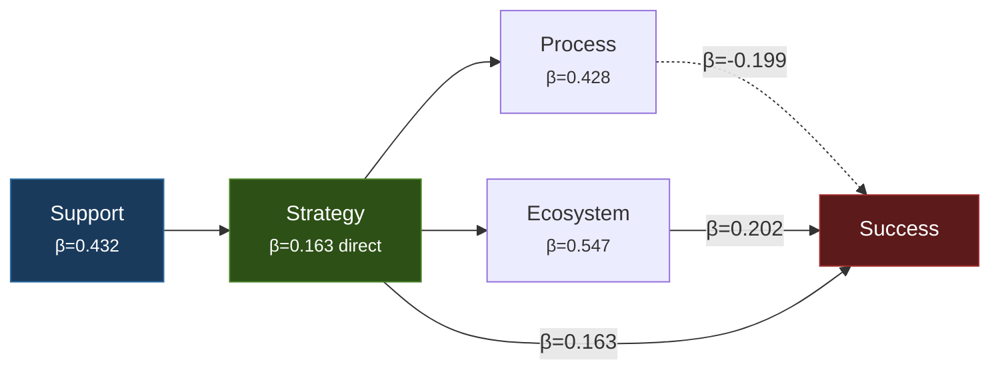

# Strategy Over Code Generation

> AI coding assistants accelerate the "how" of development but cannot replace the "why" and "what" of strategic thinking. Projects fail at the goal-setting layer, not the code-generation layer.

## The Evidence

Over 80% of ML projects fail to deliver business value — twice the rate of traditional IT projects ([Prause, 2026](https://arxiv.org/abs/2601.01839)). This persists despite AI assistants increasing code production speed by 50–55% ([Peng et al., 2023](https://arxiv.org/abs/2302.06590)). The bottleneck is not code generation. It is strategic alignment.

Prause (2026) surveyed 150 data scientists and used Structural Equation Modeling to identify four interdependent success factors, quantifying how they cascade:

All paths significant at p<0.001 except Success paths (p<0.05). Model fit: CFI=0.959, RMSEA=0.050 ([Prause, 2026](https://arxiv.org/abs/2601.01839)).

## The Four Factors

| Factor | Definition | What It Determines |
|--------|-----------|-------------------|
| **Support** | Organizational backing, leadership engagement, governance | Whether strategy gets defined at all |
| **Strategy** | Task definition, data specification, business-metric alignment | Whether you are solving the right problem |
| **Process** | Iterative ML development — data prep, algorithm selection, risk assessment | How work gets executed |
| **Ecosystem** | Architecture, development tools, production integration | Whether processes have infrastructure to succeed |

## The Suppressor Effect

The most counterintuitive finding: Process has a **negative** direct effect on success (β=-0.199) when not supported by Ecosystem. Structured processes without supporting infrastructure create overhead — more meetings, more documentation, more ceremony — without improving outcomes.

This maps directly to what teams experience with AI agents: adopting rigorous review processes for agent output backfires when the tooling does not support it. Manual review of high-volume agent output creates the [bottleneck migration](bottleneck-migration.md) problem. The fix is not removing process — it is building ecosystem (automated checks, CI gates, test suites) so processes have something to operate against.

## What This Means for AI Agent Adoption

The study measures ML projects broadly, not AI coding agents specifically. But the structural relationships apply:

**Strategy failure looks like**: Using an agent to generate code before defining what the code should accomplish. [Vibe coding](../workflows/vibe-coding.md) an entire feature without requirements. Automating the wrong workflow.

**Process without ecosystem looks like**: Requiring code review for every agent PR but having no automated linting, no test suite, and no CI pipeline. The review burden scales with agent output volume.

**Ecosystem without strategy looks like**: A fully automated CI/CD pipeline producing well-tested code that solves a problem nobody has.

## The Cascade in Practice

The SEM model shows success flows in a specific order. Skipping upstream factors undermines downstream ones:

1. **Secure organizational support** — Without leadership buy-in and resource allocation, strategy stays vague
2. **Define strategy clearly** — Align technical metrics with business outcomes before any code is written
3. **Establish processes** — Iterative development with risk assessment, not waterfall-then-deploy
4. **Build ecosystem** — Infrastructure that gives agents (and humans) ground-truth feedback at every step

Jumping to step 4 (better tools, faster agents) without steps 1–3 is the pattern that produces the 80% failure rate.

## When This Backfires

The cascade model is most actionable for sustained production ML projects with identifiable business metrics. It is less applicable in three specific contexts:

- **Short-horizon experiments**: Proofs of concept with a defined end date (under four weeks) often need just enough strategy to define a testable hypothesis — full cascade overhead exceeds the value delivered. Skip to process and ecosystem; treat strategy as a one-paragraph hypothesis rather than a full planning exercise.
- **Deliberately undefined goals**: Research prototypes and exploratory ML work intentionally operate without fixed objectives. Forcing strategy clarity prematurely closes off the exploration needed to discover what the right goal should be. The cascade applies once a promising direction is found, not before.
- **Skill-bottlenecked teams**: If the real constraint is that the team lacks technical capability to execute (wrong stack, missing domain knowledge, inadequate data infrastructure), strategy clarity does not unblock delivery. The SEM model assumes baseline execution capability exists; teams below that threshold need skill-building first.

The study also measures ML projects broadly, not AI coding agents specifically — the structural relationships are plausible extensions but are not empirically verified in general software development contexts.

## Key Takeaways

- AI agents increase code velocity 50–55% but cannot compensate for unclear goals — the 80% ML failure rate persists ([Prause, 2026](https://arxiv.org/abs/2601.01839))
- Success cascades: organizational support → strategy → process → ecosystem → outcomes; skipping upstream factors undermines everything downstream
- Process without ecosystem backfires (β=-0.199) — structured review of agent output requires automated infrastructure to be effective
- Strategy is the highest-leverage intervention: it has both direct effect on success and indirect effects through every other factor

## Example

A data team at a logistics company adopts an AI coding agent to build a demand forecasting service. The lead engineer immediately starts generating model training pipelines, data loaders, and API endpoints. Within two weeks the agent has produced a working system: feature engineering, model selection, hyperparameter tuning, deployment scripts, monitoring dashboards.

The project fails in production. The model optimizes for prediction accuracy on historical data, but the business needs order-level confidence intervals for warehouse staffing decisions. The metric was wrong. No amount of code velocity could fix a misaligned objective.

A second team at the same company applies the cascade:

1. **Support**: VP of operations sponsors the project with a named stakeholder and weekly check-ins
2. **Strategy**: The team defines the business metric (staffing cost error per warehouse per week) before writing any code, and specifies which data sources map to that metric
3. **Process**: Two-week iteration cycles with risk reviews comparing model output against warehouse manager decisions
4. **Ecosystem**: CI pipeline runs backtests against the staffing cost metric on every commit; the agent gets ground-truth feedback automatically

The second team ships in six weeks. The agent writes the same volume of code, but every line serves a defined business metric because the upstream factors were in place first.

## Related

- [Process Amplification](process-amplification.md) — Agents amplify existing practices; this page adds the upstream cause (strategy clarity) that determines what gets amplified
- [The Bottleneck Migration](bottleneck-migration.md) — Code generation becomes cheap but review becomes expensive; strategy failure is the earlier bottleneck this page addresses
- [Empowerment Over Automation](../agent-design/empowerment-over-automation.md) — AI should preserve human judgment; this page provides empirical evidence for why that judgment (strategy) matters most
- [Effortless AI Fallacy](../anti-patterns/effortless-ai-fallacy.md) — Expecting AI tools to work without effort; the ML Canvas shows effort must be directed at strategy, not just prompting
- [Rigor Relocation](rigor-relocation.md) — Effort shifts from writing to verification; the cascade model shows where that relocated effort should be directed
- [PM on the AI Exponential](pm-on-the-ai-exponential.md) — How product managers adapt to AI-driven development velocity; the cascade model shows which strategic decisions remain human-owned
- [Deliberate AI-Assisted Learning](deliberate-ai-learning.md) — Structured practice with AI tools; strategy clarity determines which skills to build vs. delegate
- [Skill Atrophy](skill-atrophy.md) — AI reliance can erode developer capability; the cascade model identifies where human judgment must be preserved upstream
