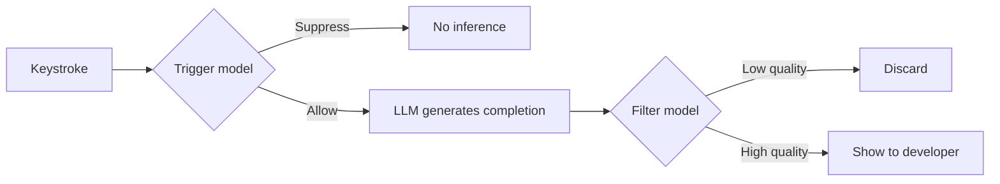

# Suggestion Gating

> ~90% of AI code completion inference is wasted — suggestions generated but never shown, or shown and immediately dismissed. Gating fixes this by deciding *whether* to suggest before deciding *what* to suggest.

## The Waste Problem

JetBrains measured their completion pipeline end-to-end: only 31% of inferences produce a shown suggestion, and only 31% of shown suggestions get accepted. That compounds to roughly [10% useful output from raw inference capacity](https://arxiv.org/abs/2601.20223).

The cost is not just compute. Every unwanted suggestion interrupts flow, forces a dismiss action, and erodes trust in the tool. [unverified] Developers who see too many bad suggestions stop reading suggestions at all — the same [alert fatigue dynamic](../code-review/signal-over-volume-in-ai-review.md) that degrades AI code review.

## How Gating Works

Gating inserts lightweight classifiers between the LLM and the developer. Two models handle distinct decisions:

**Trigger model** — decides whether to invoke the LLM at all. Prevents wasted inference when context signals suggest a completion would be unwanted (mid-word typing, rapid deletion, ambiguous scope).

**Filter model** — evaluates the generated completion against context signals before displaying it. Catches suggestions the LLM produced confidently but that the developer would reject.

Both models are tiny. JetBrains' production filter compiles to [2.5 MB and predicts in 1–2 milliseconds](https://blog.jetbrains.com/ai/2025/03/ai-code-completion-less-is-more/), running locally on the developer's machine with zero latency overhead.

## Production Evidence

### JetBrains: CatBoost classifiers

A/B study across Java (n=278), Python (n=205), and Kotlin (n=157) users with the filter model active ([de Moor et al., 2026](https://arxiv.org/abs/2601.20223)):

| Metric | Change |
|--------|--------|
| Accept rate | **+33% to +48%** |
| Cancel rate | **-16% to -37%** |
| Ratio of completed code | -10% to -14% |

The trigger model, tested on Kotlin (n=3,511), reduced generations by 13.8% while improving accept rate +2.7% and cutting cancel rate -4.5%.

The trade-off is explicit: developers type more themselves (ratio of completed code drops), but the suggestions they do see are far more useful.

### Cursor: reinforcement learning

Rather than separate classifier models, Cursor trains the Tab completion model itself to avoid producing bad suggestions via [online reinforcement learning](https://cursor.com/blog/tab-rl). Result: 21% fewer suggestions, 28% higher accept rate. Same pattern, different mechanism.

### GitHub Copilot: logistic regression trigger

As of 2022, Copilot used a logistic regression model with 11 features to decide when to invoke inference — a simpler variant of the trigger pattern ([Thakkar, 2022](https://thakkarparth007.github.io/copilot-explorer/posts/copilot-internals.html)). [unverified] Copilot’s internals have likely evolved since this reverse-engineering analysis.

### GitHub NES: custom model suppression

The Next Edit Suggestions model independently converged on the same principle: [showing 24.5% fewer suggestions while increasing acceptance by 26.5%](../tool-engineering/next-edit-suggestions.md).

## What the Classifiers See

The gating models consume context signals that indicate developer intent, not just code syntax. JetBrains uses ~120 features for the trigger model and several hundred for the filter ([de Moor et al., 2026](https://arxiv.org/abs/2601.20223)):

- **Typing dynamics** — speed, pause duration, deletion patterns
- **Caret context** — scope depth, surrounding syntax, file structure
- **Code signals** — imports, reference resolution, token-level scores
- **Session state** — recent accept/reject history, time since last interaction

This feature set explains why gating outperforms simple confidence thresholds on the LLM output: the decision depends on the developer's state, not just the completion's quality.

## Language-Specific Behavior

Optimal gating balance differs across languages. In JetBrains' evaluation:

- **Kotlin** benefits more from the filter model (post-generation gating)
- **PHP** benefits more from the trigger model (pre-generation gating)
- **Python and C#** fall between the two extremes

A single gating threshold applied uniformly across languages leaves quality on the table. Tools that tune per-language perform better ([de Moor et al., 2026](https://arxiv.org/abs/2601.20223)).

## The Perception Gap

Gating also addresses a deeper measurement problem. A controlled study of experienced open-source developers found a divergence between perceived productivity (+20%) and actual productivity (−19%) when using AI completions ([METR, 2025](https://metr.org/blog/2025-07-10-early-2025-ai-experienced-os-dev-study/)). Developers *felt* faster while measurably producing less.

Ungated completions amplify this gap: high suggestion volume creates the sensation of progress. Gated completions compress it: fewer but better suggestions mean the perceived benefit more closely tracks real output.

## Implications for Developers

**Acceptance rate matters more than suggestion volume.** A tool showing 100 suggestions with 15% acceptance is worse than one showing 40 with 45% acceptance — the second tool interrupts less and builds more trust.

**Configure aggressively.** [unverified] Most tools expose completion sensitivity settings. If you routinely dismiss most suggestions, the tool is too aggressive for your workflow. Reduce suggestion frequency or raise confidence thresholds where available.

**Context signals improve over time.** [unverified] Gating models that observe your accept/reject patterns can learn your preferences. Consistent interaction (accepting good suggestions, explicitly dismissing bad ones) may improve the model's calibration to your workflow.

## Key Takeaways

- Multiple major AI coding tools (JetBrains, Cursor, GitHub Copilot, GitHub NES) have independently converged on suggestion gating
- Lightweight classifiers (2.5 MB, 1–2 ms) gate suggestions with no perceptible latency cost
- The trade-off is explicit: developers type more themselves, but acceptance rates improve 26–48% and flow interruptions drop significantly

## Unverified Claims

- Developers who see too many bad suggestions stop reading suggestions entirely (extrapolated from alert fatigue research, not directly measured for code completions)
- Most tools expose completion sensitivity settings (likely true but not systematically verified across all major tools)
- Gating models learn individual developer preferences over time (plausible for session-state features but not confirmed as personalized online learning in production)
- Copilot’s current architecture may differ significantly from the 2022 reverse-engineering analysis

## Related

- [Signal Over Volume in AI Review](../code-review/signal-over-volume-in-ai-review.md) — the same principle applied to code review: silence when confidence is low
- [Next Edit Suggestions Paradigm](../tool-engineering/next-edit-suggestions.md) — GitHub's NES model independently validates the "fewer but better" approach
- [Cognitive Load, AI Fatigue, and Sustainable Agent Use](cognitive-load-ai-fatigue.md) — every dismissed suggestion adds to judgment fatigue
- [Safe Command Allowlisting](safe-command-allowlisting.md) — a parallel gating pattern for agent permissions rather than completions
- [Agent Backpressure](../agent-design/agent-backpressure.md) — rate-limiting agent output to match developer processing capacity
