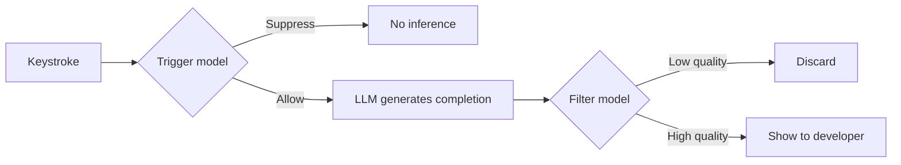

# Suggestion Gating

> ~90% of AI code completion inference is wasted — suggestions generated but never shown, or shown and immediately dismissed. Gating fixes this by deciding *whether* to suggest before deciding *what* to suggest.

## The Waste Problem

JetBrains measured their completion pipeline end-to-end: only 31% of inferences produce a shown suggestion, and only 31% of those get accepted — roughly [10% useful output from raw inference](https://arxiv.org/abs/2601.20223). Every unwanted suggestion interrupts flow and erodes trust. The pattern mirrors the [alert fatigue dynamic](../code-review/signal-over-volume-in-ai-review.md) seen in AI code review: when signal-to-noise drops, developers begin ignoring the signal.

## How Gating Works

Gating inserts lightweight classifiers between the LLM and the developer:

**Trigger model** — decides whether to invoke the LLM at all. Suppresses inference when context signals indicate an unwanted completion (mid-word typing, rapid deletion, ambiguous scope).

**Filter model** — evaluates the completion before display. Catches suggestions the LLM produced confidently but the developer would reject.

Both are tiny. JetBrains' production filter compiles to [2.5 MB, predicts in 1–2 ms](https://blog.jetbrains.com/ai/2025/03/ai-code-completion-less-is-more/), running locally with zero latency overhead.

## Production Evidence

### JetBrains: CatBoost classifiers

A/B study across Java (n=278), Python (n=205), and Kotlin (n=157) with the filter active ([de Moor et al., 2026](https://arxiv.org/abs/2601.20223)):

| Metric | Change |
|--------|--------|
| Accept rate | **+33% to +48%** |
| Cancel rate | **-16% to -37%** |
| Ratio of completed code | -10% to -14% |

The trigger model, tested on Kotlin (n=3,511), reduced generations by 13.8% while improving accept rate +2.7% and cutting cancel rate -4.5%.

### Cursor: reinforcement learning

Cursor trains the Tab model to avoid bad suggestions via [online reinforcement learning](https://cursor.com/blog/tab-rl): 21% fewer suggestions, 28% higher accept rate.

### GitHub Copilot: logistic regression trigger

As of 2022, Copilot used a logistic regression model with 11 features to decide when to invoke inference ([Thakkar, 2022](https://thakkarparth007.github.io/copilot-explorer/posts/copilot-internals.html)). The 2022 reverse-engineering predates major Copilot architecture revisions; the feature set will differ in current releases.

### GitHub NES: custom model suppression

NES independently converged on the same principle: [24.5% fewer suggestions, 26.5% higher acceptance](../tool-engineering/next-edit-suggestions.md).

## What the Classifiers See

JetBrains uses ~120 features for the trigger and several hundred for the filter ([de Moor et al., 2026](https://arxiv.org/abs/2601.20223)):

- **Typing dynamics** — speed, pause duration, deletion patterns
- **Caret context** — scope depth, surrounding syntax, file structure
- **Code signals** — imports, reference resolution, token-level scores
- **Session state** — recent accept/reject history, time since last interaction

Gating outperforms simple confidence thresholds because the decision depends on developer state, not just completion quality.

## Language-Specific Behavior

Kotlin benefits more from post-generation filtering while PHP benefits more from pre-generation triggering; Python and C# fall between. Per-language tuning outperforms a uniform threshold ([de Moor et al., 2026](https://arxiv.org/abs/2601.20223)).

## The Perception Gap

Open-source developers perceived +20% productivity while producing −19% less ([METR, 2025](https://metr.org/blog/2025-07-10-early-2025-ai-experienced-os-dev-study/)). Higher interruption rates from ungated completions can widen this gap; reducing noise via gating is one lever for realigning perceived and actual productivity.

## Implications for Developers

**Acceptance rate matters more than volume.** A tool showing 40 suggestions at 45% acceptance beats one showing 100 at 15%.

**Configure aggressively.** GitHub Copilot and VS Code extensions expose completion sensitivity and trigger delay settings. If you routinely dismiss suggestions, raise thresholds before reaching for a different tool.

**Context signals improve over time.** Cursor's RL-based Tab model trains directly on accept/reject history ([Cursor, 2024](https://cursor.com/blog/tab-rl)); tools using online learning get better at individual preference modeling as usage accumulates.

## Key Takeaways

- Four major tools (JetBrains, Cursor, Copilot, NES) independently converged on suggestion gating
- Lightweight classifiers (2.5 MB, 1–2 ms) gate with no perceptible latency cost
- Developers type more themselves, but acceptance rates improve 26–48% and interruptions drop

## When This Backfires

Gating classifiers trained on aggregate accept/reject data may not generalize well to every developer or context:

- **Atypical coding patterns** — developers who work in narrow domains (e.g., embedded systems, novel DSLs) may have accept/reject patterns that diverge from the training distribution, causing a filter calibrated on the majority to suppress their highest-value completions.
- **Exploratory sessions** — during low-familiarity work (learning a new framework, prototyping), a developer’s natural accept rate drops. A filter tuned to production accept rates may suppress at exactly the moment when completions are most valuable, forcing more manual typing when cognitive load is already high.
- **Rapid style evolution** — as a developer changes habits (moving from verbose to terse code, adopting new idioms), a static or slow-updating filter lags behind. Suggestion volume may not recover to the useful level until the model observes enough new accept/reject signal to recalibrate.

When gating degrades rather than improves DX, the fix is exposure controls: disable or loosen the filter, accumulate fresh data, then re-enable.

## Related

- [Signal Over Volume in AI Review](../code-review/signal-over-volume-in-ai-review.md) — the same principle applied to code review: silence when confidence is low
- [Next Edit Suggestions Paradigm](../tool-engineering/next-edit-suggestions.md) — GitHub's NES model independently validates the "fewer but better" approach
- [Cognitive Load, AI Fatigue, and Sustainable Agent Use](cognitive-load-ai-fatigue.md) — every dismissed suggestion adds to judgment fatigue
- [Safe Command Allowlisting](safe-command-allowlisting.md) — a parallel gating pattern for agent permissions rather than completions
- [Agent Backpressure](../agent-design/agent-backpressure.md) — rate-limiting agent output to match developer processing capacity
- [Attention Management with Parallel Agents](attention-management-parallel-agents.md) — managing completion fatigue when multiple agents compete for developer focus
- [Progressive Autonomy Model Evolution](progressive-autonomy-model-evolution.md) — acceptance rate as a signal for shifting autonomy levels
- [Bottleneck Migration](bottleneck-migration.md) — how gating shifts the bottleneck from suggestion overload to suggestion quality
