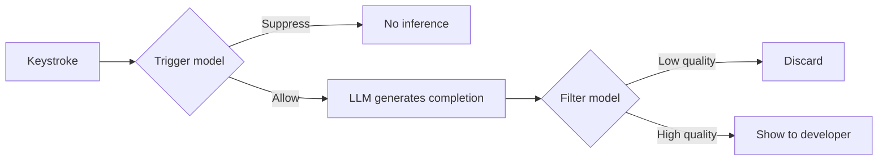

# Suggestion Gating: Fewer Completions, Better DX

> Gating decides *whether* to suggest before deciding *what* to suggest — fixing the ~90% of AI completion inference generated but never usefully shown.

## The waste problem

JetBrains measured its completion pipeline: only 31% of inferences produce a shown suggestion, and 31% of those get accepted — [~10% useful output from raw inference](https://arxiv.org/abs/2601.20223). Every unwanted suggestion interrupts flow and erodes trust. This mirrors the [alert fatigue dynamic](../code-review/signal-over-volume-in-ai-review.md) in AI code review: when signal-to-noise drops, developers ignore the signal.

## How gating works

Gating inserts lightweight classifiers between the LLM and the developer:

```mermaid
flowchart LR
    K[Keystroke] --> T{Trigger model}
    T -->|Suppress| X[No inference]
    T -->|Allow| LLM[LLM generates completion]
    LLM --> F{Filter model}
    F -->|Low quality| D[Discard]
    F -->|High quality| S[Show to developer]
```

Trigger model — decides whether to invoke the LLM. It suppresses inference when it sees signs of an unwanted completion: mid-word typing, rapid deletion, or ambiguous scope.

Filter model — checks the completion before display. JetBrains runs this stage locally before showing a suggestion. It catches suggestions the LLM produced confidently but the developer would reject.

JetBrains' production filter compiles to [2.5 MB and predicts in 1–2 ms](https://blog.jetbrains.com/ai/2025/03/ai-code-completion-less-is-more/), running locally and adding no perceptible latency.

## Production evidence

### JetBrains: CatBoost classifiers

A/B study across Java (n=278), Python (n=205), and Kotlin (n=157) with the filter active ([de Moor et al., 2026](https://arxiv.org/abs/2601.20223)):

| Metric | Change |
|--------|--------|
| Accept rate | +33% to +48% |
| Cancel rate | -16% to -37% |
| Ratio of completed code | -10% to -14% |

The trigger model, tested on Kotlin (n=3,511), reduced generations by 13.8% while improving accept rate +2.7% and cutting cancel rate -4.5%.

### Cursor: reinforcement learning

Cursor trains the Tab model to avoid bad suggestions via [online reinforcement learning](https://cursor.com/blog/tab-rl): 21% fewer suggestions, 28% higher accept rate.

### GitHub Copilot: logistic regression trigger

As of 2022, Copilot used a logistic regression with 11 features to decide when to invoke inference ([Thakkar, 2022](https://thakkarparth007.github.io/copilot-explorer/posts/copilot-internals.html)). The feature set will differ in current releases.

### GitHub NES: custom model suppression

NES independently converged on the same principle: [24.5% fewer suggestions, 26.5% higher acceptance](../tools/copilot/next-edit-suggestions.md).

## What the classifiers see

JetBrains uses ~120 features for the trigger and several hundred for the filter ([de Moor et al., 2026](https://arxiv.org/abs/2601.20223)):

- Typing dynamics — speed, pause duration, deletion patterns
- Caret context — scope depth, surrounding syntax, file structure
- Code signals — imports, reference resolution, token-level scores
- Session state — recent accept/reject history, time since last interaction

Gating beats simple confidence thresholds because the decision depends on developer state, not just completion quality.

## Language-specific behavior

Kotlin benefits more from post-generation filtering, while PHP benefits more from pre-generation triggering. Python and C# fall between. Per-language tuning beats a uniform threshold ([de Moor et al., 2026](https://arxiv.org/abs/2601.20223)).

## The perception gap

Open-source developers perceived a 20% productivity gain while producing 19% less ([METR, 2025](https://metr.org/blog/2025-07-10-early-2025-ai-experienced-os-dev-study/)). Higher interruption rates from ungated completions widen this gap. Gating is one way to realign perceived and actual productivity.

## Implications for developers

Acceptance rate matters more than volume. A tool that shows 40 suggestions at 45% acceptance beats one that shows 100 at 15%.

Tune the settings before switching tools. Copilot and VS Code extensions expose sensitivity and trigger-delay settings. If you routinely dismiss suggestions, raise the thresholds first.

Context signals improve over time. Cursor's RL-based Tab model trains on your accept/reject history ([Cursor, 2024](https://cursor.com/blog/tab-rl)). Tools that use online learning model your preferences better as you keep using them.

## Key Takeaways

- Four major tools (JetBrains, Cursor, Copilot, NES) independently converged on suggestion gating
- Lightweight classifiers (2.5 MB, 1–2 ms) gate with no perceptible latency cost
- Developers type more themselves, but acceptance rates improve 26–48% and interruptions drop

## When this backfires

Classifiers trained on aggregate accept/reject data may not generalize to every developer:

- Atypical coding patterns — narrow domains such as embedded work or novel DSLs diverge from the training distribution, so a filter calibrated on the majority suppresses high-value completions.
- Exploratory sessions — learning a framework or prototyping lowers your natural accept rate. A filter tuned to production rates then suppresses completions exactly when they are most valuable.
- Rapid style evolution — as your habits change, from verbose to terse or adopting new idioms, a slow-updating filter lags until it sees enough fresh signal to recalibrate. Online-learning models like Cursor's Tab close this gap faster than statically trained classifiers.

When gating hurts DX, the fix is exposure controls: loosen the filter, let it gather fresh data, then re-enable.

## Related

- [Signal Over Volume in AI Review](../code-review/signal-over-volume-in-ai-review.md) — the same principle applied to code review: silence when confidence is low
- [Next Edit Suggestions Paradigm](../tools/copilot/next-edit-suggestions.md) — GitHub's NES model independently validates the "fewer but better" approach
- [Cognitive Load, AI Fatigue, and Sustainable Agent Use](cognitive-load-ai-fatigue.md) — every dismissed suggestion adds to judgment fatigue
- [Selective Autonomy from Copilot Feedback](../agent-design/selective-autonomy-from-copilot-feedback.md) — the same selective-classification idea applied to executing actions rather than displaying completions
- [Agent Backpressure](../agent-design/agent-backpressure.md) — rate-limiting agent output to match developer processing capacity
- [Attention Management with Parallel Agents](attention-management-parallel-agents.md) — managing completion fatigue when multiple agents compete for developer focus
- [Progressive Autonomy Model Evolution](progressive-autonomy-model-evolution.md) — acceptance rate as a signal for shifting autonomy levels
- [Bottleneck Migration](bottleneck-migration.md) — how gating shifts the bottleneck from suggestion overload to suggestion quality
