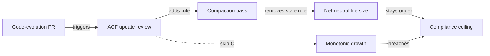

# Agent Context File Evolution: Treating ACFs as Configuration Code

> Agent Context Files grow monotonically; pair every add-on-drift update with a compact pass that deletes or consolidates.

Agent Context Files (ACFs) — `CLAUDE.md`, `AGENTS.md`, `.github/copilot-instructions.md` — are not write-once documentation. The first large-scale empirical study of 2,303 ACFs from 1,925 repositories found that 67.4% of Claude Code files are modified in multiple commits, in short bursts at median intervals of 24.1h (Claude Code), 22.0h (Codex), and 70.7h (Copilot) ([Chatlatanagulchai et al., 2025](https://arxiv.org/abs/2511.12884)). Median deletions are under 15 words per commit. Those numbers imply one maintenance discipline: update triggers tied to code-evolution events, paired with an explicit pruning pass.

## When this applies

The evidence applies under specific conditions. Lead with these or the recommendation backfires:

- Active multi-contributor codebase with a load-bearing ACF: the 67.4% multi-commit cohort is real projects whose agents work daily. On a prototype, a pinned-model deployment, or a well-documented OSS repo, the empirical baseline is different — added context files traded ~19% cost for marginal or negative accuracy in [Gloaguen et al.'s evaluation](https://arxiv.org/abs/2602.11988) ([Evaluating AGENTS.md: When Context Files Hurt More Than Help](evaluating-agents-md-context-files.md)).
- The ACF is human-written, not auto-generated: auto-generated files reduced success rates by 3% and increased cost 20% in the same study, and running `/init` more often is not the lever. Maintenance discipline applies to files that already contain non-inferable signal.
- The codebase evolves faster than the ACF tracks: build commands move, test runners change, and architectural invariants shift. Drift is what the discipline corrects.

If those conditions hold, the file is configuration code, not documentation, and warrants the same review rigor as a Dockerfile or CI workflow.

## The two-loop discipline

The Chatlatanagulchai data exposes one specific failure mode: monotonic accretion. Developers respond to drift by adding new instructions, almost never by removing stale ones. Combined with the [Instruction Compliance Ceiling](instruction-compliance-ceiling.md) (compliance degrades as rule count grows; even frontier models hit only 68% accuracy at high instruction densities — [IFScale, 2025](https://arxiv.org/abs/2507.11538)), unbounded growth turns each new rule into a reduction in agent compliance, not an addition.

The maintenance loop therefore has two halves that must run together:



| Loop | Trigger | Action |
|------|---------|--------|
| Add-on-drift | PR modifies build system, test runner, lint config, or core architectural module | Reviewer checklist asks whether the ACF needs an update ([Eisele, 2026](https://www.the-main-thread.com/p/coding-agent-operating-manual)) |
| Compact-on-add | ACF receives a new rule | Same PR (or a follow-up audit) removes a now-stale rule, consolidates an overlapping section, or moves a rule to a hook |

The compact loop is what most teams skip. Without it, the discipline produces what one practitioner observed: "after a few weeks, the file is 400 lines long and Claude is ignoring more rules than ever" ([Pan, 2026](https://tianpan.co/blog/2026-02-14-writing-effective-agent-instruction-files)).

## Why it works

ACFs and the code they describe form a tight runtime feedback loop: the file is read on every agent invocation ([Claude Code sub-agents docs](https://code.claude.com/docs/en/sub-agents); [GitHub Docs — repository custom instructions](https://docs.github.com/en/copilot/how-tos/configure-custom-instructions/add-repository-instructions)), so an unmaintained ACF produces wrong agent actions on the very next session. That coupling makes ACFs configuration, not documentation. The compact half of the loop is forced by the [compliance ceiling](instruction-compliance-ceiling.md) — instruction compliance depends on file size and attention budget, so a discipline that only adds is one that gradually disables itself. Practitioners report the same: ["context files drift as codebases evolve, and there is no automated way to detect staleness"](https://www.augmentcode.com/blog/your-agents-context-is-a-junk-drawer); Chatlatanagulchai et al. explicitly recommend a "configuration-as-code mindset … semantic versioning and changelogs" for ACF governance.

## A maintenance-theory taxonomy

[Voria et al. (2026)](https://arxiv.org/abs/2606.25257) propose mapping ACF changes onto classical software-maintenance categories — Corrective, Preventive, Adaptive, Perfective, Additive. (The paper is a registered report; the taxonomy is the design, not yet validated against measured outcomes.) Used as a checklist at PR time it makes the compact-on-add loop concrete:

| Change type | Trigger | Compact-pair candidate |
|-------------|---------|------------------------|
| Corrective | Agent ignored a rule or produced wrong action | Move the rule to a [hook](enforcing-agent-behavior-with-hooks.md); delete the prose version |
| Adaptive | Build command, test runner, or framework version changed | Delete the prior command's rule; replace, do not append |
| Additive | New module, new convention | Check whether an older module's rule is now dead |
| Perfective | Reword for clarity or compactness | Net-negative word count; otherwise skip |
| Preventive | Anticipated future failure mode | Highest scrutiny — most undead rules originate here ([Rule Lifecycle Metadata](rule-lifecycle-metadata.md)) |

The taxonomy is a write-time tag, not an audit lens. The audit lens is the per-rule lifecycle triple in [Rule Lifecycle Metadata](rule-lifecycle-metadata.md).

## Example

A team's `CLAUDE.md` has 280 lines and the agent is missing the new linting step they added two weeks ago. Tracing through their ACF git log shows the pattern Chatlatanagulchai et al. document:

```text
$ git log --oneline --stat CLAUDE.md | head -20
a1b2c3d CLAUDE.md | 4 ++++           # added "always run pre-commit"
e4f5g6h CLAUDE.md | 6 ++++           # added Python 3.12 note
i7j8k9l CLAUDE.md | 8 ++++           # added new test script path
m1n2o3p CLAUDE.md | 12 +++++         # added architectural rule
...
```

Twenty-four commits in three months. Median +6 lines per commit. Zero deletions.

Without the discipline, the team's next response is to add the linting rule too, pushing the file to 290 lines, well past the [compliance ceiling](instruction-compliance-ceiling.md) for their ~150-rule budget.

With the two-loop discipline, the PR that adds the new lint step is gated on the reviewer checklist:

```markdown
- [ ] If this PR changed build/test/lint config or a core module,
      does CLAUDE.md need an update? If yes, the same PR also includes:
- [ ] A compact pass: at least one rule deleted, consolidated, or
      moved to a hook in exchange for the new rule.
```

The agent author runs the compact pass and finds three rules describing the old test runner, two superseded architecture notes, and one rule already enforced by a [pre-commit hook](enforcing-agent-behavior-with-hooks.md). Net change: +1 rule, -6 rules. File shrinks from 280 lines to 245. Compliance stays inside the ceiling.

## When this backfires

The discipline is not free, and several conditions invert its sign:

- Prototypes and short-lived repos: the 67.4% multi-commit cohort comes from active projects. A repo with three contributors and six weeks of life will not accumulate enough drift to justify the review overhead.
- Auto-generated ACFs: a file produced by running `/init` and never edited is duplicating discoverable context already in the codebase. Maintaining the duplicate raises cost without raising accuracy ([Gloaguen et al., 2026](https://arxiv.org/abs/2602.11988)). The fix is deletion, not cadence.
- High update frequency without the compact pass: running only the add loop reproduces the monotonic-growth pattern the empirical data already shows. The Chatlatanagulchai numbers (deletions <15 words/commit) are the warning, not the prescription.
- Reviewers without prompt-engineering literacy: PR-gated ACF changes degrade into rubber-stamps when reviewers cannot predict the behavioral delta of a wording change — addressed in [Prompt Governance via PR](prompt-governance-via-pr.md).
- Pinned-model deployments: maintenance overhead assumes that future model updates will reveal new ACF-vs-code drift. On a frozen model with a stable codebase, the rationale collapses; see also [Harness Impermanence](../patterns/agent-design/harness-impermanence.md) for the related discipline applied to scaffolding rather than ACFs.

## Differentiation from adjacent patterns

- [Harness Impermanence](../patterns/agent-design/harness-impermanence.md) — about deleting scaffolding code when models subsume it. This page is about maintaining the instruction file.
- [Discoverable vs Non-Discoverable Context](../context-engineering/discoverable-vs-nondiscoverable-context.md) — about what belongs in the ACF. This page is about how the ACF changes over time.
- [Evaluating AGENTS.md: When Context Files Hurt More Than Help](evaluating-agents-md-context-files.md) — about whether an ACF helps. This page is about the maintenance of one that already does.
- [Rule Lifecycle Metadata](rule-lifecycle-metadata.md) — the per-rule lifecycle (the `source` / `applies_to` / `retire_when` triple). This page is the file-level lifecycle that sits above it; the metadata makes the compact loop mechanical.
- [Prompt Governance via PR](prompt-governance-via-pr.md) — the review mechanism. This page names the cadence and the update triggers that feed that review queue.

## Key Takeaways

- Empirical evidence: 67.4% of Claude Code ACFs are multi-commit artifacts edited in ~24-hour bursts and grow monotonically ([Chatlatanagulchai et al., 2025](https://arxiv.org/abs/2511.12884)). They are configuration code, not documentation.
- The maintenance discipline has two loops: add-on-drift (triggered by code-evolution PRs touching build/test/architecture) and compact-on-add (every addition pairs with a deletion or consolidation).
- Without the compact loop, monotonic growth breaches the [Instruction Compliance Ceiling](instruction-compliance-ceiling.md) and each new rule reduces, not increases, agent compliance.
- Apply only when the ACF is human-written, load-bearing, and the codebase evolves faster than the file tracks; prototypes, auto-generated files, and pinned-model deployments do not benefit.
- The classical maintenance taxonomy ([Voria et al., registered report 2026](https://arxiv.org/abs/2606.25257)) — Corrective / Preventive / Adaptive / Perfective / Additive — is useful as a write-time tag that surfaces compact-pair candidates.

## Related

- [Rule Lifecycle Metadata for Prunable Instruction Surfaces](rule-lifecycle-metadata.md) — per-rule pruning that makes the compact loop mechanical
- [The Instruction Compliance Ceiling](instruction-compliance-ceiling.md) — the ceiling the compact loop defends
- [Evaluating AGENTS.md: When Context Files Hurt More Than Help](evaluating-agents-md-context-files.md) — when adding/maintaining ACFs is the wrong call
- [Prompt Governance via PR](prompt-governance-via-pr.md) — the PR review surface this discipline plugs into
- [AGENTS.md as Table of Contents, Not Encyclopedia](agents-md-as-table-of-contents.md) — the structural target the compact pass aims at
- [Enforcing Agent Behavior with Hooks](enforcing-agent-behavior-with-hooks.md) — the destination for rules the compact pass moves out of prose
- [Harness Impermanence](../patterns/agent-design/harness-impermanence.md) — the analogous discipline applied to scaffolding code rather than instruction files
</content>
