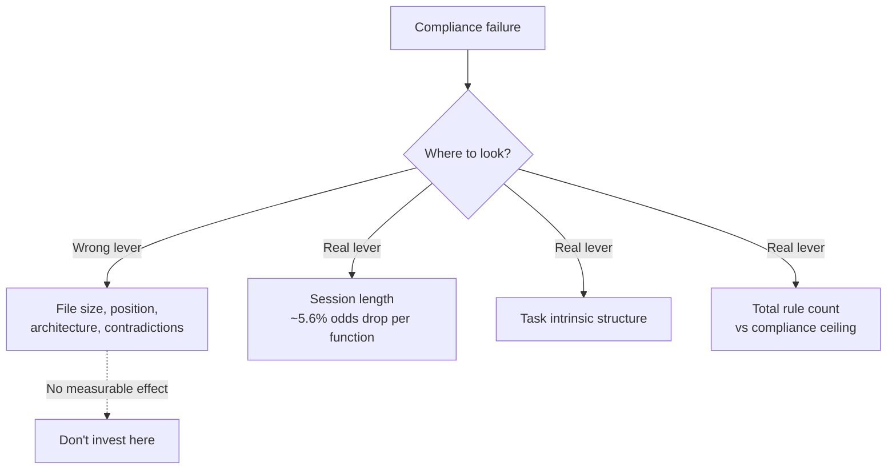

# Configuration File Structure Does Not Drive Compliance

> Within realistic file sizes, rearranging configuration files does not measurably improve agent compliance. The lever is total rule count and session length.

!!! info "Also known as"
    Configuration File Structure Compliance Gap, CLAUDE.md Structure Null

## The experiment

A factorial study manipulated four structural variables of coding-agent configuration files and measured compliance with a trivial target annotation across 1,650 Claude Code CLI sessions and 16,050 function-level observations — two TypeScript codebases, three frontier models (Sonnet 4.6 primary, Opus 4.6 cross-check, Opus 4.7 descriptive), and five coding tasks — using mixed-effects models with a Bayesian companion ([McMillan, 2026](https://arxiv.org/abs/2605.10039)).

| Variable | Practitioner belief | Manipulation |
|---|---|---|
| File size | Smaller files improve compliance | Short vs long CLAUDE.md within realistic bounds |
| Instruction position | Top of file gets followed | Target rule near start vs near end |
| File architecture | Split files outperform monolithic | Single file vs multi-file split |
| Adjacent-file contradictions | Conflicts hurt compliance | Contradictory vs consistent adjacent files |

None of the four variables, and none of three two-way interactions, produced a detectable contrast after multiple-testing correction ([McMillan, 2026](https://arxiv.org/abs/2605.10039)).

## Evidence strength

The nulls are not all equal:

| Variable | Verdict | Evidence |
|---|---|---|
| File size | Affirmative null | BF₁₀ 0.05–0.10 — strong evidence for no effect |
| Adjacent-file contradictions | Affirmative null | BF₁₀ 0.05–0.10 — strong evidence for no effect |
| Instruction position | Failure to reject | No Bayes-factor support |
| File architecture | Failure to reject | No Bayes-factor support |

Size and conflict are affirmatively ruled out within the tested envelope. Position and architecture are merely not detected — a smaller real effect could exist below the study's resolution ([McMillan, 2026](https://arxiv.org/abs/2605.10039)).

## What did move compliance

The largest measured effect was within-session: each additional function the agent generated lowered the odds of compliance by roughly 5.6% per step (OR = 0.944), non-monotonic across the range. It reproduced on a second TypeScript codebase and on Opus 4.6 at matched CLI configuration, but it surfaced during analysis rather than being pre-specified. Compliance also varied systematically across the five coding tasks ([McMillan, 2026](https://arxiv.org/abs/2605.10039v1)).

## Why this matters for practitioners

Engineers debugging compliance failures reach for structural fixes — split CLAUDE.md, move the rule to line 1, deduplicate adjacent files — that the evidence does not support within realistic file sizes. When a model misses a rule:

| Suspected cause | Correct response |
|---|---|
| File is "too long" within normal bounds | Likely not the cause — measure total rule count against the [instruction compliance ceiling](instruction-compliance-ceiling.md) |
| Rule is in the wrong position | Place critical rules at primacy positions anyway, but expect a small ceiling on the gain |
| Multi-file vs single-file architecture | No measurable effect — choose the layout humans can audit |
| Mild contradictions with adjacent files | No measurable effect on compliance — fix them for maintainability, not adherence |
| Session has generated many functions | The real lever — segment work into shorter sessions |
| Total rule count above ceiling | Cut content; do not rearrange it |

## Reconciling with the compliance ceiling

This finding does not contradict the [instruction compliance ceiling](instruction-compliance-ceiling.md) or [primacy bias](critical-instruction-repetition.md). Those measure stress regimes — hundreds of rules, position varied across very long contexts. McMillan tested realistic file sizes and found that moving the same rule around inside that envelope does not change compliance.

Both can hold: ceiling effects exist at extreme rule counts, but the structural choices practitioners argue about within bounded files do not move the needle. The same pattern holds for [constraint encoding](constraint-encoding-compliance-gap.md) — reformatting how a rule is written has no measurable effect; what it says does.

## When this backfires

The null is conditional on the tested envelope. The recommendation to stop rearranging files breaks down when:

- Total content already exceeds the compliance ceiling. Cutting content (which incidentally changes file size) does help — but the mechanism is rule-count reduction, not file structure ([IFScale, 2025](https://arxiv.org/abs/2507.11538)).
- Sessions run long. The within-session ~5.6%-per-function compliance decay means a 30-function session degrades regardless of file structure. Mitigation is session segmentation ([McMillan, 2026](https://arxiv.org/abs/2605.10039v1)).
- The stack is not TypeScript. Results replicated on two TypeScript codebases; whether they generalize to Python, Go, or polyglot codebases is unconfirmed.
- The model is newer than Opus 4.7. Sonnet 4.6 and Opus 4.6 anchor the result; Opus 4.7 was reported descriptively under a CLI-version confound.
- "Restructure" actually means "delete". Many practitioner success stories describe restructuring that incidentally cut hundreds of lines. That intervention works — through the rule-count mechanism, not the structural one.

## Key Takeaways

- A factorial study across 1,650 sessions and 16,050 observations found no detectable compliance effect from file size, instruction position, file architecture, or adjacent-file contradictions
- File-size and contradiction nulls are affirmatively supported by Bayes factors; position and architecture nulls are failures to reject
- The dominant measured effect was within-session: ~5.6% lower compliance odds per additional generated function
- The compliance levers are total rule count and session length, not file structure — within realistic file sizes, rearranging CLAUDE.md or AGENTS.md is not a fix
- The result is bounded by TypeScript codebases, Sonnet/Opus 4.6, and realistic file sizes; do not over-generalize

## Related

- [The Instruction Compliance Ceiling](instruction-compliance-ceiling.md) — the rule-count regime where compliance does degrade; sets the envelope this study operates inside
- [Constraint Encoding Does Not Fix Constraint Compliance](constraint-encoding-compliance-gap.md) — a parallel null result for constraint *formatting*; the compliance lever is rule design, not layout
- [Critical Instruction Repetition](critical-instruction-repetition.md) — primacy and recency as positional levers in long contexts; complementary to the within-envelope null
- [Hierarchical CLAUDE.md](hierarchical-claude-md.md) — splitting CLAUDE.md by scope is justified for human comprehension and scope discipline, not for compliance gains
- [Instruction File Ecosystem](instruction-file-ecosystem.md) — the broader map of instruction-file types whose structure this study finds compliance-neutral
- [Layered Instruction Scopes](layered-instruction-scopes.md) — scope layering as a comprehension lever, not the compliance lever this null result rules out
- [AGENTS.md as Table of Contents, Not Encyclopedia](agents-md-as-table-of-contents.md) — keeping files short is a content-budget argument, not a compliance-tuning argument
- [Evaluating AGENTS.md: When Context Files Hurt More Than Help](evaluating-agents-md-context-files.md) — what context-file content does and does not change in agent behavior
- [Enforcing Agent Behavior with Hooks](enforcing-agent-behavior-with-hooks.md) — when compliance must not fail, move enforcement out of the instruction file entirely
