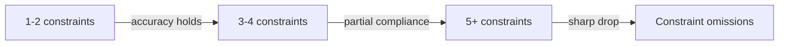

# Constraint Degradation in AI Code Generation

> LLM code generation accuracy drops sharply as the number of simultaneous constraints increases — reduce constraint load through decomposition, schemas, and mechanical enforcement.

!!! info "Also known as"
    Multi-Constraint Degradation, Constraint Count Ceiling

## The Problem

When a code generation prompt includes multiple simultaneous constraints — data types, return formats, length limits, value ranges, architectural rules — model performance degrades measurably with each additional constraint. This is not a prompt quality issue. It is a structural limitation of how LLMs distribute attention across competing requirements during decoding.

Empirical testing on the CodeConstraints benchmark shows that models follow individual constraints reliably, but accuracy drops sharply as the number of simultaneous constraints grows ([Fang et al., 2026](https://arxiv.org/abs/2602.00066)).



## Why It Happens

Models prioritize some constraints over others when given too many simultaneously — satisfying the most prominent and quietly dropping the rest ([Fang et al., 2026](https://arxiv.org/abs/2602.00066)). [unverified] The likely mechanism is attention dilution: as constraint count grows, the model's capacity to track each requirement during decoding degrades.

This appears to be the same degradation pattern as the [instruction compliance ceiling](instruction-compliance-ceiling.md) applied to code generation constraints rather than behavioral rules. [unverified]

## Mitigations

### Decompose Constraints Across Turns

Instead of a single prompt with all constraints, issue them sequentially:

```text
# Instead of this:
"Write a function that takes a list of integers, returns a sorted
dictionary mapping values to frequencies, handles empty input by
returning {}, limits keys to positive numbers, and uses no imports."

# Do this:
Turn 1: "Write a function that counts frequency of integers in a list."
Turn 2: "Update it to return a sorted dictionary."
Turn 3: "Add handling for empty input — return {}."
Turn 4: "Filter to only positive numbers as keys."
Turn 5: "Remove any import statements."
```

Each turn addresses one constraint while the model can verify prior constraints against existing code. After each turn, confirm prior constraints still hold — sequential editing can silently regress earlier requirements. [unverified]

### Use Structured Output Schemas

Constrain output format programmatically rather than through natural language:

```json
{
  "type": "object",
  "properties": {
    "function_name": { "type": "string", "pattern": "^[a-z_]+$" },
    "parameters": { "type": "array", "items": { "type": "string" } },
    "return_type": { "const": "dict[int, int]" },
    "body": { "type": "string" }
  },
  "required": ["function_name", "parameters", "return_type", "body"]
}
```

Schema validation enforces structural constraints — function name format, return type, parameter shape — that would otherwise compete for attention in the prompt. Behavioral constraints like "no imports" cannot be offloaded to schemas and must remain in the prompt or be enforced by a linter post-generation. [unverified]

### Prioritize Constraints by Enforcement Method

Not all constraints belong in the prompt:

| Constraint type | Enforcement method |
|---|---|
| Return type, function signature | Type checker, schema validation |
| No banned imports | Linter rule, pre-commit hook |
| Value range, input validation | Unit tests |
| Algorithmic approach, style | Prompt (natural language) |

Reserve prompt-based constraints for requirements that cannot be checked mechanically. The fewer constraints competing for attention during generation, the more reliably the remaining ones are followed.

### Verify After Generation

Add a verification pass that checks each constraint explicitly:

```text
"Review the function above against these requirements:
1. Returns dict[int, int]
2. Handles empty input
3. No imports used
4. Keys are positive only
Fix any failures."
```

Separating generation from verification lets the model focus attention on checking rather than simultaneously generating and constraining. [unverified]

## What About Intent Amplification?

Contrastive decoding — comparing logits from a full prompt against an intent-masked version — shows up to 71% improvement in constraint adherence ([Fang et al., 2026](https://arxiv.org/abs/2602.00066)), building on classifier-free guidance adapted from image generation ([Sanchez et al., 2023](https://arxiv.org/abs/2306.17806)).

These methods require token-level logit access, making them **applicable only to open-weight models** (vLLM, llama.cpp). Developers using closed-source APIs cannot modify decoding behavior. The mitigations above work with any model.

## Key Takeaways

- Beyond ~4 simultaneous constraints, expect partial compliance — the model will silently drop requirements
- Stack mitigations: schemas and linters enforce structural constraints mechanically, turn decomposition isolates behavioral constraints, and a verification pass catches what slips through
- Reserve prompt-based constraints for requirements that no tool can check — the fewer constraints competing during generation, the more reliably each is followed
- Decoding-level fixes (intent amplification) exist but require open-weight models with logit access

## Unverified Claims

- The attention dilution mechanism is consistent with the empirical data, but the cited paper measures compliance rates, not internal attention patterns [unverified]
- Shared mechanism between code constraint degradation and the behavioral instruction compliance ceiling is inferred across separate bodies of work [unverified]
- Sequential constraint decomposition as a mitigation is a practitioner heuristic, not empirically measured [unverified]
- Schemas freeing attention for behavioral constraints is architecturally plausible but untested in published studies [unverified]
- Separating generation from verification is a common recommendation without controlled evaluation [unverified]

## Related

- [The Instruction Compliance Ceiling](instruction-compliance-ceiling.md) — the same degradation mechanism applied to behavioral rules rather than code constraints
- [Critical Instruction Repetition](critical-instruction-repetition.md) — exploiting primacy and recency bias to boost compliance on specific constraints
