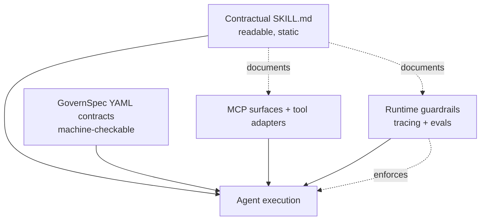

# Contractual Skill Files

> Structure `SKILL.md` as a fixed schema of governance fields when enterprise audit and multi-author review are the bottleneck — never as a runtime safety mechanism.

Contractual skill files are `SKILL.md` documents organised as a fixed schema of governance fields rather than free-form prose, making intent, boundaries, and acceptance criteria mechanically locatable for reviewers and downstream tools. In the framework's own evaluation, contractual structure outperformed no-skill and minimal-skill baselines on every model tested, but gains over information-rich plain skills were "small and mixed" — the framework improves checkability and maintainability rather than raw generation quality ([Liu, 2026](https://arxiv.org/abs/2605.22634)).

## When This Pattern Applies

The contractual structure is worth its overhead under specific conditions ([Liu, 2026](https://arxiv.org/abs/2605.22634)):

- **Enterprise audit contexts** — reviewers, compliance, or security teams must locate permissions, evidence requirements, and approval points without reading every skill end-to-end.
- **Multi-author skill libraries** — when several engineers author skills, a fixed schema keeps the inspection surface consistent across authors.
- **Skills that touch high-risk tools** — the framework's tool-calling experiments showed contractual skills usually reduce high-risk tool attempts across eight models, though "runtime tool guardrails are still required" ([Liu, 2026](https://arxiv.org/abs/2605.22634)).

If none of these apply, plain expanded skills perform comparably and cost less to maintain.

## The Nine Fields

The framework defines nine inspectable fields, each addressing a question a reviewer would otherwise have to infer ([Liu, 2026](https://arxiv.org/abs/2605.22634)):

| Field | Question it answers |
|-------|---------------------|
| Goals | What outcome counts as success |
| Input boundaries | What the skill accepts; what it rejects |
| Permissions | Which tools, paths, or APIs the skill may touch |
| Evidence requirements | What sources the skill must cite or verify |
| Output contract | The shape, fields, and format of the produced artifact |
| Quality criteria | What "good" looks like for the output |
| Verification steps | How the skill (or a downstream check) confirms the output |
| Human approval points | Where execution pauses for sign-off |
| Handoff rules | How the skill passes control to another skill or human |

Fields stay readable in markdown; they are not a YAML schema. The framework separates contractual skills from GovernSpec YAML contracts, MCP surfaces, tool adapters, runtime guardrails, tracing, and evals — each layer has different observability properties ([Liu, 2026](https://arxiv.org/abs/2605.22634)).

## Why It Works

Contractual fields convert tacit skill assumptions into typed inspection surfaces. A reviewer locates the `permissions` block, `verification steps`, and `human approval points` without reading every paragraph; automated tools do the same for cross-skill comparison and adapter compatibility. The framework's evaluation reports the mechanism cleanly: gains concentrate in checkability and maintainability, not output quality, which remains governed by model capability and runtime feedback ([Liu, 2026](https://arxiv.org/abs/2605.22634)).

The same mechanism underlies typed-debt detection at library scale: SkillOps requires typed precondition, operation, artifact, validator, and failure fields so redundancy, supersession, and type compatibility are machine-checkable — without that structure, detection collapses to body-hash comparison and string similarity over descriptions ([SkillOps, arXiv:2605.13716](https://arxiv.org/abs/2605.13716)).

## When This Backfires

- **Treated as enforcement.** A `permissions:` field listing `git push` does not stop a runtime call. The framework states contractual skills are "a governance layer that makes task intent, boundaries, and acceptance criteria explicit, not a standalone safety mechanism" ([Liu, 2026](https://arxiv.org/abs/2605.22634)). Reading them otherwise produces false assurance and skipped runtime guardrails.
- **Small teams with mature review.** When engineers already read every skill before merge, the fixed schema adds maintenance overhead without changing what reviewers catch.
- **Greenfield prototyping.** Skills that change weekly outpace any fixed schema; minimal-skill baselines suffice until the skill stabilises.
- **Compliance overload.** The added field surface increases the rule count a model must honour, and the [instruction compliance ceiling](instruction-compliance-ceiling.md) shows compliance degrades as rule count grows — more fields can produce more omission errors, not fewer.
- **Library-level debt.** Contractual fields multiply the surface where redundant clones, stale dependencies, and type mismatches accumulate; the library needs its own detectors and named actions ([SkillOps, arXiv:2605.13716](https://arxiv.org/abs/2605.13716)).

Empirically, 29.9% of 402 deployed `SKILL.md` files in the SEFZ study silently violated their own declared natural-language rules on benign inputs ([arXiv:2605.13044](https://arxiv.org/abs/2605.13044)). Restructuring those rules into named fields does not, on its own, make them honoured at runtime.

## Where It Sits in the Stack

The paper explicitly separates contractual skills from neighbouring layers ([Liu, 2026](https://arxiv.org/abs/2605.22634)):



The contractual layer documents intent; enforcement lives in runtime guardrails, validators, and skill evals. A team that invests only in the contractual layer has documented governance, not enforced it.

## Example: A Permissions Field That Documents, Not Enforces

```markdown
## Permissions
- Reads: `docs/**/*.md`, `scripts/lint-page.py`
- Writes: `docs/**/*.md` (no other paths)
- Tools: `Read`, `Edit`, `Grep`, `Bash(uv run python scripts/lint-page.py:*)`
- Forbidden: `git push`, `git rebase`, network egress

## Verification
- After every edit, run `uv run python scripts/lint-page.py --check <file>`
- Block on any HIGH severity finding
```

The block is readable, locatable, and reviewable in five seconds. It enforces nothing — a runtime hook or harness deny rule does the actual stopping. The contractual fields document what the runtime layer must enforce.

## Key Takeaways

- Contractual fields raise **checkability and maintainability**, not output quality — the framework's own evaluation found gains over information-rich plain skills were small and mixed ([Liu, 2026](https://arxiv.org/abs/2605.22634)).
- Apply the pattern when audit, multi-author review, or high-risk tool surface make inspectability the bottleneck; skip it when skills are stable and small-team.
- Never read a contractual field as enforcement — runtime tool guardrails are still required ([Liu, 2026](https://arxiv.org/abs/2605.22634)).
- The nine fields are an authoring convention, not a YAML schema; keep them readable.
- Pair with library-time maintenance and skill evals — contractual structure does not detect runtime violations on its own ([arXiv:2605.13044](https://arxiv.org/abs/2605.13044)).

## Related

- [Skill Library Technical Debt](../tool-engineering/skill-library-technical-debt.md) — library-time maintenance signals and named actions that complement per-skill contracts
- [Skill Specification Violation Fuzzing](../verification/skill-specification-violation-fuzzing.md) — empirical evidence that declared rules silently fail on benign inputs; the testing layer contractual fields do not replace
- [Skill Evals](../verification/skill-evals.md) — paired with-skill versus baseline runs that measure whether the contract actually produces the claimed behavior
- [The Specification as Prompt](specification-as-prompt.md) — using formal artifacts as agent instructions; the contractual fields are a lighter-weight cousin for skills
- [The Instruction Compliance Ceiling](instruction-compliance-ceiling.md) — why adding more rule fields can worsen, not improve, compliance
