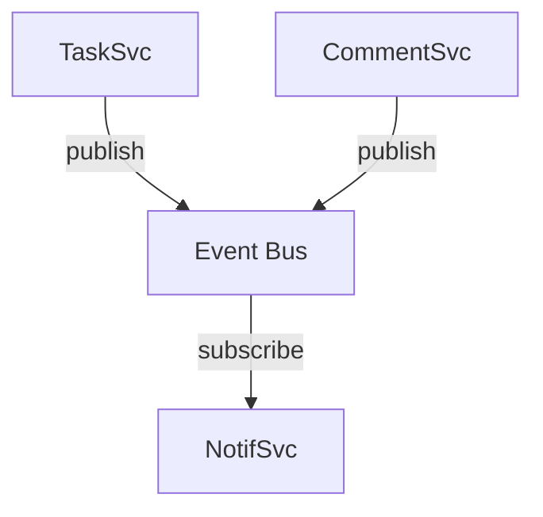

# Diagram as the Shared Spec: One Artifact for the Picture and the Prompt

> Keep one diagram source that the human reads as a picture and the agent reads as its spec. It buys sync, not quality.

A Mermaid block is text. The renderer draws it and the model reads the same bytes, so the picture in the README and the structure the agent works from cannot drift apart. There is no export step and no second copy to update. That property is the reason to do this, and the only one the evidence supports. In a controlled experiment of 90 multi-turn agent trials across six models, format moved overall quality by 0.17 points on Sonnet 4.6, and the diagram format spent 2.4 times the tokens of prose ([arXiv:2608.21747v1](https://arxiv.org/abs/2608.21747v1)).

## Put structure in the diagram, rules where a checker can see them

The diagram format in that experiment was never a diagram alone. It was "a specification combining Mermaid architecture and sequence diagrams, structured per-service component blocks, a numbered constraint list, architectural decision records (ADRs), and a route table" ([arXiv:2608.21747v1](https://arxiv.org/abs/2608.21747v1)). The sample spec parks its rules in comments beside the arrows, as `% Constraint 1: Services MUST NOT import or call other services directly.` Flowchart syntax has nowhere else to put a rule. An arrow says an edge exists; it cannot say the edge is mandatory, retried, or forbidden in the reverse direction.

Writing the rules next to the arrows did not make the agent follow them. Prose, OpenAPI, and TypeScript contracts each produced zero automated constraint violations across all three Sonnet trials. The diagram spec produced two violations and was clean in only one of three ([arXiv:2608.21747v1](https://arxiv.org/abs/2608.21747v1)). The authors state it directly: "The formats with the most explicit constraint lists (Mermaid, C4) did not achieve the best automated compliance."

So split by what each half can carry. Nodes and edges go in the diagram; rules go where something executes them, in a schema, a type, or a test.

## What the extra tokens buy

On Sonnet 4.6 the diagram spec scored 8.50 against prose's 8.42, and spent 1,060K tokens and 38.3 agent turns against prose's 433K and 23.7. Per 100K tokens that is 0.80 score points against 1.94 ([arXiv:2608.21747v1](https://arxiv.org/abs/2608.21747v1)). It was also the least predictable condition, with a score range of 2.25 across three trials against prose's 0.25, holding a joint-best 9.50 and a 7.25 in the same cell ([arXiv:2608.21747v1](https://arxiv.org/abs/2608.21747v1)).

Which format a given model prefers is a separate question, answered in [Match Architecture Spec Format to Model Capability](spec-format-by-model-tier.md). Pick the diagram for the sync property, then check that against your model tier.

## Why it works

The mechanism is artifact count, not model comprehension. Two documents describing one system can disagree; one document cannot disagree with itself. When the same source renders for the human and parses for the agent, the job of keeping them equal does not exist to be skipped. Shipped tooling has the same shape. Kiro's spec workflow puts the diagrams in a `design.md` covering "technical architecture, sequence diagrams, and implementation considerations". That file is one of three, and the next phase of the workflow generates "discrete, executable implementation tasks" in `tasks.md` ([Kiro specs documentation](https://kiro.dev/docs/specs/)).

The graph-encoding literature adds no comprehension argument on top. The direct study of graph-to-text encoding found the best encoder was a prose-like one naming each node's neighbors, at 53.8% on connected-node questions against 19.8% for terse adjacency notation, on models the authors describe as performing "poorly on almost all the basic graph tasks we experimented with" ([arXiv:2310.04560v1](https://arxiv.org/abs/2310.04560v1)). Diagram syntax was not among the encodings tested.

## When this backfires

- The diagram has to carry a constraint. Mermaid gives an edge no modality, so "must", "at most once", and "only after retry" survive only in a comment the agent may or may not honor ([arXiv:2608.21747v1](https://arxiv.org/abs/2608.21747v1)).
- You drive a smaller or fine-tuned model. Prompt template choice swings GPT-3.5-turbo by up to 40% on code translation while GPT-4 is more robust ([arXiv:2411.10541v1](https://arxiv.org/abs/2411.10541v1)), and fine-tuning "reduces sensitivity to node relabeling but may increase it to variations in structure and format" ([arXiv:2511.10234v3](https://arxiv.org/abs/2511.10234v3)).
- The agent edits the diagram back. LLMs "can produce different outputs under node reindexing, edge reordering, or formatting changes" ([arXiv:2511.10234v3](https://arxiv.org/abs/2511.10234v3)), so a round-trip commit that only reshuffles node order is not a no-op for the next run.
- The topology you drew for legibility is also a prior. Cycle detection ran at 91.7% on complete graphs and 5.9% on path graphs, which the authors read as a "strong prior towards graphs having cycles" ([arXiv:2310.04560v1](https://arxiv.org/abs/2310.04560v1)).
- The work is not graph-shaped. Acceptance criteria, budgets, and ordered procedures flatten into boxes, and the edges then carry nothing.

## Example

The experiment published the spec fragment it handed each agent, so the shape is not hypothetical.

**Before** — the diagram condition as tested, with the rule riding in a Mermaid comment ([arXiv:2608.21747v1](https://arxiv.org/abs/2608.21747v1)):

The renderer drops the comment and the agent may or may not act on it. In that condition, two automated constraint violations landed across three Sonnet trials, against zero for prose, OpenAPI, and TypeScript contracts ([arXiv:2608.21747v1](https://arxiv.org/abs/2608.21747v1)).

**After** — the same diagram, with Constraint 1 moved to a checker. An ArchUnit-style rule in the test suite, or a lint rule forbidding imports from `services/notification` inside `services/task`, fails the build instead of asking the agent to remember. The paper's two zero-violation structured formats put their rules exactly there: OpenAPI in a schema, TypeScript contracts in interfaces plus ArchUnit-style rules ([arXiv:2608.21747v1](https://arxiv.org/abs/2608.21747v1)).

The diagram still does the job it is good at. The reviewer reads the topology in one pass and the agent parses the same lines. The rule is the part that had to move.

## Key Takeaways

- The reason to make the diagram the spec is that one artifact cannot disagree with itself. Sync is the deliverable; quality is not.
- Budget for the token bill before you adopt it. The diagram spec returned 0.80 score points per 100K tokens against prose's 1.94, and had the widest score range in the experiment ([arXiv:2608.21747v1](https://arxiv.org/abs/2608.21747v1)).
- Adding a numbered constraint list to the diagram did not produce the best constraint compliance. Prose, OpenAPI, and TypeScript contracts each hit zero violations; the diagram spec was clean in one trial of three ([arXiv:2608.21747v1](https://arxiv.org/abs/2608.21747v1)).
- Treat a diagram edit as a behavior change even when it only reorders nodes, because encoding changes move model output ([arXiv:2511.10234v3](https://arxiv.org/abs/2511.10234v3)).
- Draw the structure, then put every rule somewhere that can fail.

## Related

- [Mermaid as Agent Output Format: When to Ask for a Diagram Instead of Prose](mermaid-as-agent-output-format.md) — the other direction, where the agent emits the diagram and the consumer surface decides whether that pays.
- [Match Architecture Spec Format to Model Capability](spec-format-by-model-tier.md) — which spec format to pick once you know which model tier you drive.
- [The Specification as Prompt](specification-as-prompt.md) — using types, schemas, and API definitions as the instruction instead of prose.
- [Constraint Encoding Does Not Fix Constraint Compliance](constraint-encoding-compliance-gap.md) — why reformatting a rule changes tokens rather than adherence.
- [Multi-Layer Specification Redundancy as a Robustness Budget](multi-layer-specification-redundancy.md) — when a second, independent specification layer earns its keep.
