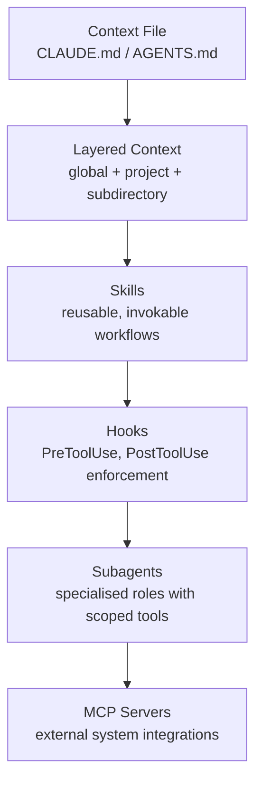

# Empirical Baseline: How Developers Configure Agentic AI Coding Tools

> A study of 2,923 GitHub repositories finds that context files dominate configuration while advanced mechanisms — Skills, Subagents, Hooks, MCP — remain shallowly adopted across every tool.

## The study

[Galster et al. (arXiv:2602.14690)](https://arxiv.org/abs/2602.14690) analyzed 2,923 public GitHub repositories that use Claude Code, GitHub Copilot, Cursor, Gemini, and OpenAI Codex. The study names eight configuration mechanisms — context files, skills, subagents and agents, hooks, MCP servers, memory, permissions, and settings and model config — and measures how often each appears in practice.

## What the data shows

Context files dominate. Most repos configure the agent through a single context file. AGENTS.md is emerging as the cross-tool interoperability standard — the [agents.md spec](https://agents.md) self-reports more than 60,000 projects and 25 or more tools.

Skills are shallowly adopted. Most repositories define only one or two skill artifacts, and these hold static instructions rather than executable workflows. The [Agent Skills open standard](../standards/agent-skills-standard.md) (self-reported 30 or more supporting tools) and [Claude Code's SKILL.md format](https://code.claude.com/docs/en/skills) support file bundling, subagent execution, dynamic context injection, invocation control, and hooks. Yet the Galster et al. data shows that real-world adoption uses almost none of this capability.

Subagents are rarely configured beyond defaults. Claude Code's subagent system (`.claude/agents/`) supports per-agent model selection, tool restrictions, permission modes, hooks, and persistent memory ([Claude Code sub-agents documentation](https://code.claude.com/docs/en/sub-agents)). Repos rarely configure any of these.

Hooks are underused. Claude Code hooks fire at `PreToolUse`, `PostToolUse`, `SubagentStart`, `SubagentStop`, `Stop`, and `InstructionsLoaded` events. They can block, transform, or log tool calls ([Claude Code hooks documentation](https://code.claude.com/docs/en/hooks)). Adoption is minimal.

MCP servers are underrepresented. MCP connects agents to external systems — databases, issue trackers, design tools, and monitoring — at local, project, user, and managed scopes ([Claude Code MCP documentation](https://code.claude.com/docs/en/mcp)). Deployment stays low despite broad availability.

Claude Code users draw on the broadest range of mechanisms. Distinct configuration cultures form around each tool, and Claude Code leads in multi-mechanism adoption.

## The gap this creates

Under-configuration is a self-imposed capability gap. The mechanisms exist, are documented, and work.

The CLAUDE.md hierarchy spans managed policy, user, project, and subdirectory layers, plus `.claude/rules/` for path-scoped rules ([Claude Code memory documentation](https://code.claude.com/docs/en/memory)). Most repos collapse that hierarchy to a single flat file at the root.

## A prioritized adoption ramp

Build up the configuration step by step:

Step 1 — Layered context files. Split the root context file into global, project, and subdirectory layers, so each scope carries only the rules it needs. See [Layer Agent Instructions by Specificity](../instructions/layered-instruction-scopes.md).

Step 2 — Skills. Extract repeated workflows into SKILL.md files that name their subagent, required tools, and preloaded context. See [Skill Library Evolution](../tool-engineering/skill-library-evolution.md).

Step 3 — Hooks. Replace prompt-based enforcement with hooks for constraints that must not vary. A `PreToolUse` hook cannot be overridden by injected instructions. See [Hooks for Enforcement vs Prompts for Guidance](hooks-vs-prompts.md).

Step 4 — Subagent specialization. Assign distinct roles with scoped tool sets, so a reviewer subagent cannot modify files even if instructed to. See [Specialized Agent Roles](../agent-design/specialized-agent-roles.md).

Step 5 — MCP for external systems. Connect agents to issue trackers, documentation, observability, and design tools through structured [MCP integrations](../tools/copilot/mcp-integration.md) instead of copy-paste context.

## When not to over-configure

The ramp above is an option, not a mandate. Three conditions favor stopping at a simple context file:

1. Short-lived or exploratory projects. Hooks, subagent roles, and MCP integrations only pay off when the same patterns repeat across many sessions. A two-day prototype rarely recurs enough to justify the setup cost.
2. Single-developer codebases. Hooks and permission modes exist to enforce constraints across many contributors or over long time horizons. Solo work with tight review cycles already provides that enforcement through code review.
3. Stable, low-complexity domains. If the agent's job is a small, well-understood task — formatting, or test generation for a single framework — a single CLAUDE.md rule often covers it. Subagent specialization adds overhead without capability gain when there is only one role to play.

The data reflects this. Shallow adoption may be partly rational scoping, not just ignorance of the available features.

## Key Takeaways

- Context files dominate real-world agentic AI configuration; advanced mechanisms are rarely used
- The gap is awareness and adoption, not capability — all mechanisms are documented and production-ready
- Claude Code users exhibit the broadest configuration culture; AGENTS.md is emerging as the cross-tool standard, self-reported at 25+ tools
- Teams that adopt multiple mechanisms tend to configure each more deeply

## Related

- [Hooks for Enforcement vs Prompts for Guidance](hooks-vs-prompts.md)
- [Hooks and Lifecycle Events: Intercepting Agent Behavior](../tool-engineering/hooks-lifecycle-events.md)
- [PostToolUse Hooks: Auto-Formatting on Every File Edit](../tools/claude/posttooluse-auto-formatting.md)
- [Hierarchical CLAUDE.md: Structuring Context Files at Multiple Levels](../instructions/hierarchical-claude-md.md)
- [Specialized Agent Roles](../agent-design/specialized-agent-roles.md)
- [GitHub Copilot: Model Selection & Routing](../training/copilot/model-selection.md) — per-agent model selection and routing strategies
- [Skill Library Evolution](../tool-engineering/skill-library-evolution.md)
- [Encode Project Conventions in Distributed AGENTS.md Files](../instructions/agents-md-distributed-conventions.md)
- [Cross-Tool Translation](../human/cross-tool-translation.md)
- [MCP: The Open Protocol Connecting Agents to External Tools](../standards/mcp-protocol.md)
- [Progressive Autonomy: Scaling Trust with Model Evolution](../human/progressive-autonomy-model-evolution.md)
- [The Bottleneck Migration When Humans Supervise Agents](../human/bottleneck-migration.md)
- [Initiatives and Community: Tracking the Agentic Engineering](../human/initiatives-community.md)
- [Rigor Relocation](../human/rigor-relocation.md)
- [Evidence-Based Allowlist Auto-Discovery](../security/evidence-based-allowlist-auto-discovery.md)
- [Safe Command Allowlisting: Reducing Approval Fatigue](../security/safe-command-allowlisting.md)
- [Skill Atrophy: When AI Reliance Erodes Developer Capability](../human/skill-atrophy.md)
- [Developer Control Strategies for AI Coding Agents](../human/developer-control-strategies-ai-agents.md)
