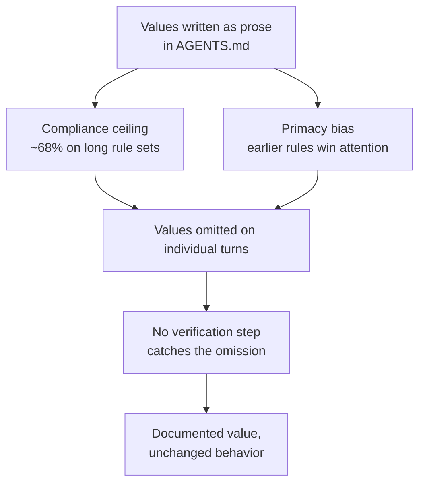

# Encoding Values in AGENTS.md: Why Prose Without Verification Fails

> Developers translate team values — fairness, accessibility, sustainability, tone — into AGENTS.md prose. Corpus studies show these values are largely absent in practice, and when present, unverified prose rarely changes agent behavior. Pair every value-bearing rule with a verification command or move it to a lower layer.

## The Empirical Gap

Two recent corpus studies measured what developers actually encode in repository context files. Functional context dominates; values content is sparse.

| Category | Wei et al. (2,303 files) | Liu et al. (466 OSS repos) |
|---|---|---|
| Implementation details | 69.9% | Top category |
| Architecture | 67.7% | 47 instances |
| Build / run commands | 62.3% | 40 instances |
| Error handling / debugging | 24.4% | — |
| Security | 14.5% | 6 instances |
| Performance | 14.5% | — |
| Accessibility, fairness, sustainability, tone | Not measured (rare) | None found |

Liu et al. classified instructions by writing style — descriptive, prescriptive, prohibitive, explanatory, conditional — and reported **no explicit ethical, accessibility, fairness, or tone instructions** across the analyzed AGENTS.md files ([Liu et al., 2025](https://arxiv.org/abs/2510.21413)). Wei et al. note the same gap: developers "provide few guardrails to ensure that agent-written code is secure or performant" ([Wei et al., 2025](https://arxiv.org/abs/2511.12884)).

The encoded-values story is largely aspirational; the files themselves contain build commands and naming conventions.

## Why Values-as-Prose Fails



Frontier models top out at roughly 68% accuracy at 500 simultaneous instructions, and earlier instructions are satisfied more reliably than later ones — primacy effects peak around 150–200 instructions ([Jaroslawicz et al. — How Many Instructions Can LLMs Follow at Once?](https://arxiv.org/abs/2507.11538)). A "be accessible" sentence in a 500-line AGENTS.md inherits both penalties. Gloaguen et al. add a direct cost: verbose AGENTS.md files **reduce** task success and add ~20% inference cost on SWE-bench Lite and AGENTbench ([Gloaguen et al., 2026](https://arxiv.org/abs/2602.11988)).

## Verification, Not Prose

Pair every value with a mechanical check the agent runs; reduce the AGENTS.md line to a pointer.

| Value | Prose-only (low signal) | Verification-paired (high signal) |
|---|---|---|
| Accessibility | "Write accessible UIs." | "After UI changes, run `pnpm test:a11y` (axe-core); fix violations before commit." |
| Licensing | "Respect open-source licenses." | "Run `pnpm licenses:check`; only `MIT`, `Apache-2.0`, `BSD-*` allowed." |
| Fairness in data | "Avoid biased datasets." | "Run `scripts/dataset-audit.py` on every new dataset; CI fails on parity-check failure." |
| Security | "Write secure code." | "Run `gitleaks detect` and `npm audit --omit=dev` before commit." |

This aligns with the broader site finding that [guardrails beat guidance](guardrails-beat-guidance-coding-agents.md) for coding agents — negative constraints with concrete triggers outperform positive prose, and tool-specific commands are the only AGENTS.md content with reliable behavioral effect ([Wei et al., 2025](https://arxiv.org/abs/2511.12884)).

## Where Values Actually Belong

If the goal is enforced values, AGENTS.md is rarely the right layer. Each value usually has a lower-level mechanism:

- **Permissions and sandboxes** — egress, file-write, and shell deny rules enforce "do not exfiltrate data" without prose
- **CI checks** — accessibility linters, license scanners, dataset audits, dependency scans
- **Pre-commit / hook scripts** — secret scanning, formatting, deny-rule enforcement on risky operations
- **Branch protection** — "do not commit to main" becomes a server-side rule, not an AGENTS.md sentence

AGENTS.md then references the mechanism: "Run `make check-a11y`. If it fails, do not propose merging." That sentence works because the agent can verify the outcome.

Prose values still earn space when they are short, point to a mechanism, or signal priorities to human contributors. What does not work is a long ethics preamble with no operational follow-through — high attention via primacy, no behavioral teeth, direct cost on the task budget.

## Example

A real "before" pattern, rewritten for verification:

**Before** — values as advisory prose:

```markdown
# AGENTS.md

## Our values

We care deeply about accessibility, sustainability, and inclusive language.
Please write code that respects these values.

## Build

pnpm install
pnpm build
```

**After** — values pinned to mechanisms:

```markdown
# AGENTS.md

## Build & verify

- pnpm install
- pnpm build
- pnpm test:a11y      # accessibility (axe-core); CI fails on violations
- pnpm licenses:check # sustainability/licensing (MIT/Apache-2.0/BSD-* only)
- pnpm test           # unit + integration

Run all four before proposing a commit. Do not propose merging if any fail.

See docs/a11y.md and docs/licensing.md for the underlying policies.
```

The "after" version contains the same values commitments. The difference is that every value points to a command the agent runs, the result of which the team can audit.

## Key Takeaways

- Corpus studies show developers rarely encode fairness, accessibility, sustainability, or tone in AGENTS.md; functional context dominates ([Wei et al.](https://arxiv.org/abs/2511.12884), [Liu et al.](https://arxiv.org/abs/2510.21413))
- Values-as-prose inherits the [compliance ceiling](instruction-compliance-ceiling.md) and primacy bias — read by the model, applied unreliably, never verified
- Verbose AGENTS.md actively reduces task success and raises cost ~20% ([Gloaguen et al.](https://arxiv.org/abs/2602.11988)); adding values prose has a real cost
- Pair every value with a verification command, or move it to a lower-layer mechanism (permissions, CI, hooks, branch protection)
- Keep AGENTS.md as a pointer: short rule, named command, link to policy

## Sources

- [Wei et al. — Agent READMEs: An Empirical Study of Context Files for Agentic Coding](https://arxiv.org/abs/2511.12884) — 2,303 context files; functional categories dominate, security/performance under 15%
- [Liu et al. — Context Engineering for AI Agents in Open-Source Software](https://arxiv.org/abs/2510.21413) — 466 OSS repos; five writing styles; no explicit ethical, accessibility, fairness, or tone instructions found
- [Gloaguen et al. — Evaluating AGENTS.md: Are Repository-Level Context Files Helpful for Coding Agents?](https://arxiv.org/abs/2602.11988) — verbose context files reduce success and add ~20% cost
- [Jaroslawicz et al. — How Many Instructions Can LLMs Follow at Once?](https://arxiv.org/abs/2507.11538) — frontier models top out at 68% at 500 instructions; primacy bias peaks around 150–200 instructions
- [Zhang et al. — Do Agent Rules Shape or Distort? Guardrails Beat Guidance in Coding Agents](https://arxiv.org/abs/2604.11088) — negative constraints help, positive directives hurt; ground for the verification-not-prose recommendation

## Related

- [Evaluating AGENTS.md: When Context Files Hurt More Than Help](evaluating-agents-md-context-files.md)
- [Guardrails Beat Guidance: Rule Design for Coding Agents](guardrails-beat-guidance-coding-agents.md)
- [The Instruction Compliance Ceiling](instruction-compliance-ceiling.md)
- [Critical Instruction Repetition](critical-instruction-repetition.md)
- [Standards as Agent Instructions](standards-as-agent-instructions.md)
- [Enforcing Agent Behavior with Hooks](enforcing-agent-behavior-with-hooks.md)
- [AGENTS.md: A README for AI Coding Agents](../standards/agents-md.md)
