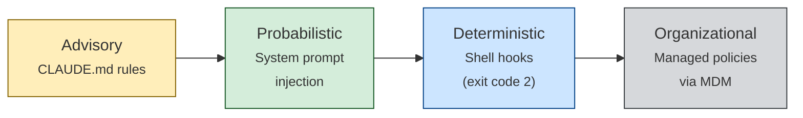

# Enforcing Agent Behavior with Hooks

> Move critical behavioral rules out of prompts and into deterministic shell hooks that the model cannot override — blocking forbidden actions, rewriting inputs, and gating task completion.

## The Enforcement Spectrum

Behavioral rules sit on a spectrum from advisory to deterministic. Most teams leave high-stakes rules at the mercy of model attention.



**Advisory** — Rules in CLAUDE.md or [AGENTS.md](../standards/agents-md.md). The model may ignore them under task pressure, [context compaction](../context-engineering/context-compression-strategies.md), or conflicting training priors ([Lavaee, 2025](https://alexlavaee.me/blog/openai-agent-first-codebase-learnings)).

**Probabilistic** — System prompts or event-driven reminders. Higher attention weight, but still subject to drift in long sessions ([Claude Code best practices](https://code.claude.com/docs/en/best-practices)).

**Deterministic** — Shell hooks executing outside the context window. Exit code 2 is documented to block the tool call and feed stderr back to the model ([Claude Code hooks](https://code.claude.com/docs/en/hooks)); the model cannot argue with or forget a shell process. Coverage varies by event and tool — see [When This Backfires](#when-this-backfires) for current gaps.

**Organizational** — Managed policies via MDM, enforcing org-wide standards beyond project or user control.

The key insight: **[rigor relocation](../human/rigor-relocation.md)** — move enforcement to a layer the model cannot influence. Every rule shifted from advisory to deterministic stops failing silently.

## Three Hook Patterns

Claude Code hooks fire on lifecycle events (`PreToolUse`, `PostToolUse`, `Notification`, `Stop`) and receive JSON via stdin ([Claude Code hooks guide](https://code.claude.com/docs/en/hooks-guide)):

### Block: Exit Code 2

The hook exits with code 2 to block the tool call; stderr becomes the block reason.

```jsonc
// .claude/settings.json
{
  "hooks": {
    "PreToolUse": [
      {
        "matcher": "Bash",
        "command": "python .claude/hooks/block-force-push.py"
      }
    ]
  }
}
```

```python
# .claude/hooks/block-force-push.py
import json, sys

event = json.load(sys.stdin)
cmd = event.get("tool_input", {}).get("command", "")
if "push" in cmd and ("--force" in cmd or "-f" in cmd):
    print("Blocked: force push requires human confirmation", file=sys.stderr)
    sys.exit(2)
```

Exit 2 blocks; exit 0 allows; any other code is treated as a hook error and does not block.

### Rewrite: Transform Inputs via `updatedInput`

A hook can modify the tool call instead of blocking. Print JSON with `updatedInput` to stdout and Claude Code replaces the original input.

```python
# .claude/hooks/enforce-uv.py
import json, sys

event = json.load(sys.stdin)
cmd = event.get("tool_input", {}).get("command", "")
if cmd.startswith("pip install"):
    package = cmd.replace("pip install", "uv pip install")
    result = {"updatedInput": {"command": package}}
    json.dump(result, sys.stdout)
```

The model sees the rewritten command, reinforcing the correct pattern for future calls.

### Completion Gates: Stop Hooks

`Stop` hooks fire when the agent is about to end its turn. Use them to run a linter, check test coverage, or validate spec updates before "done."

```jsonc
{
  "hooks": {
    "Stop": [
      {
        "command": "python .claude/hooks/lint-before-done.py"
      }
    ]
  }
}
```

Exit 2 from a Stop hook prevents the agent from stopping; it continues with the hook's stderr as feedback. The agent cannot declare "done" until the gate passes.

## Hook Scoping Hierarchy

Hooks resolve from four scopes with different trust and override properties ([Claude Code hooks](https://code.claude.com/docs/en/hooks)):

| Scope | Location | Override by user? | Use case |
|---|---|---|---|
| **User** | `~/.claude/settings.json` | Yes | Personal workflow preferences |
| **Project** | `.claude/settings.json` (committed) | Yes | Team-wide enforcement |
| **Local** | `.claude/settings.local.json` | Yes | Per-machine overrides |
| **Managed** | Enterprise MDM policy | No | Organization-wide mandates |

Managed hooks cannot be disabled by project or user settings, so organizations can enforce security policies regardless of developer configuration.

## Why Hooks Beat Instructions

Models revert to training defaults under pressure — attention-based architectures lose instruction compliance as the context window fills or priors conflict ([Fowler, 2025](https://martinfowler.com/articles/exploring-gen-ai/harness-engineering.html)). Hooks execute in the shell, outside the context window.

## When to Use Each Layer

| Rule type | Layer | Example |
|---|---|---|
| Style preference | Advisory (CLAUDE.md) | "Prefer functional style" |
| Naming convention | Advisory + linter | "Use snake_case for variables" |
| Package manager | Deterministic (hook) | "Use uv, not pip" |
| Destructive command | Deterministic (hook) | "No force push" |
| Completion criteria | Deterministic (Stop hook) | "Tests must pass before done" |
| Security policy | Organizational (managed) | "No secrets in source" |

Judgment rules belong in instructions; binary, non-negotiable rules belong in hooks. See [hooks for enforcement vs prompts for guidance](../verification/hooks-vs-prompts.md).

## When This Backfires

- **Exit code 2 has coverage gaps.** `PreToolUse` exit code 2 has failed to block `Write` and `Edit` while still blocking `Bash` ([anthropics/claude-code #13744](https://github.com/anthropics/claude-code/issues/13744)), and has caused the agent to halt idle rather than act on stderr ([#24327](https://github.com/anthropics/claude-code/issues/24327)). Prefer JSON stdout with explicit `decision` fields when tool-level nuance matters.
- **False positives cost more than the rule saves.** Broad matchers block legitimate commands; rewrite hooks break projects with intentional exceptions. Scope matchers narrowly.
- **Hooks fail open silently.** Any exit code other than 0 or 2 is treated as hook error and does not block. Teammates with missing dependencies get no enforcement and no warning ([5 Claude Code hook mistakes](https://dev.to/yurukusa/5-claude-code-hook-mistakes-that-silently-break-your-safety-net-58l3)).
- **Judgment rules regress when forced binary.** "Prefer descriptive names" or "add tests when changing behavior" lose nuance compressed into a regex. Keep ambiguous rules in CLAUDE.md.

## Key Takeaways

- Exit code 2 is the documented block signal — a shell process sits outside the context window, but coverage gaps exist across tools and events
- Relocate rigor from instructions to hooks for every binary, non-negotiable rule
- Use Block hooks for prohibitions, Rewrite hooks for corrections, and Stop hooks for completion gates
- Managed hooks enforce organizational policy beyond individual developer control
- Instructions handle judgment; hooks handle compliance — use both, but know which does what

## Related

- [Hook Catalog: Guardrails, Sandboxing, and CLI Enforcement](../tool-engineering/hook-catalog.md)
- [Hooks for Enforcement vs Prompts for Guidance](../verification/hooks-vs-prompts.md)
- [Deterministic Guardrails](../verification/deterministic-guardrails.md)
- [Defense-in-Depth Agent Safety](../security/defense-in-depth-agent-safety.md)
- [The Instruction Compliance Ceiling](instruction-compliance-ceiling.md)
- [Guardrails Beat Guidance: Rule Design for Coding Agents](guardrails-beat-guidance-coding-agents.md) — where instruction text stops working, hooks start
- [Event-Driven System Reminders](event-driven-system-reminders.md)
- [Hooks Lifecycle Events](../tool-engineering/hooks-lifecycle-events.md)
