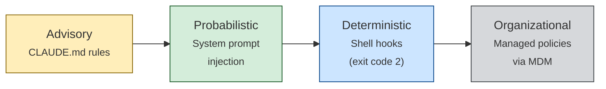

# Enforcing Agent Behavior with Hooks

> Move critical behavioral rules out of prompts and into deterministic shell hooks that the model cannot override — blocking forbidden actions, rewriting inputs, and gating task completion.

## The Enforcement Spectrum

Agent behavioral rules exist on a spectrum from advisory to deterministic. Most teams leave their highest-stakes rules at the mercy of model attention.



**Advisory** — Rules in CLAUDE.md or AGENTS.md. The model may ignore them under task pressure, [context compaction](../context-engineering/context-compression-strategies.md), or conflicting training priors ([Lavaee, 2025](https://alexlavaee.me/blog/openai-agent-first-codebase-learnings)).

**Probabilistic** — System prompts or event-driven reminders. Higher attention weight, but still subject to drift in long sessions ([Claude Code best practices](https://code.claude.com/docs/en/best-practices)).

**Deterministic** — Shell hooks executing outside the context window. Exit code 2 blocks the tool call unconditionally — the model cannot override, argue with, or forget it ([Claude Code hooks](https://code.claude.com/docs/en/hooks)).

**Organizational** — Managed policies via MDM or enterprise configuration, enforcing organization-wide standards beyond project or user control.

The key insight: **[rigor relocation](../human/rigor-relocation.md)**. Move enforcement to a layer the model cannot influence. Every rule that shifts from advisory to deterministic stops failing silently.

## Three Hook Patterns

Claude Code hooks fire on lifecycle events (`PreToolUse`, `PostToolUse`, `Notification`, `Stop`) and receive JSON via stdin. Three patterns cover most needs ([Claude Code hooks guide](https://code.claude.com/docs/en/hooks-guide)):

### Block: Exit Code 2

The hook inspects the tool call and exits with code 2 if it violates a rule. Claude Code blocks the call and shows the hook's stderr as the reason.

```jsonc
// .claude/settings.json
{
  "hooks": {
    "PreToolUse": [
      {
        "matcher": "Bash",
        "command": "python .claude/hooks/block-force-push.py"
      }
    ]
  }
}
```

```python
# .claude/hooks/block-force-push.py
import json, sys

event = json.load(sys.stdin)
cmd = event.get("tool_input", {}).get("command", "")
if "push" in cmd and ("--force" in cmd or "-f" in cmd):
    print("Blocked: force push requires human confirmation", file=sys.stderr)
    sys.exit(2)
```

Exit code 2 means "blocked." Exit code 0 means "allowed." Any other exit code is treated as a hook error and does not block.

### Rewrite: Transform Inputs via `updatedInput`

A hook can modify the tool call rather than blocking it. Output a JSON object with `updatedInput` to stdout, and Claude Code replaces the original input.

```python
# .claude/hooks/enforce-uv.py
import json, sys

event = json.load(sys.stdin)
cmd = event.get("tool_input", {}).get("command", "")
if cmd.startswith("pip install"):
    package = cmd.replace("pip install", "uv pip install")
    result = {"updatedInput": {"command": package}}
    json.dump(result, sys.stdout)
```

The model sees the rewritten command in its output, reinforcing the correct pattern for future calls.

### Completion Gates: Stop Hooks

`Stop` hooks fire when the agent is about to end its turn. Use them to enforce completion criteria — running a linter, checking test coverage, or validating spec updates.

```jsonc
{
  "hooks": {
    "Stop": [
      {
        "command": "python .claude/hooks/lint-before-done.py"
      }
    ]
  }
}
```

If the Stop hook exits with code 2, the agent does not stop — it continues working with the hook's stderr as feedback. This creates a completion gate: the agent cannot declare "done" until the gate passes.

## Hook Scoping Hierarchy

Hooks resolve from four scopes, each with different trust and override properties ([Claude Code hooks](https://code.claude.com/docs/en/hooks)):

| Scope | Location | Override by user? | Use case |
|---|---|---|---|
| **User** | `~/.claude/settings.json` | Yes | Personal workflow preferences |
| **Project** | `.claude/settings.json` (committed) | Yes | Team-wide enforcement |
| **Local** | `.claude/settings.local.json` | Yes | Per-machine overrides |
| **Managed** | Enterprise MDM policy | No | Organization-wide mandates |

Managed hooks cannot be disabled by project or user settings — this is how organizations enforce security policies regardless of individual developer configurations.

## Why Hooks Beat Instructions

Models revert to training defaults under pressure — attention-based architectures lose instruction compliance when the context window fills or priors conflict ([Fowler, 2025](https://martinfowler.com/articles/exploring-gen-ai/harness-engineering.html)). Hooks are immune: they execute in the shell, outside the context window.

## When to Use Each Layer

The decision depends on violation cost and whether the rule requires judgment.

| Rule type | Layer | Example |
|---|---|---|
| Style preference | Advisory (CLAUDE.md) | "Prefer functional style" |
| Naming convention | Advisory + linter | "Use snake_case for variables" |
| Package manager | Deterministic (hook) | "Use uv, not pip" |
| Destructive command | Deterministic (hook) | "No force push" |
| Completion criteria | Deterministic (Stop hook) | "Tests must pass before done" |
| Security policy | Organizational (managed) | "No secrets in source" |

Rules requiring judgment belong in instructions. Binary, non-negotiable rules belong in hooks. See [hooks for enforcement vs prompts for guidance](../verification/hooks-vs-prompts.md) for the decision framework.

## Key Takeaways

- Exit code 2 blocks a tool call unconditionally — no model can override a shell process
- Relocate rigor from instructions to hooks for every binary, non-negotiable rule
- Use Block hooks for prohibitions, Rewrite hooks for corrections, and Stop hooks for completion gates
- Managed hooks enforce organizational policy beyond individual developer control
- Instructions handle judgment; hooks handle compliance — use both, but know which does what

## Related

- [Hook Catalog: Guardrails, Sandboxing, and CLI Enforcement](../tool-engineering/hook-catalog.md)
- [Hooks for Enforcement vs Prompts for Guidance](../verification/hooks-vs-prompts.md)
- [Deterministic Guardrails](../verification/deterministic-guardrails.md)
- [Defense-in-Depth Agent Safety](../security/defense-in-depth-agent-safety.md)
- [The Instruction Compliance Ceiling](instruction-compliance-ceiling.md)
- [Event-Driven System Reminders](event-driven-system-reminders.md)
- [Hooks Lifecycle Events](../tool-engineering/hooks-lifecycle-events.md)
