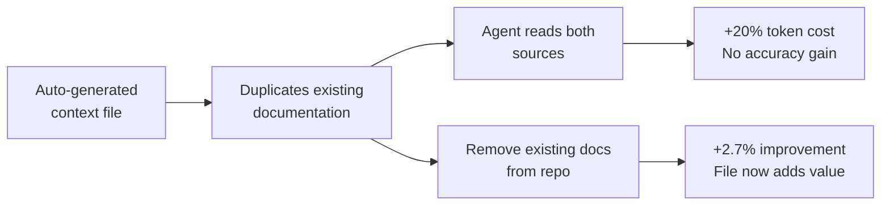

# Evaluating AGENTS.md: When Context Files Hurt More Than Help

> Auto-generated context files reduce task success rates. Human-written files improve success only when they contain minimal, specific instructions — not architectural overviews or duplicated documentation.

## The Evidence

Two studies evaluated AGENTS.md-style context files on real coding benchmarks:

| Study | Benchmark | Finding |
|-------|-----------|---------|
| Gloaguen et al. (2026) | SWE-bench Lite (300 tasks), AGENTbench (138 tasks) | LLM-generated files: **-3% success, +20% cost**. Human-written files: **+4% success, +19% cost** |
| Lulla et al. (2026) | 10 repos, 124 PRs | AGENTS.md present: **-28.6% runtime, -16.6% output tokens**, completion rates unchanged |

One measures success, the other efficiency. Context files can make agents faster but not more successful.

## Why Auto-Generated Files Fail

Running `/init` produces a document restating what the agent can already discover:

When researchers removed existing documentation from repos, the same auto-generated files **improved** performance by 2.7% — confirming that redundancy, not the file itself, is the problem.

GPT-5.1 Mini and GPT-5.2 used 14% and 22% more reasoning tokens respectively with LLM-generated context files — effort spent processing information the agent would have found anyway.

## Why Verbose Human-Written Files Trade Success for Cost

Human-written context files improved success by ~4% on AGENTbench but increased costs by up to 19% because agents followed instructions **too faithfully** — running more tests, reading more files, and executing more searches than the task required.

This is the [compliance ceiling](instruction-compliance-ceiling.md) in action — agents treat every instruction as equally important, producing more work without proportional accuracy gains.

**Architectural overviews did not help.** Agents spent the same effort locating files regardless of overview presence.

## What Actually Works

One finding was unambiguous: **tool-specific instructions change agent behavior reliably**. Repository-specific tools averaged 2.5 calls per instance when mentioned vs 0.05 when not.

| Include | Omit |
|---------|------|
| Exact build/test/lint commands with flags | Architecture overviews |
| Non-obvious constraints agents cannot infer | Codebase structure descriptions |
| Repository-specific tool invocations | Information already in existing docs |
| Critical rules that apply to every task | Task-specific procedures (load on demand) |

This aligns with the [table of contents pattern](agents-md-as-table-of-contents.md) — a pointer map outperforms an encyclopedia by avoiding the redundancy that makes auto-generated files fail.

## The Resolution

"AGENTS.md files hurt" overstates the finding. What the research shows:

1. **Auto-generated context files are net negative** — stop running `/init` and expecting improvement
2. **Verbose human-written files trade marginal accuracy for significant cost** — the [compliance ceiling](instruction-compliance-ceiling.md) now has empirical backing
3. **Minimal, specific instructions work** — tool commands and non-inferable constraints change behavior reliably
4. **Pointer files avoid the core failure mode** — no duplication of discoverable information

The advice: remove everything the agent can already infer, and keep only what it cannot.

## Benchmark Limitations

Both studies evaluated well-documented open-source repositories. Context file value is likely higher in:

- Closed-source codebases with undocumented conventions
- Projects with non-standard tooling or build systems
- Repos where critical constraints are not inferable from code

This gap is untested — the evidence applies to the open-source case.

## Key Takeaways

- Auto-generated context files duplicate discoverable information and increase costs 20%+ with no accuracy gain
- Human-written files improve success ~4% but at ~19% higher cost
- Tool-specific commands are the highest-value content: 2.5 calls when mentioned vs 0.05 when not
- Architectural overviews do not reduce file discovery time — omit them
- The research validates minimal instruction files and the pointer-map pattern

## Sources

- [Gloaguen et al. — Evaluating AGENTS.md: Are Repository-Level Context Files Helpful for Coding Agents?](https://arxiv.org/abs/2602.11988)
- [Lulla et al. — On the Impact of AGENTS.md Files on the Efficiency of AI Coding Agents](https://arxiv.org/abs/2601.20404)
- [InfoQ — New Research Reassesses the Value of AGENTS.md Files for AI Coding](https://www.infoq.com/news/2026/03/agents-context-file-value-review/)
- [Upsun — The research is in: your AGENTS.md is probably too long](https://devcenter.upsun.com/posts/agents-md-less-is-more/)

## Unverified Claims

- The 2.7% improvement when documentation is removed `[unverified — cited from secondary source; may be derivative interpretation]`
- Whether findings generalize to closed-source enterprise codebases `[unverified — acknowledged gap in both studies]`
- Whether Lulla et al. efficiency gains hold across models tested by Gloaguen et al. `[unverified — different model/agent sets]`

## Related

- [The Instruction Compliance Ceiling](instruction-compliance-ceiling.md)
- [AGENTS.md as Table of Contents, Not Encyclopedia](agents-md-as-table-of-contents.md)
- [AGENTS.md Design Patterns: Commands, Boundaries, and Personas](agents-md-design-patterns.md)
- [AGENTS.md: A README for AI Coding Agents](../standards/agents-md.md)
- [Layered Instruction Scopes](layered-instruction-scopes.md)
- [Convention Over Configuration](convention-over-configuration.md)
- [Discoverable vs Non-Discoverable Context](../context-engineering/discoverable-vs-nondiscoverable-context.md)
