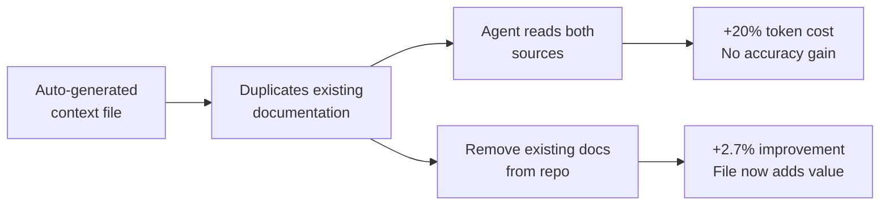

# Evaluating AGENTS.md: When Context Files Hurt More Than Help

> Auto-generated context files do not improve task success and raise cost. Human-written files gain little on success, and tool-specific instructions change agent behavior reliably.

## The evidence

Two studies evaluated AGENTS.md-style context files on real coding benchmarks:

| Study | Benchmark | Finding |
|-------|-----------|---------|
| Gloaguen et al. (2026) | SWE-bench Lite (300 tasks), CTXbench (138 tasks) | LLM-generated files: -0.5% success on SWE-bench Lite and -2% on CTXbench (p=87% and p=37%, no significant effect), +20% and +23% cost. Human-written files: +2.4% success on CTXbench (p=21%, no significant effect), up to +19% cost |
| Lulla et al. (2026) | 10 repos, 124 PRs | AGENTS.md present: -28.6% runtime, -16.6% output tokens, completion rates unchanged |
| AIDev (2026) | Agentic PRs across many projects | Context files do not reliably improve merge rate: 27.7% of projects improved ≥20% while 26.35% degraded |

One study measures success, the other efficiency. A third, PR-level study reaches the same conclusion from the merge-rate angle: an [AIDev empirical analysis](https://arxiv.org/abs/2606.13449v1) found instruction and context files do not reliably improve agentic-PR merge rate. Roughly as many projects degraded (26.35%) as improved by 20% or more (27.7%). Context files can make agents faster, but not more reliably successful.

## Why auto-generated files fail

Running `/init` produces a document that restates what the agent can already discover:

```mermaid
graph LR
    A[Auto-generated<br>context file] --> B[Duplicates existing<br>documentation]
    B --> C[Agent reads both<br>sources]
    C --> D[+20% token cost<br>No accuracy gain]
    B --> E[Remove existing docs<br>from repo]
    E --> F[+2.7% improvement<br>File now adds value]
```

When researchers removed existing documentation from the CTXbench repos, the auto-generated files improved performance by 2.7% on average and outperformed the developer-written ones (the paper compares the two in that setting). This confirms that redundancy, not the file itself, is the problem.

With LLM-generated context files, GPT-5.2 used 22% more reasoning tokens on SWE-bench Lite and 14% more on CTXbench. GPT-5.1 Mini used 10% more on both. That effort went into processing information the agent would have found anyway.

## Why human-written files trade success for cost

Human-written context files improved success by 2.4% on average on CTXbench, a difference the authors could not separate from chance (p=21%), and raised costs by up to 19%. They did beat LLM-generated files by 7% on average (p=3.8%). Agents followed instructions too faithfully — running more tests, reading more files, and searching more than the task required.

This is the [compliance ceiling](instruction-compliance-ceiling.md) in action. Agents treat every instruction as equally important, producing more work without proportional accuracy gains.

Architectural overviews did not help. Agents spent the same effort locating files whether or not an overview was present.

## What actually works

One finding was clear: tool-specific instructions change agent behavior reliably. Repository-specific tools averaged 2.5 calls per instance when mentioned, against fewer than 0.05 when not.

| Include | Omit |
|---------|------|
| Exact build/test/lint commands with flags | Architecture overviews |
| Non-obvious constraints agents cannot infer | Codebase structure descriptions |
| Repository-specific tool invocations | Information already in existing docs |
| Critical rules that apply to every task | Task-specific procedures (load on demand) |

This aligns with the [table of contents pattern](agents-md-as-table-of-contents.md). A pointer map beats an encyclopedia because it avoids the redundancy that makes auto-generated files fail.

## The resolution

"AGENTS.md files hurt" overstates the finding. The research shows four things:

1. Auto-generated context files do not improve success and cost about 20% more — stop running `/init` and expecting improvement.
2. Human-written files trade a small, non-significant accuracy gain for higher cost — the [compliance ceiling](instruction-compliance-ceiling.md) now has empirical backing.
3. Tool-specific instructions change behavior reliably — agents used repository-specific tools 2.5 times per instance when mentioned, against fewer than 0.05 when not.
4. Pointer files avoid the core failure mode — no duplication of discoverable information. The study did not test minimal or pointer-style files, so this follows from its findings rather than being measured.

The advice: remove everything the agent can already infer, and keep only what it cannot.

One caveat on the measure: every row above scores task success or cost. A later study graded a different repository-guidance artifact, a generated norm package, on contribution compliance and found a gain there while functional success did not reach significance ([He et al., 2026](https://arxiv.org/abs/2610.07757v1)); see [Verified Norm Packages for Repository Contribution Rules](verified-norm-packages.md).

## Benchmark limitations

Both studies evaluated well-documented open-source repositories. Context file value is likely higher in:

- Closed-source codebases with undocumented conventions
- Projects with non-standard tooling or build systems
- Repos where critical constraints are not inferable from code

This gap is untested. The evidence applies to the open-source case.

The two studies also used different model and agent sets. So it is unclear whether the efficiency gains Lulla et al. measured would hold for the models Gloaguen et al. tested, or the other way round.

## Key Takeaways

- Auto-generated context files duplicate discoverable information and increase costs 20%+ with no accuracy gain
- Human-written files improved success 2.4% on average (p=21%, not significant) at up to 19% higher cost
- Tool-specific commands are the highest-value content: 2.5 calls when mentioned vs fewer than 0.05 when not
- Architectural overviews do not reduce file discovery time — omit them
- The research is consistent with minimal instruction files and the pointer-map pattern, but did not test them

## Sources

- [Gloaguen et al. — Evaluating AGENTS.md: Are Repository-Level Context Files Helpful for Coding Agents?](https://arxiv.org/abs/2602.11988v3)
- [Lulla et al. — On the Impact of AGENTS.md Files on the Efficiency of AI Coding Agents](https://arxiv.org/abs/2601.20404)
- [AIDev — Empirical analysis of agentic-PR merge rates and context files](https://arxiv.org/abs/2606.13449)
- [InfoQ — New Research Reassesses the Value of AGENTS.md Files for AI Coding](https://www.infoq.com/news/2026/03/agents-context-file-value-review/)
- [Upsun — The research is in: your AGENTS.md is probably too long](https://devcenter.upsun.com/posts/agents-md-less-is-more/)

## Related

- [The Instruction Compliance Ceiling](instruction-compliance-ceiling.md)
- [Guardrails Beat Guidance: Rule Design for Coding Agents](guardrails-beat-guidance-coding-agents.md) — complementary empirical finding on negative-vs-positive rule polarity for coding agents
- [AGENTS.md as Table of Contents, Not Encyclopedia](agents-md-as-table-of-contents.md)
- [AGENTS.md Design Patterns: Commands, Boundaries, and Personas](agents-md-design-patterns.md)
- [AGENTS.md: A README for AI Coding Agents](../standards/agents-md.md)
- [Layered Instruction Scopes](layered-instruction-scopes.md)
- [Instruction File Ecosystem](instruction-file-ecosystem.md) — the map of instruction-file types this evaluation lens sits inside
- [Configuration File Structure Compliance Gap](configuration-file-structure-compliance-gap.md) — empirical null on file structure, complementary to this page's when-do-context-files-hurt question
- [Convention Over Configuration](convention-over-configuration.md)
- [Discoverable vs Non-Discoverable Context](../context-engineering/discoverable-vs-nondiscoverable-context.md)
- [Agent Context File Evolution: Treating ACFs as Configuration Code](agent-context-file-evolution.md) — for ACFs that already help, the empirical maintenance lifecycle on the same Chatlatanagulchai dataset
- [RAMP: Committed AI Configuration and the Quality Cost](committed-ai-configuration-quality-cost.md) — the longitudinal counterpart, where committed configuration tracks lower complexity drift even though task success does not move
- [Documentation Read Counts Measure Retrievability, Not Value](documentation-read-counts.md) — the behavioral traces showing agents read these files most, and why that is not an argument for writing more of them
- [Constraint Preambles and the Gain Your Scanner Misses](constraint-preamble-before-generation.md) — the artifact class that did move named defect classes, and why the two results are not in conflict
