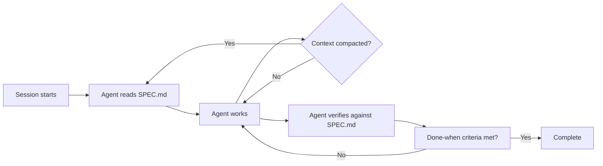

# Frozen Spec File

> Write goals, non-goals, constraints, and completion criteria into an immutable file the agent reads but cannot modify — preventing drift even across context compaction.

## The Problem

Agents build impressive things that are wrong. Over long sessions, the original objective blurs: context compaction drops nuance, the agent reinterprets constraints it finds inconvenient, and scope creeps in directions nobody asked for. The result is coherent, high-quality code that solves a subtly different problem than assigned.

[Spec-driven development](../workflows/spec-driven-development.md) solves the *writing* problem — how to capture intent. The frozen spec solves the *preservation* problem — how to keep that intent unmodifiable throughout execution.

## Anatomy of a Frozen Spec

A frozen spec contains five sections. Everything else belongs in mutable plan or progress files.

| Section | Purpose | Example |
|---------|---------|---------|
| **Goals** | What the agent must deliver | "Add OAuth2 login via Google" |
| **Non-goals** | What the agent must not build | "Do not add email/password auth" |
| **Hard constraints** | Non-negotiable boundaries | "No new runtime dependencies" |
| **Deliverables** | Concrete output artifacts | `src/auth/oauth.ts`, migration file, tests |
| **Done-when criteria** | Objective, testable completion conditions | "All existing tests pass; `/auth/google` returns 302 to Google consent screen" |

Non-goals are first-class. Without them, agents expand scope toward whatever seems useful — adding email auth "while we're at it" or refactoring adjacent code that looks messy.

## Why Immutability Matters

The spec must be structurally protected from the agent, not just instructionally protected.



The re-read loop is the core mechanism. After every compaction event, the agent re-reads the frozen spec from disk. The spec survives because it lives in a file, not in conversation history.

Without structural protection, agents rewrite specs they find inconvenient. Anthropic's harness research found that agents are less likely to modify JSON files than Markdown files — format choice is itself a defense against mutation ([Effective Harnesses for Long-Running Agents](https://www.anthropic.com/engineering/effective-harnesses-for-long-running-agents)). Strongly-worded prohibition language ("it is unacceptable to remove or edit tests") is necessary but not sufficient.

## Immutability Mechanisms

No single mechanism guarantees immutability. Layer them.

| Mechanism | Strength | Limitation |
|-----------|----------|------------|
| System prompt directive ("never modify SPEC.md") | Easy to add | Degrades over long sessions |
| JSON format instead of Markdown | Agent less likely to edit | Not enforced, just resistant |
| File permissions (read-only) | OS-level enforcement | Agent may have elevated access |
| Pre-commit hook rejecting spec changes | Hard enforcement | Only catches git commits |
| PreToolUse hook blocking writes to spec path | Hard enforcement | Tool-specific (e.g. Claude Code) |

The strongest setups combine a system prompt directive with a structural guardrail (hook or file permission) — instruction tells the agent not to try, enforcement catches it if it does.

## Example

Create the spec before the agent session starts:

```json
{
  "goals": [
    "Add Google OAuth2 login to the existing Express app"
  ],
  "non_goals": [
    "Do not add email/password authentication",
    "Do not refactor existing auth middleware",
    "Do not upgrade Express or any existing dependency"
  ],
  "hard_constraints": [
    "No new runtime dependencies beyond googleapis",
    "All routes must remain backward-compatible",
    "Environment variables for secrets, never hardcoded"
  ],
  "deliverables": [
    "src/auth/google-oauth.ts",
    "src/auth/google-oauth.test.ts",
    "migration/003_oauth_tokens.sql"
  ],
  "done_when": [
    "GET /auth/google returns 302 redirect to Google consent screen",
    "GET /auth/google/callback exchanges code for token and creates session",
    "All existing tests pass without modification",
    "New integration tests cover success and error paths"
  ]
}
```

The system prompt anchors the agent to the file:

```
Before starting work and after every context reset, read SPEC.json.
Verify each action against the goals, non-goals, and hard constraints.
Never modify SPEC.json. If a constraint prevents you from proceeding, stop and report — do not work around it.
```

A Claude Code hook provides hard enforcement:

```json
{
  "hooks": {
    "PreToolUse": [
      {
        "matcher": "Edit|Write",
        "hooks": [
          {
            "type": "command",
            "command": "bash -c 'if jq -r \".tool_input.file_path\" | grep -q \"SPEC.json\"; then echo \"BLOCKED: SPEC.json is frozen\" >&2; exit 2; fi'"
          }
        ]
      }
    ]
  }
}
```

## Frozen vs. Mutable Artifacts

The frozen spec works alongside mutable files — plan, progress, and status. The distinction is the core insight.

| Artifact | Mutability | Contains |
|----------|-----------|----------|
| SPEC.json | Frozen | Goals, non-goals, constraints, done-when |
| PLAN.md | Mutable | Implementation approach, task breakdown |
| PROGRESS.md | Mutable | Completed steps, current status, blockers |
| Feature state JSON | Mutable | Per-feature pass/fail tracking |

OpenAI's Codex long-horizon guide uses this exact split: Prompt.md is frozen (goals and constraints), while Plan.md and Implement.md are mutable working documents ([Run Long-Horizon Tasks with Codex](https://developers.openai.com/blog/run-long-horizon-tasks-with-codex)).

## Key Takeaways

- A frozen spec contains goals, non-goals, hard constraints, deliverables, and done-when criteria — nothing else
- Non-goals explicitly prevent the scope creep agents find most tempting
- Immutability requires structural enforcement (hooks, permissions), not just prompt instructions
- The agent re-reads the spec after every context compaction, anchoring to the original intent
- JSON format resists agent mutation better than Markdown

## Related

- [Spec-Driven Development](../workflows/spec-driven-development.md) — the writing workflow that produces the spec
- [Objective Drift](../anti-patterns/objective-drift.md) — the failure mode a frozen spec prevents
- [Trajectory Logging via Progress Files](../observability/trajectory-logging-progress-files.md) — mutable companion artifacts
- [Feature List Files](feature-list-files.md) — structured feature tracking alongside specs
- [Hooks Beat Prompts](../verification/hooks-vs-prompts.md) — why structural enforcement outperforms prompt instructions
- [Post-Compaction Re-read Protocol](post-compaction-reread-protocol.md) — the mechanism that makes re-reading the frozen spec reliable after context compaction
- [The Specification as Prompt](specification-as-prompt.md) — using formal artifacts (types, schemas, tests) as agent instructions
- [Layer Agent Instructions by Specificity](layered-instruction-scopes.md) — structural approach to organizing agent instruction files
