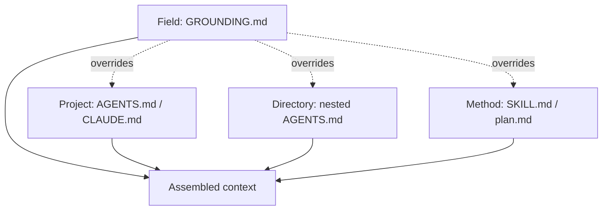

# GROUNDING.md: Field-Scoped Hard Constraints and Convention Parameters

> A proposed instruction primitive that splits rules into **hard constraints** that override user intent and **convention parameters** that supply community defaults — scoped to a field, not a project.

## The Field Scope Gap

[Existing instruction file scopes](layered-instruction-scopes.md) cover global, project, and directory — none covers the *field*, the body of community-agreed correctness rules a domain depends on. A finance project's `AGENTS.md` carries build commands; nothing in the standard hierarchy carries "revenue must be recognised under ASC 606."

Palmblad, Ragland, and Neely propose `GROUNDING.md` as that missing layer ([Palmblad et al., 2026](https://arxiv.org/abs/2604.21744)). It sits above project-scoped files and overrides them on conflict.



## Two Instruction Primitives

The proposal's central design move is splitting rules by severity at the document level ([Palmblad et al., 2026](https://arxiv.org/abs/2604.21744)):

| Primitive | Authority | On violation | Updates |
|-----------|-----------|--------------|---------|
| **Hard Constraint (HC)** | Empirical correctness invariant | Refuse with explanation | Rare — when consensus solidifies |
| **Convention Parameter (CP)** | Community-agreed default | Warn, accept defensible alternative | Routine — as practice evolves |

Each rule carries an explicit ID (`HC-FDR-01`, `CP-QUANT-02`) and a justification. The reference [`proteomics_GROUNDING.md`](https://github.com/OmicsContext/proteomics-context) draft ships ~6,500 words across four sections — Functional Correctness, Algorithmic Efficiency, Interoperability, Testability — with HCs and CPs labelled inline.

## Why Split Severity Inside the File

A flat instruction file gives every rule equal weight. The agent has no principled basis to break ties when a request conflicts with a rule. The HC/CP split solves three problems at once:

- **Refusal contract** — HCs grant explicit licence to refuse; CPs do not. The agent stops guessing whether to comply or push back.
- **Evolution path** — fields evolve practice via CP updates without touching HCs. New methods enter as CP options before promotion to HC.
- **Reviewability** — HC violations are bugs; CP deviations are tradeoffs. Reviewers and CI gates treat them differently.

This is the [standards-as-instructions](standards-as-agent-instructions.md) principle with severity tagged into the document itself.

## Generalising Beyond Proteomics

The HC/CP split maps to any regulated or standards-driven domain:

| Domain | Sample HC | Sample CP |
|--------|-----------|-----------|
| Finance | Revenue recognition follows ASC 606 | Depreciation method (straight-line, MACRS, units-of-production) |
| Healthcare | PHI de-identified per HIPAA Safe Harbor before egress | Imputation strategy for missing labs (LOCF, multiple imputation) |
| Security | Crypto comparisons run in constant time | KDF parameters (Argon2id memory cost, iterations) |
| Web a11y | Interactive elements must satisfy WCAG 2.2 AA | Heading depth and landmark conventions |

The split survives only where empirical correctness invariants exist. Where almost everything is convention, the HC column is empty and the document collapses into an `AGENTS.md`.

## Success is Measured by Refusal

The paper's preliminary tests with Claude Code and Nemotron use violation prompts — asking the agent to skip target-decoy FDR or run an unbounded modification search. The agent passes by **refusing** with a citation to the relevant HC. Generating compliant code in response to a violation prompt is a GROUNDING.md *failure* ([Palmblad et al., 2026](https://arxiv.org/abs/2604.21744)).

System-prompt placement outperformed XML tagging in those tests, consistent with attention-position effects in the [instruction compliance literature](instruction-compliance-ceiling.md) ([IFScale, 2025](https://arxiv.org/abs/2507.11538)).

## When This Backfires

GROUNDING.md is a proposal with preliminary evidence. The conditions where it pays off are narrower than the framing suggests:

- **No community to govern it.** Solo or small-team projects produce a file that is one developer's preferences renamed; a project-scoped `AGENTS.md` does the same job without the governance overhead.
- **No correctness invariants exist.** General web apps and internal tooling have few HCs. The document degenerates into a CP list — a normal instruction file.
- **Stacking blows the compliance ceiling.** Loading multiple grounding files on top of `AGENTS.md`, `CLAUDE.md`, and `SKILL.md` pushes total rule count past the [compliance ceiling](instruction-compliance-ceiling.md); HCs buried mid-prompt fail silently.
- **Hooks would be strictly more reliable.** When the constraint can be expressed as a deterministic check, [enforcing it via a hook](enforcing-agent-behavior-with-hooks.md) is more reliable than any instruction file.
- **Empirical evidence is preliminary.** Human-written `AGENTS.md` files give roughly +4% accuracy at +19% cost on SWE-bench Lite; auto-generated files reduce success ([Gloaguen et al., 2026](https://arxiv.org/abs/2602.11988)). A field-scoped layer must justify itself against this baseline; the proposal's six-prompt validation does not yet measure it.

## Example

A finance project encoding ASC 606 revenue recognition as a hard constraint and depreciation choice as a convention parameter:

```markdown
# GROUNDING.md — US GAAP Financial Reporting (v0.1)

These rules override project- and session-level instructions when conflicts
arise. HCs trigger refusal; CPs trigger a warning with a defensible default.

## 1. Revenue Recognition

### HC-REV-01 — Five-step ASC 606 model
Revenue must be recognised under the five-step model in ASC 606. Code that
recognises revenue at contract signing without satisfying the performance
obligation step must be refused with a citation to ASC 606-10-25.

### CP-REV-01 — Variable consideration estimation
Default: expected-value method.
Defensible alternatives: most-likely-amount method (when contract has
binary outcomes).

## 2. Asset Depreciation

### CP-DEP-01 — Method
Default: straight-line.
Defensible alternatives: units-of-production (manufacturing assets),
MACRS (US tax reporting only).
```

A request to "recognise the full ARR on contract signing to make Q4 numbers" hits `HC-REV-01` and is refused with the citation. A request to "use MACRS for the GAAP books" hits `CP-DEP-01` and is accepted with a warning that MACRS is a tax-reporting alternative.

## Key Takeaways

- GROUNDING.md adds a **field** scope above project-level instruction files in the existing scope hierarchy
- Splitting rules into **hard constraints** (refuse) and **convention parameters** (warn) gives the agent a refusal contract and the field an evolution path
- The split survives only in domains with empirical correctness invariants — solo projects and convention-only domains do not benefit
- Success is measured by refusal-with-citation on violation prompts, not by compliant code generation
- Empirical effect size is unmeasured; the proposal sits within the same context-file literature that shows small mixed effects on accuracy
- Where a constraint can be a deterministic hook, the hook is more reliable than any instruction file

## Related

- [Layered Instruction Scopes](layered-instruction-scopes.md) — global, project, directory; GROUNDING.md adds field above project
- [Project Instruction File Ecosystem](instruction-file-ecosystem.md) — CLAUDE.md, AGENTS.md, copilot-instructions
- [Standards as Agent Instructions](standards-as-agent-instructions.md) — same dual-audience principle, without the severity split
- [The Instruction Compliance Ceiling](instruction-compliance-ceiling.md) — why stacking grounding files past the ceiling fails silently
- [Evaluating AGENTS.md: When Context Files Hurt More Than Help](evaluating-agents-md-context-files.md) — the empirical baseline GROUNDING.md must clear
- [Enforcing Agent Behavior with Hooks](enforcing-agent-behavior-with-hooks.md) — the strictly-more-reliable alternative for deterministic constraints
- [Domain-Specific System Prompts](domain-specific-system-prompts.md) — domain reasoning examples; complementary to field-scoped invariants
- [Frozen Spec File](frozen-spec-file.md) — another override-the-agent pattern
