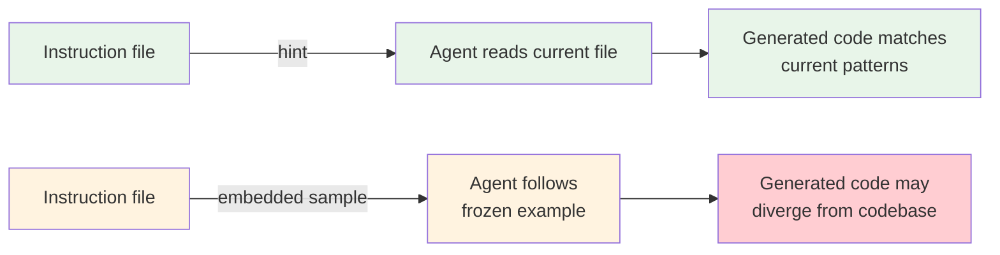

# Hints Over Code Samples in Agent Prompts

> Point agents at existing code instead of pasting samples into instructions. Hints stay current as the codebase evolves; embedded code samples become stale the moment you commit them.

A hint is a path reference: "follow the repository pattern in `src/repos/UserRepo.ts`." The agent reads the current file, not a frozen copy. Coding agents operate inside a live codebase — few-shot examples that work well in isolated prompts become a liability when the source of truth is already on disk.

## The Problem with Embedded Code Samples

Code samples in instruction files create a shadow codebase. The real implementation changes while the prompt example stays frozen. Two failure modes emerge:

- **Divergence.** The agent follows the frozen example, producing outdated patterns or incompatible signatures.
- **Token waste.** A 30-line sample loaded at session start consumes context budget on every task, including unrelated ones. Multiply by several examples and a meaningful share of the window holds stale reference material.

## How Hints Work

A hint replaces a code block with a path reference:

| Embedded sample | Hint equivalent |
|----------------|-----------------|
| 30-line `UserRepo` class definition | `Follow the repository pattern in src/repos/UserRepo.ts` |
| Full middleware function | `Use src/middleware/auth.ts as the pattern for new middleware` |
| Example test setup with fixtures | `Tests follow the pattern in src/__tests__/user.test.ts` |

The agent reads the referenced file at task time. The hint itself is stable — it rarely changes even as the referenced code evolves.



## Why Hints Are More Effective

**Zero maintenance.** The hint stays valid as the referenced code evolves. No one needs to update the instruction file when the implementation changes.

**Context efficiency.** A one-line hint costs a fraction of the tokens a multi-line sample consumes. For files loaded at session start, this compounds across every interaction.

**KV-cache stability.** Prompt caching works by hashing the token sequence up to a cache breakpoint. Because a hint is a fixed string, it hashes identically across sessions. An embedded code sample that changes with the codebase produces a different hash each time, breaking the cache and forcing a full re-computation ([Anthropic prompt caching docs](https://docs.anthropic.com/en/docs/build-with-claude/prompt-caching)).

**Reduced few-shot brittleness.** Repeated examples can make agents copy structure verbatim rather than generalizing. A hint forces the agent to read and interpret the real code, producing more adaptive output.

## When to Still Use Code Samples

Hints require something to point at. Use an inline code sample when:

- **Introducing a genuinely novel pattern** with no existing implementation. The sample serves as the initial specification.
- **Defining output formats** where the exact structure matters (commit message templates, API response schemas, file naming conventions).
- **Tool definitions** where example usage and edge cases improve tool selection accuracy.

Once a file implements the novel pattern, replace the sample with a hint. The sample was a bootstrap; the hint is the steady state.

## When This Backfires

Hints add a file-read step at task time. In contexts where that overhead matters, the trade-off shifts:

- **Large referenced files.** If the hint points at a 500-line module, the agent may load the entire file into context — far more tokens than a targeted 20-line embedded sample. Use hints for files where the agent will read selectively, not monolithic ones.
- **Deleted or renamed targets.** A hint pointing at a deleted file silently fails. The agent either errors or invents a pattern. Embedded samples survive refactors; hints require the target to exist.
- **Low-latency agent loops.** Short-lived agents (e.g., a CI bot that runs hundreds of small tasks) pay the file-read cost on every invocation. For high-frequency, low-complexity tasks, pre-loading a short sample may be cheaper than repeated disk reads.
- **Isolated execution environments.** Sandboxed or remote agents without filesystem access cannot follow a hint. Embedded samples are the only option when the referenced code is unavailable.

## Example

**Before** — embedded sample in CLAUDE.md:

```markdown
# API Handlers

Create new API handlers following this pattern:

​```typescript
import { Handler } from '../types';
import { validateRequest } from '../middleware/validation';
import { handleError } from '../utils/errors';

export const createHandler: Handler = async (req, res) => {
  try {
    const validated = validateRequest(req.body, schema);
    const result = await service.create(validated);
    res.status(201).json(result);
  } catch (err) {
    handleError(err, res);
  }
};
​```
```

**After** — hint in CLAUDE.md:

```markdown
# API Handlers

New API handlers follow the pattern in `src/api/handlers/users.ts`. Read it before creating new handlers.
```

The hint version costs ~20 tokens instead of ~80, stays correct when the handler pattern changes, and lets the agent adapt to current imports, error handling, and conventions.

## Key Takeaways

- Code samples in instruction files are frozen snapshots that diverge from the real codebase over time
- Hints point agents to current code, eliminating maintenance burden and token waste
- Use code samples only for novel patterns with no existing reference, output formats, or tool documentation
- Replace every code sample with a hint once the pattern exists in the codebase

## Sources

- [Alex Lavaee: OpenAI Agent-First Codebase Learnings](https://alexlavaee.me/blog/openai-agent-first-codebase-learnings) — instruction files as table of contents, context scarcity, progressive disclosure
- [Claude Code Best Practices](https://code.claude.com/docs/en/best-practices) — "Reference existing patterns" strategy, CLAUDE.md guidance on inclusion/exclusion
- [Anthropic: Effective Context Engineering for AI Agents](https://www.anthropic.com/engineering/effective-context-engineering-for-ai-agents) — minimal high-signal tokens, curated examples over exhaustive coverage
- [Manus: Context Engineering for AI Agents](https://manus.im/blog/Context-Engineering-for-AI-Agents-Lessons-from-Building-Manus) — KV-cache optimization, few-shot brittleness, file system as ultimate context
- [Anthropic: Building Effective Agents](https://www.anthropic.com/engineering/building-effective-agents) — tool definitions benefit from example usage

## Related

- [Context Engineering](../context-engineering/context-engineering.md) — designing what enters an agent's context window
- [Example-Driven vs Rule-Driven Instructions](example-driven-vs-rule-driven-instructions.md) — framework for choosing between rules and examples, including hints
- [AGENTS.md as Table of Contents, Not Encyclopedia](agents-md-as-table-of-contents.md) — same principle applied to AGENTS.md sizing
- [System Prompt Altitude](system-prompt-altitude.md) — hints operate at a higher altitude than code samples, staying valid across variation
- [The Instruction Compliance Ceiling](instruction-compliance-ceiling.md) — shorter instruction files with hints keep rule counts lower
- [Prompt Compression](../context-engineering/prompt-compression.md) — hints as compression that preserves signal while reducing token cost
