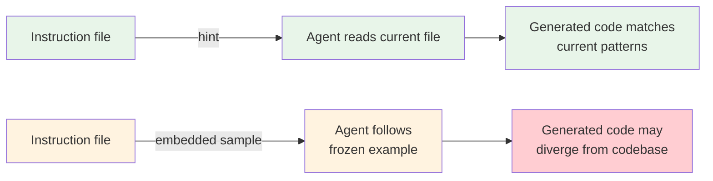

# Hints Over Code Samples in Agent Prompts

> Point agents at existing code instead of pasting samples into instructions. Hints stay current as the codebase evolves; embedded code samples become stale the moment you commit them.

A hint is a path reference that tells the agent where to find a pattern: "follow the repository pattern in `src/repos/UserRepo.ts`." The agent reads the current file, not a frozen copy. This is a departure from traditional prompt engineering, where few-shot examples are a default technique — but coding agents operate inside a live codebase, not a stateless API call.

## The Problem with Embedded Code Samples

Code samples in instruction files create a shadow codebase. The real implementation changes — function signatures, dependencies, error handling — while the prompt example stays frozen. Two failure modes emerge:

- **Divergence.** The agent follows the prompt example while the real code has moved on. Generated code may use outdated patterns, deprecated APIs, or incompatible signatures.
- **Token waste.** A 30-line code sample loaded at session start consumes context budget on every task, including unrelated ones. Multiply by several examples and a meaningful share of the context window is occupied by stale reference material.

Instruction files should function as a table of contents, not an encyclopedia. Every token competes with the actual task context for the agent's attention.

## How Hints Work

A hint replaces a code block with a path reference:

| Embedded sample | Hint equivalent |
|----------------|-----------------|
| 30-line `UserRepo` class definition | `Follow the repository pattern in src/repos/UserRepo.ts` |
| Full middleware function | `Use src/middleware/auth.ts as the pattern for new middleware` |
| Example test setup with fixtures | `Tests follow the pattern in src/__tests__/user.test.ts` |

The agent reads the referenced file at task time, getting the current implementation. The hint itself is stable — it rarely changes even as the referenced code evolves.



## Why Hints Are More Effective

**Zero maintenance.** The hint stays valid as the referenced code evolves. No one needs to remember to update the instruction file when the implementation changes.

**Context efficiency.** A one-line hint costs a fraction of the tokens that a multi-line code sample consumes. For files loaded at session start (CLAUDE.md, AGENTS.md, system prompts), this compounds across every interaction.

**KV-cache stability.** In production agent systems, cache hit rates depend on stable context prefixes. Code samples that change when the codebase changes invalidate cache prefixes. Hints are stable strings that preserve cache hits across sessions.

**Reduced few-shot brittleness.** Repeated, uniform examples can make agents brittle — they copy structure verbatim rather than generalizing the pattern. A hint forces the agent to read and interpret the real code, producing more adaptive output.

## When to Still Use Code Samples

Hints require something to point at. Use an inline code sample when:

- **Introducing a genuinely novel pattern** with no existing implementation in the codebase. The sample serves as the initial specification.
- **Defining output formats** where the exact structure matters (commit message templates, API response schemas, file naming conventions).
- **Tool definitions** where example usage and edge cases improve tool selection accuracy.

Once any file implements the novel pattern, replace the sample with a hint to that file. The sample was a bootstrap; the hint is the steady state.

## Example

**Before** — embedded sample in CLAUDE.md:

```markdown
# API Handlers

Create new API handlers following this pattern:

​```typescript
import { Handler } from '../types';
import { validateRequest } from '../middleware/validation';
import { handleError } from '../utils/errors';

export const createHandler: Handler = async (req, res) => {
  try {
    const validated = validateRequest(req.body, schema);
    const result = await service.create(validated);
    res.status(201).json(result);
  } catch (err) {
    handleError(err, res);
  }
};
​```
```

**After** — hint in CLAUDE.md:

```markdown
# API Handlers

New API handlers follow the pattern in `src/api/handlers/users.ts`. Read it before creating new handlers.
```

The hint version costs ~20 tokens instead of ~80. It stays correct when the handler pattern changes. The agent reads the real file and adapts to current imports, error handling, and conventions.

## Key Takeaways

- Code samples in instruction files are frozen snapshots that diverge from the real codebase over time
- Hints point agents to current code, eliminating maintenance burden and token waste
- Use code samples only for novel patterns with no existing reference, output format definitions, or tool documentation
- Replace every code sample with a hint once the pattern exists in the codebase
- This is a strong default, not a blanket rule — the exception is when there is nothing to point at

## Sources

- [Alex Lavaee: OpenAI Agent-First Codebase Learnings](https://alexlavaee.me/blog/openai-agent-first-codebase-learnings) — instruction files as table of contents, context scarcity, progressive disclosure
- [Claude Code Best Practices](https://code.claude.com/docs/en/best-practices) — "Reference existing patterns" strategy, CLAUDE.md guidance on inclusion/exclusion
- [Anthropic: Effective Context Engineering for AI Agents](https://www.anthropic.com/engineering/effective-context-engineering-for-ai-agents) — minimal high-signal tokens, curated examples over exhaustive coverage
- [Manus: Context Engineering for AI Agents](https://manus.im/blog/Context-Engineering-for-AI-Agents-Lessons-from-Building-Manus) — KV-cache optimization, few-shot brittleness, file system as ultimate context
- [Anthropic: Building Effective Agents](https://www.anthropic.com/engineering/building-effective-agents) — tool definitions benefit from example usage

## Unverified Claims

- The specific framing of "hints over code samples" originated from internal practitioner discussion — no public source uses this exact terminology [unverified]
- KV-cache invalidation from changing code samples is architecturally plausible but not empirically measured in published benchmarks [unverified]

## Related

- [Example-Driven vs Rule-Driven Instructions](example-driven-vs-rule-driven-instructions.md) — broader framework for choosing between rules and examples, including a section on hints
- [AGENTS.md as Table of Contents, Not Encyclopedia](agents-md-as-table-of-contents.md) — the same principle applied to AGENTS.md file sizing
- [System Prompt Altitude: Specific Without Being Brittle](system-prompt-altitude.md) — hints operate at a higher altitude than code samples, staying valid across variation
- [The Instruction Compliance Ceiling](instruction-compliance-ceiling.md) — shorter instruction files with hints instead of samples keep rule counts lower
- [Prompt Compression: Maximizing Signal Per Token](../context-engineering/prompt-compression.md) — hints are a form of compression that preserves signal while reducing token cost
